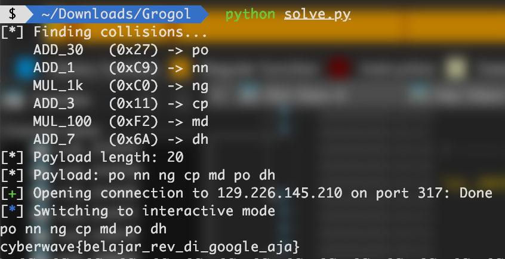
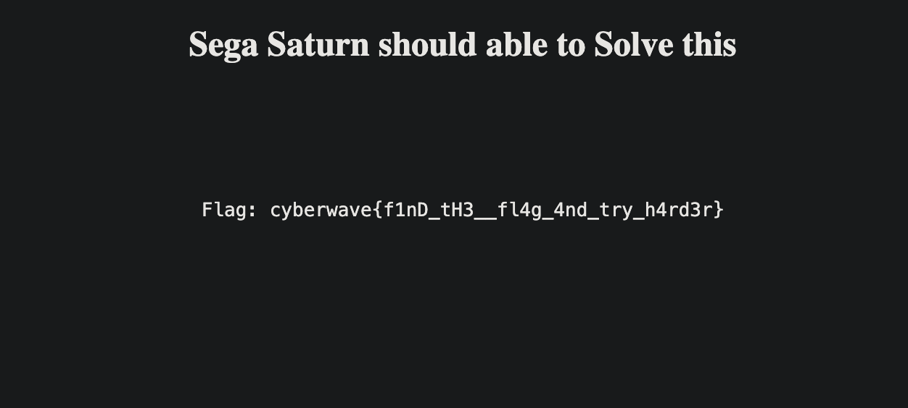
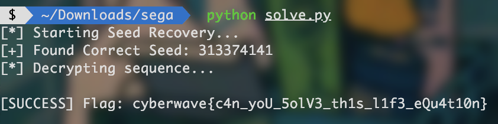
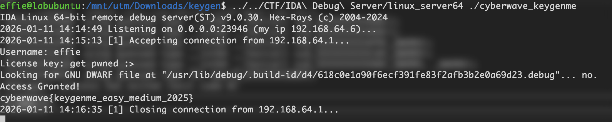

CyberWave 2025 is an "indie" national CTF held by [JKTCoders](https://www.instagram.com/jktcoders/).
I think it's open for everyone, not just high schoolers, because I seen some PETIR sub-team in the leaderboards—one is on the podium!
The challenges was not that hard, I guess, or at least, it can be easily beaten by AIs.
What's interesting about this CTF is that it uses the fixed scoring system, amidst virtually all other CTFs using the dynamic scoring one (actuall easier & better).
Wait, they actually do use dynamic, but the set the starting values differently and the recline value (or whatever u call it) small.
...I think?

Also, if u read the description above, u may guess that, well, I AM THE BURDEN.  
I didn't know why but it seems like I was short-circuiting.
The thing is this competition started at 8:00—but got delayed—and I just had ANOTHER competition (ARA OlimpIt) at 09:00 till around 10:15.
It was an olympiad about IOT and cyber security, and thanks to my teammate covering IOT questions for me, so I didn't even study for it.
We even completed and submitted our answers just one hour in. Like, it was nothing to worry about.
I might get a lil freaky and silly (laughing at the questions), but that's about it.
But how can't I focus on the damn CTF?
I CAN'T SOLVE GROGOL FOR HOURS, but when I up-solve it from scratch, I just did it in freaking 15 minutes?!?!
Why didn't I tried the other rev challenges then?
Well, duh, if only the goat genggx. didn't solved them already...
So yeah, I scored 0 points for the team.
I don't know how to feel about myself right now...
...

Also, you can see the online gdocs version of this write-up [here](https://docs.google.com/document/d/1sNfYBAuuR1cTizYGOqicKKX90TwNnWt65znNhH3cOVI/edit?tab=t.0)!
Have fun reading!! :>

## REVERSE ENGINEERING

### [600] Grogol [9 Solves]

> **Description**  
> Although Grogol asks for a number greater than infinity, just reverse the check and secure your glorious victory now.  

###### Download files [here](/downloadable/Grogol.tar.xz).

#### Overview

We are given a 64-bit ELF binary acting as a custom stack-based calculator. TL;DR: It tokenizes (strtok) the input, hashes the tokens to be used as opcodes, and executes them on a custom Virtual Machine (VM). The goal is to provide an input string that results in the final stack’s top value of 31337.

#### Analysis

Upon opening the binary in IDA Pro, we analyze main. From here on, decompilation code snippets have been renamed for readability; for you! Interestingly, this is a RISC-V binary!! Something refreshing for once… The program sets up standard buffering and reads input via Fgets.


if ( !Fgets(Input, 4096, STDIN) )
  goto L_ExitFail;
if ( (unsigned __int64)Strlen(Input) > 21 )
{
  Print(2, "Your input is too long! ->>>>");
L_ExitFail:
  Status = 1;
  goto L_EXITFAIL;
}


See that?! We have a constraint. The input length must be  less than or equal to 21 characters. Next…

The input is split into tokens using Strtok (space, tab, newline). These tokens are then hashed using a custom algo, then mapped to opcodes with actions such as addition, multiplication, and push-to-stack. It calculates a rolling XOR hash for each token; effectively, we can just brute-force all possible values for a byte (256 of them) and create a reverse map of the hashes opcodes.

I looked into this RISC-V reference, and found a decompilation error:


      state_A = 1;
      state_B = 0;
      if ( *pBuf1024 )
      {
        pBuf1024_3 = pBuf1024;
        LowNib = 1;
        Len_1 = 1LL - (_QWORD)pBuf1024;
        do
        {
          Len = Len_1 + (_BYTE)pBuf1024_3;
          state_A = LowNib >> 1;
          state_B = (__int64)&pBuf1024_3[Len_1];
          Val = (unsigned __int8)*pBuf1024_3++;
          LowNib = Val ^ (LowNib >> 1);
          state_A = LowNib;
        }
        while ( *pBuf1024_3 );
        if ( ((unsigned __int8)(16 * (*pBuf1024 ^ Len)) | (unsigned __int64)(LowNib & 0xF)) == 0x27 )
        {
          A_ccumulator += 30;
          ::A_ccumulator = A_ccumulator;
        }


This loop, which reoccurs for every time an opcode check is made (how redundant), calculates the State values, and then does a check to see if it matches the opcode (0x27 in the example). The multiply by 16 is the same as << 4, meaning, it shifts the value into the higher nibble.

We do not need to reverse the collision check perfectly if we simply brute-force short strings (maybe a char, even) that result in the opcodes.

As I said, the binary implements a custom stack machine:

- Accumulator: stores the current intermediate value.  
- HighPart: Stores large multiplied values (e.g., when multiplying by 1000 or 1,000,000).  
- Multiplier: Toggles between 1 and -1 (for subtraction/negative numbers).  
- Stack: Used to store operands and operators.


  else
  {
    Idx = 0;
  }
  Buf1024[Idx] = 0;
  pBuf1024 = (_BYTE *)Buf1024[0];
  Multiplier = 1;
  A_ccumulator = ::A_ccumulator;
  B_HighPart = ::B_HighPart;
  C_ExprStackPtr = ::C_ExprStackPtr;
  D = ::D;


The VM processes these tokens in a loop. When the loop finishes, it performs a final calculation.


  v209 = ::B_HighPart;
  v210 = ::A_ccumulator * Multiplier;
  v211 = ::D;
  v212 = &STACK[2 * ::C_ExprStackPtr];
  v213 = ::C_ExprStackPtr + 1;
  ::A_ccumulator = 0;
  ::B_HighPart = 0;
  ++::C_ExprStackPtr;
  *(_DWORD *)v212 = 1;
  v212[1] = v210 + v209;
  Multiplier = 1;


It then checks if the top of the stack is 31337.


if ( STACK[2 * STACK_TOP + 1] != 31337 )


Next, we map the opcodes to the actions they perform. I used Helix to make this easier, using regexes and macros to make a dictionary of the opcode hex and its function. I got the following:

| Opcode | Action                                 |
| ------ | -------------------------------------- |
| 6A     | TOP += 7                               |
| 34     | TOP += 40                              |
| DF     | TOP += 18                              |
| 1f     | TOP += 15                              |
| a5     | TOP += 9                               |
| 79     | TOP += 2                               |
| 28     | TOP += 5                               |
| 71     | TOP += 10                              |
| 38     | TOP += 11                              |
| 6F     | TOP += 19                              |
| 2D     | TOP += 12                              |
| EE     | TOP += 14                              |
| 00     | TOP += 6                               |
| 2F     | TOP += 4                               |
| CE     | TOP += 13                              |
| 31     | TOP += 50                              |
| 82     | TOP += 90                              |
| AF     | TOP += 17                              |
| 02     | TOP += 8                               |
| 11     | TOP += 3                               |
| 67     | TOP += 60                              |
| 41     | TOP += 70                              |
| 27     | TOP += 30                              |
| c9     | TOP += 1                               |
| 4E     | TOP += 16                              |
| 30     | TOP += 80                              |
| 20     | TOP += 20                              |
| f2     | TOP *= 100                             |
| C0     | TOP *= Multiplier * 1e3  -> B          |
| aa     | TOP *= Multiplier * 1e6  -> B          |
| 5a     | TOP *= Multiplier * 1e9  -> B          |
| CA     | TOP *= Multiplier * 1e12 -> B          |
| 6e     | Multiplier = -1                        |
| 10     | push TOP; push multiplication operator |
| 37     | push TOP; push division operator       |
| 89     | push TOP; push subtraction operator    |
| 4c     | push TOP; push addition operator       |
| e8     | push TOP; push modulo operator         |

For the push instructions, they push the current immediate value, and also an operator.

#### Solution

Now that we know what we’re dealing with, let’s find the opcodes to construct 31337. We are limited by input length (21 chars), so we cannot simply add 1 thirty-one thousand times. We must use multiplication.

31337 = 31000 + 337

31337 = (31 x 1000) + (3 x 100) + 37

31337 = ((30 + 1) x 1000) + (3 x 100) + 30 + 7

So, the VM Instruction Sequence is

- Load 30: ADD_30 (Accumulator = 30)  
- Add 1: ADD_1 (Accumulator = 31)  
- Multiply by 1000 & Store: MUL_1000  
  - B_HighPart becomes 31,000.  
  - A_ccumulator becomes 0.  
- Load 3: ADD_3 (Accumulator = 3)  
- Multiply by 100: MUL_100 (Accumulator = 300)  
  - Note: MUL_100 acts directly on A_ccumulator, unlike MUL_1000.  
- Add 30: ADD_30 (Accumulator = 330)  
- Add 7: ADD_7 (Accumulator = 337)

At program termination, the VM sums A_ccumulator and B_HighPart:

337 + 31000 = 31337

What’s left is getting the input that translates to our target opcodes. Since we can't type "ADD_30", we need to find short strings that generate the required hash opcodes. I tried with just a char, but not a single one of them produces is the opcode we want. We’ll use itertools.product to brute-force these collisions. Referring back to the opcodes we extracted above, our payload will be:

1. ADD_30: 0x27  
2. ADD_1: 0xC9  
3. MUL_1000: 0xC0  
4. ADD_3: 0x11  
5. MUL_100: 0xF2  
6. ADD_7: 0x6A

Solver:

import string  
import itertools  
from pwn import *  
  
# === Configuration ===  
HOST = '129.226.145.210'  
PORT = 317  
  
# === Hashing Logic (Reversed from C) ===  
def calculate_hash(s):  
    v13 = 1  
    for char in s:  
        c = ord(char)  
        v13 = c ^ (v13 >> 1) # The rolling XOR  
  
    first = ord(s[0])  
    v15 = len(s)  
  
    # The check found in the 'if' statements:  
    # ((unsigned __int8)(16 * (*pBuf1024 ^ v18)) | (unsigned __int64)(State & 0xF))  
    # v18 in C was calculated using pointer math, effectively just the length for small strings  
     
    term1 = ((first ^ v15) & 0xF) << 4  
    term2 = v13 & 0xF  
    return term1 | term2  
  
def find_collision(target_hash):  
    # Brute force 2 char strings (efficient and keeps payload short)  
    chars = string.ascii_letters + string.digits  
    for s in itertools.product(chars, repeat=2):  
        word = "".join(s)  
        if calculate_hash(word) == target_hash:  
            return word  
    # Fallback to 1 char if needed  
    for s in chars:  
        if calculate_hash(s) == target_hash:  
            return s  
    return None  
  
# === Payload Construction ===  
# Logic: ((30 + 1) * 1000) + (3 * 100) + 30 + 7 = 31337  
needed_hashes = {  
    'ADD_30': 0x27,  
    'ADD_1':  0xC9,  
    'MUL_1k': 0xC0,  
    'ADD_3':  0x11,  
    'MUL_100':0xF2,  
    'ADD_7':  0x6A  
}  
  
print("[*] Finding collisions...")  
word_map = {}  
for name, h in needed_hashes.items():  
    word = find_collision(h)  
    if word:  
        print(f"    {name:<8} (0x{h:02X}) -> {word}")  
        word_map[name] = word  
    else:  
        log.error(f"Could not find collision for {name}")  
  
# Construct the sequence  
payload_tokens = [  
    word_map['ADD_30'],  # 30  
    word_map['ADD_1'],   # 31  
    word_map['MUL_1k'],  # Move 31000 to HighPart, Acc=0  
    word_map['ADD_3'],   # 3  
    word_map['MUL_100'], # 300  
    word_map['ADD_30'],  # 330  
    word_map['ADD_7']    # 337  
]  
  
payload = " ".join(payload_tokens)  
print(f"[*] Payload length: {len(payload)}")  
print(f"[*] Payload: {payload}")  
  
# === Exploitation ===  
r = remote(HOST, PORT)  
r.recvuntil(b'Input > ')  
r.sendline(payload.encode())  
  
# Interaction to grab flag  
r.interactive()


**Flag: cyberwave{belajar_rev_di_google_aja}**

### [230] Sega Saturn [17 Solves]

> **Description**  
> sedikit bit membuat sakit kepala

###### Download files [here](/downloadable/Sega%20Saturn.tar.xz).
#### Overview

We’re given a website (for a rev challenge?) that looks like this:

That’s a fake flag obvi. Something interesting show up when we “View Page Source”:


<!DOCTYPE html>
<html>
  <title>X-Bit Playground</title>
  <body>
    

      <h2>Sega Saturn should able to Solve this</h2>
    

     
     
     
    

      <pre id="flag"></pre>
    

    
  </body>
</html>


#### Analyze

Looking at the source code, we find a \<script> block containing the challenge logic. That was easy. There are two immediate red herrings:

- A variable flag = "cyberwave{gu3s5_th3_fl4g_4nD_try_h4rd3r}".  
- A DOM update setting the text to "Flag: cyberwave{f1nD_tH3__fl4g_4nd_try_h4rd3r}".

These are clearly decoys obviously, duh. The real data of interest is a large, unused integer array named seq and an encode function. Straightforward! Just decode it!

It implements a custom encryption scheme driven by RNG, a standard Linear Congruential Generator (LCG), specifically the "MinStd" generator used in C++'s minstd_rand0. 🤓 (AI, not me)


function RNG(seed) {
  return function() {
    seed = (seed * 48271) % 2147483647; // Multiplier A=48271, Modulo M=2^31-1
    return seed;
  };
}


On the other hand, the encode function in the script uses a hardcoded seed of 1337. However, decoding seq using seed = 1337 yields garbage (talks about inconsistency). So, I guess, the seq array provided in the source was generated with a secret seed that we must recover.

Let's analyze the rng() usage per character. For every character in the flag, the RNG is called exactly three times:

- r1​: Used for adj (modulo 93).  
- r2​: Used for XOR key (lower 8 bits).  
- r3​: Used for padding (lower 24 bits).

The output for one character is stored as a 32-bit integer big.

`big = (encrypted_byte << 24) | (r3 ​& 0xFFFFFF)`

This structure leaks the lower 24 bits of every 3rd RNG output directly in the ciphertext.

Since the LCG operates modulo 231−1 (approx 2.1 billion), recovering the full state from 24 bits is trivial because the missing information is small (7 bits).

#### Solution

We can perform a brute-force attack to recover the internal state of the RNG.

- Take the first element of seq, seq[0]. The lower 24 bits represent the 3rd RNG output (r3) modulo 224.

`L0 ​= seq[0] & 0xFFFFFF`

- Brute-Force High Bits: The actual RNG value r3​ must satisfy:

`r3 ​= (k x 224) + L0`

- Since the LCG modulus M = 231−1, the maximum value for r3​ is slightly less than 231.

`Max k ≈ 231/224 ​= 27 = 128`

We only need to iterate k from 0 to 127 to find the true r3​!

- Verification: For each candidate r3​:
  - Run the RNG forward 3 steps to generate r4​, r5​, r6​.
  - Compare the lower 24 bits of r6​ with `seq[1] & 0xFFFFFF`.
  - If they match, we have found the correct state.
- Backtracking: Once we have the correct r3​, we can mathematically step backwards to find the initial seed (s0​) used to start the sequence. This requires the modular multiplicative inverse of the multiplier A = 48271.

`sprev​ = (snext​ x A−1) (mod M)`

Applying this 3 times from r3​ gives us the initial seed. Once the seed is recovered, decryption is a straightforward reversal of the encoding steps:

1. Initialize RNG with the recovered seed.  
2. Loop through seq:  
	- Generate 3 RNG values: r1​,r2​,r3​.  
	- Calculate adj from r1.  
	- Calculate xor_key from r2.  
	- Extract encrypted_byte from the top 8 bits of the seq value (val >> 24).  
	- Reverse XOR: temp = encrypted_byte ^ xor_key.  
	- Reverse NibbleSwap: The operation is symmetric. temp = nibbleSwap(temp).  
	- Reverse Addition: plain_char = (temp - adj) % 256.

Solver:

#!/usr/bin/env python3  
import sys  
  
def solve():  
    seq = [  
        697438994, 112812148, 1601952528, 848567091, 1409540622, 719284623,  
        4183535244, 2852213902, 2109397207, 3611470734, 604567242, 1692610300,  
        2414225221, 1979551723, 3174382114, 425190723, 1060279654, 4283219352,  
        1099139615, 3427871953, 2056419824, 103242998, 2789231820, 97749902,  
        3832000502, 2437931514, 337329827, 1784389836, 1971115025, 2430188600,  
        420768160, 2890064672, 3927353914, 2033350795, 372941141, 2974609317,  
        1442092933, 2838369745, 3198352587, 230640255, 2641503210, 1721308159,  
        3764390994  
    ]  
  
    # --- LCG Constants ---  
    M = 2147483647  
    A = 48271  
    # Calculate Modular Inverse for reversing the RNG steps  
    # Using Fermat's Little Theorem: A^(M-2) % M is the inverse  
    A_inv = pow(A, M - 2, M)  
  
    print("[*] Starting Seed Recovery...")  
  
    # Extract leaked lower 24 bits  
    leak_0 = seq[0] & 0xFFFFFF  # Corresponds to 3rd RNG output (r3)  
    leak_1 = seq[1] & 0xFFFFFF  # Corresponds to 6th RNG output (r6)  
     
    seed = None  
  
    # Brute-force the upper 7 bits (approx 128 possibilities)  
    # We are reconstructing r3  
    for k in range(128):  
        candidate_r3 = leak_0 + (k << 24)  
         
        # Candidate must be within the modulus  
        if candidate_r3 >= M:  
            break  
         
        # Step BACKWARDS to find the initial seed (s0)  
        # s0 -> r1 -> r2 -> r3 (candidate)  
        r2 = (candidate_r3 * A_inv) % M  
        r1 = (r2 * A_inv) % M  
        s0 = (r1 * A_inv) % M  
  
        # Step FORWARDS to verify against leak_1 (r6)  
        # r3 -> r4 -> r5 -> r6  
        r4 = (candidate_r3 * A) % M  
        r5 = (r4 * A) % M  
        r6 = (r5 * A) % M  
         
        if (r6 & 0xFFFFFF) == leak_1:  
            seed = s0  
            print(f"[+] Found Correct Seed: {seed}")  
            break  
             
    if seed is None:  
        print("[-] Failed to find seed. Logic error suspected.")  
        return  
  
    # --- Decryption Phase ---  
    current_seed = seed  
     
    # Internal RNG helper  
    def rng():  
        nonlocal current_seed  
        current_seed = (current_seed * A) % M  
        return current_seed  
  
    def nibble_swap(x):  
        return ((x & 0x0F) << 4) | ((x & 0xF0) >> 4)  
  
    flag = ""  
    print("[*] Decrypting sequence...")  
  
    for val in seq:  
        # Replicate the 3 RNG calls per char  
        r1 = rng() # Used for adj  
        r2 = rng() # Used for XOR  
        r3 = rng() # Used for Padding (which we saw in the leak)  
  
        # 1. Reverse XOR  
        encrypted_byte = (val >> 24) & 0xFF  
        xor_key = r2 & 0xFF  
        step_1 = encrypted_byte ^ xor_key  
  
        # 2. Reverse Nibble Swap (Symmetric operation)  
        step_2 = nibble_swap(step_1)  
  
        # 3. Reverse Adjustment  
        # Original: x = (x + adj) % 256  
        # Inverse:  x = (x - adj) % 256  
        adj = (r1 % 93) + 33  
        plain_char = (step_2 - adj) % 256  
  
        flag += chr(plain_char)  
  
    print(f"\n[SUCCESS] Flag: {flag}")  
  
if __name__ == "__main__":  
    solve()


**Flag: cyberwave{c4n_yoU_5olV3_th1s_l1f3_eQu4t10n}**

### [610] KeygenMe [26 Solves]

> Description  
> Vendor bilang ini sistem license paling aman

###### Download files [here](/downloadable/KeygenMe.tar.xz).

#### Overview

We’re given an ELF x64 Linux (you know what that means) binary! TL;DR: Just jump to the success branch lol lmao xd. This challenge wants us to generate a license key for any given name, but we’re not doing that today!

#### Analyze

Load this into IDA Pro, and we’ll have the main function. Now, would you care to look at it???


__int64 __fastcall main(int a1, char **a2, char **a3)
{
  size_t NameLen; // r12
  unsigned __int64 Idx; // rax
  __int64 bite; // rcx
  char C; // dl
  char *Name_1; // r8
  int i; // eax
  int C_Name; // edx
  __int64 Idx_1; // r9
  int P; // r8d
  unsigned int Q; // edx
  int C_Name_1; // eax
  int R; // eax
  unsigned int S; // edx
  __int64 (__fastcall *Func)(); // rax
  char *chunk3_1; // r12
  unsigned int G; // ebx
  char *EncryptedFlag; // rbp
  __int16 chunk1; // [rsp+6h] [rbp-162h] BYREF
  __int64 (__fastcall *chunk2)(); // [rsp+8h] [rbp-160h] BYREF
  char chunk3[36]; // [rsp+10h] [rbp-158h] BYREF
  char _; // [rsp+34h] [rbp-134h]
  char Name[128]; // [rsp+40h] [rbp-128h] BYREF
  char License[168]; // [rsp+C0h] [rbp-A8h] BYREF

  Printf("Username: ", a2, a3);
  if ( Fgets(Name, 128, stdin) )
  {
    Rtrim(Name);
    Printf("License key: ");
    if ( Fgets(License, 128, stdin) )
    {
      Rtrim(License);
      NameLen = strlen(Name);
      // it would look something like CW25-????-????-????
      if ( NameLen - 1 <= 0x1F
        && strlen(License) == 19
        && License[4] == '-'
        && License[9] == '-'
        && License[14] == '-'
        && License[0] == 'C'
        && License[1] == 'W'
        && License[2] == '2'
        && License[3] == '5' )
      {
        Idx = 5;
        bite = 16896;
        while ( 1 )
        {
          if ( !_bittest64(&bite, Idx) )
          {
            C = License[Idx];
            // all must be [0-9A-F]
            if ( (unsigned __int8)(C - '0') > 9u && (unsigned __int8)(C - 'A') > 5u )
              break;
          }
          if ( ++Idx == 19 )
          {
            chunk1 = 0;
            LOWORD(chunk2) = 0;
            *(_WORD *)chunk3 = 0;
            if ( !(unsigned int)HexStr4ToInt16(&License[5], &chunk1) )
              break;
            if ( !(unsigned int)HexStr4ToInt16(&License[10], &chunk2) )
              break;
            if ( !(unsigned int)HexStr4ToInt16(&License[15], chunk3) )
              break;
            Name_1 = Name;
            // 12-36 repeating
            for ( i = 826366246; ; i = (33 * i + C_Name) ^ __ROL4__(33 * i + C_Name, 7) )
            {
              C_Name = (unsigned __int8)*Name_1++;
              if ( !(_BYTE)C_Name )
                break;
            }
            MagicIdk = (unsigned __int8)((7 * chunk3[0]) ^ i ^ (5 * (_BYTE)chunk2) ^ (3 * chunk1)) ^ 0x5A
                     ? i ^ 0x2468ACE0
                     : i ^ 0x13579BDF;
            Idx_1 = 0;
            P = -1522754025;
            Q = -1056969179;
            while ( NameLen != Idx_1 )
            {
              C_Name_1 = (unsigned __int8)Name[Idx_1++];
              Q = __ROL4__(C_Name_1 + 257 * Q, 5) ^ 0xA5C3D2E1;
              P = 17 * ((P + 31 * C_Name_1) ^ __ROR4__(Q, 3)) + 61;
            }
            R = Q ^ (668265261 * NameLen);
            S = P ^ __ROL4__(R, 13);
            if ( chunk1 != ((unsigned __int16)S ^ (unsigned __int16)R)
              || (_WORD)chunk2 != ((unsigned __int16)((S >> 5) ^ __ROL4__(R, 11)) ^ 0xBEEF)
              || *(_WORD *)chunk3 != ((unsigned __int16)(__ROR4__(S, 9) + 3 * R) ^ 0xC0DE) )
            {
              break;
            }
            puts("Access Granted!");
            // odd/even; both is the same anyway so idk why this is here
            if ( (MagicIdk & 1) != 0 )
              Func = A1XorA2_0;
            else
              Func = A1XorA2;
            chunk2 = Func;
            chunk3_1 = chunk3;
            G = 322420463;
            EncryptedFlag = (char *)&::EncryptedFlag;
            do
            {
              ++EncryptedFlag;
              ++chunk3_1;
              G = sub_5555555554F0(G); // a kind of PRNG; details not important
              *(chunk3_1 - 1) = ((__int64 (__fastcall *)(_QWORD, _QWORD))chunk2)(
                                  (unsigned __int8)*(EncryptedFlag - 1),
                                  (unsigned __int8)G);
            }
            while ( EncryptedFlag != (char *)&::EncryptedFlag + 36 );
            _ = 0;
            puts(chunk3);
            return 0;
          }
        }
      }
      puts("Access Denied!");
    }
  }
  return 0;
}


This is an actually short program compared to what we’ve seen so far. To spare you the details, we don’t actually need to know what the license generation algorithm is; You can skip this section and go to Solution. What it does is:

1. reads Username and License,  
2. enforces a strict license format: CW25-XXXX-XXXX-XXXX, where XXXX are 4-character Hex strings, based on the Username,  
3. and these hex strings are parsed into three 16-bit integers: chunk1, chunk2, and chunk3.

The thing that the author wants us to reverse is:

1. The code iterates through the Username twice to generate constraints.  
   2. Loop 1: Computes a hash i using a rolling XOR/Rotate algorithm.  
   3. Loop 2: Computes two state variables, P and Q, using complex bitwise operations (ROL4, ROR4, multiplication by primes like 257, 31, 17).  
4. These values (P, Q, i) are mathematically deterministic based solely on the Username.  
5. The program calculates R and S from the username hashes.  
6. It then checks if the user-provided chunk1, chunk2, and chunk3 match specific values derived from R and S:  
   7. chunk1 must equal (S ^ R) (masked to 16 bits).  
   8. chunk2 and chunk3 follow similar derived formulas.  
9. Implication: For any given username, there is exactly one mathematically valid License Key.  
10. If the key is valid ("Access Granted!"), the program proceeds to decrypt the flag.  
11. It selects a decryption function (A1XorA2 or A1XorA2_0) based on MagicIdk (which is derived from the key chunks and hash i).  
12. It iterates 36 times, updating a PRNG state G using sub_5555555554F0(G) and XORing the result with EncryptedFlag.

#### Solution

Just look at it. Can’t you see? Both the username and the license key have nothing to do with the flag decryption and printing. So? All we need is to just get to the success branch (the one with “Access Granted”) and let the binary print the flag for us!

We can do this in IDA, or maybe even gdb if you’re into it. Since this solution is quite short, I’ll add the tools that I used here and the steps that I took:

1. Run ‘$IDA_INSTALL/IDA Debug Server/linuxserver64’ ‘./cyberwave_keygenme’ on a supported machine (in my case, an Ubuntu Server machine using UTM).  
2. On IDA Pro 9.0, put a breakpoint:


.text:0000555555555102                 mov
    rdi, rbx        ; s
.text:0000555555555105                 call    _strlen
.text:000055555555510A                 mov
    r12, rax        ; BREAKPOINT HERE


3. Next, at top center, choose “Remote Linux Debugger”, Debugger >> Start Process, input my machine’s hostname/IP, then OK.  
4. Run the debugger, input our name and “license key”, and we’ll hit the breakpoint.  
5. Now change RIP in the “General registers” window to where the success message puts call is located (0x555555555325).  
6. Then just “Continue process…”! Have a good flag!

**Flag: cyberwave{keygenme_easy_medium_2025}**
