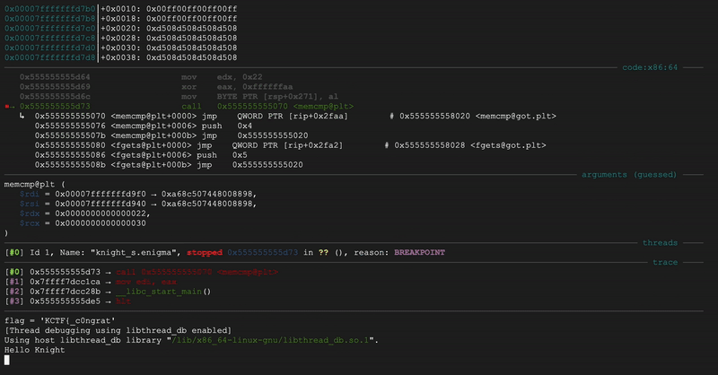

## KnightCTF 2025

Heyaa!!  
KnightCTF is held by a team originated from Bangladesh,
but I didn't know so I kinda confused at first from how many 'Indians' are there.
All the challenge are quite easier than most CTFs nowaday,
but still fun regardless!

I played this CTF with my lovely team, LastSeenIn2026 <33  
In respect to reversing, I actually learn how ctype works,
some Ghidra nuances, and practicing with IDA Pro (I'm still new with it XD).

> Do note that the variables in decompiled code are mostly renamed for your viewing convenience :>

This write-ups also include helpful things I learned in this CTF,
and I wanna share it with y'all!!
Okay, without further ado, here's the write-ups!  
Happy reading! ;)

### Binary Quest

We're given `binary.quest`, an `ELF 64-bit LSB pie executable, x86-64` binary.
I say it now: all rev binary in this CTF are just that.  

When I try out `strings`,
I could see the output of the program,
and unexpectedly the first part of the flag:


#### Ghidra vs IDA Pro is weird

Let me explain the binary flow:
1. Load unencrypted flag
2. Encrypt it in memory
3. Take input flag
4. Encrypt it
5. Compare the encrypted input and flag
6. Success if they're the same, else fail!

Well, if it's just like that, then just peek at the flag before it gets encrypted!
We should be able to do this statically.

So, I first tried this with IDA Pro, BUT-  
If you go to `main`, you'll see this static data:


That's just the same as the `strings` command.
There's no other modification to the flag prior to encryption,
so is it really the flag?  
Weird.

Then I retry this with Ghidra,
new project, import binary, auto-analyze, (you get the gist)  
and immediately:

```c {hl_lines=["21-22"],linenostart=20}
  puts(
      "                    ,.\n                  ,_> `.   ,\';\n              ,-`\'      `\'   \'`\' ._\n           ,,-) ---._   |   .---\'\'`-),.\n           ||<\' `-._`-.,;!\'  `-,_.\'`>||\n           | `-._   `-\'\'          _.-\'|.\n           `----._`--------------\'_.---\'\n                /                 \\\n               /                   \\\n"
      );
  puts("Welcome, brave knight, to the realm of Binary Quest!");
  puts("Prove your worth by discovering the sacred flag.\n");
  FUN_001012e0();
  local_b8 = 0x27444c6855475058;
  uStack_b0 = 0x4c247a4c60;
  uStack_ab = 0x602776;
  uStack_a8 = 0x6e4c2c4a;
  enc_flag = (undefined  [16])0x0;
  local_88 = (undefined  [16])0x0;
  local_78 = (undefined  [16])0x0;
  local_68 = (undefined  [16])0x0;
  input = (undefined  [16])0x0;
  local_48 = (undefined  [16])0x0;
  local_38 = (undefined  [16])0x0;
  local_28 = (undefined  [16])0x0;
  encrypt((long)&local_b8,0x15);
  local_88._0_4_ = 0x7d5f3f59;
  enc_flag._8_8_ = 0x7334655f37695f73;
  enc_flag._0_8_ = 0x34575f7b4654434b;
  input_len = strlen(enc_flag);
  encrypt((long)enc_flag,(int)input_len);
  printf("Enter the sacred flag to complete your quest: ");
  __isoc99_scanf("%63s",input);
  input_len = strlen(input);
  encrypt((long)input,(int)input_len);
  iVar1 = strcmp(input,enc_flag);
  if (iVar1 == 0) {
    puts("\nYou have proven your valor, oh noble knight!");
    puts("The kingdom rejoices at your triumph, and the hidden flag is indeed yours.\n");
  }
  else {
    puts("\nAlas, you have failed this time. The quest remains unfulfilled...");
    puts("Return stronger and try again, brave knight.\n");
  }
  return 0;
```

See that? That's just the hex value of the flag before it gets encrypted!  
Ghidra ftw :3


Flag: **KCTF{_W4s_i7_e4sY?_}**

### Knight's Droid

Droid for the Android.
Actually, it's not an ELF this time,
but .apk!

I decompile it with [`jadx`](https://github.com/skylot/jadx), and look around for non-library packages in the output source.
In the `sources` folder,
you'll see `com/knightctf/knights_droid/`,
and there there's three file there:

- `MainActivity.java`
	- This is what I dub the C `main` equivalent in .apk. I started analyzing here. The only notable thing is that it takes input from an interactable EditText, and pass it to the `verifyFlag` function in `SecretKeyVerifier` class.
- `R.java`
	- Static id for strings value used in the application. Sometimes useful for reversers; Irrelevant here.
- `SecretKeyVerifier.java`
	- This is where the flag check happens. I'll go into details below.

Here's what inside the `SecretKeyVerifier` class:

```java {hl_lines=["11-14"]}
private static final String ENC_SEG_A = "wp5_GJECD";
private static final String ENC_SEG_B = "P_u0q_c0p_";
private static final String ENC_SEG_C = "GYPB{_ykjcn";
private static final String ENC_SEG_D = "uKqN_Gj1cd7_zN01z_}";

public static boolean verifyFlag(Context context, String userInput) {
    String fullPackageName = context.getPackageName();
    if (fullPackageName.length() < 20) {
        return false;
    }
    String firstTen = fullPackageName.substring(0, 10);
    int shift = computeShiftFromKey(firstTen);
    String encodedUserInput = droidMagic(userInput, shift);
    return "GYPB{_ykjcnwp5_GJECDP_u0q_c0p_uKqN_Gj1cd7_zN01z_}".equals(encodedUserInput);
}

private static int computeShiftFromKey(String key) {
    int sum = 0;
    for (char c : key.toCharArray()) {
        sum += c;
    }
    return sum % 26;
}

private static String droidMagic(String input, int droidTask) {
    int droidTask2 = ((droidTask % 26) + 26) % 26;
    StringBuilder sb = new StringBuilder();
    for (char c : input.toCharArray()) {
        if (Character.isUpperCase(c)) {
            int originalPos = c - 'A';
            int newPos = (originalPos + droidTask2) % 26;
            sb.append((char) (newPos + 65));
        } else if (Character.isLowerCase(c)) {
            int originalPos2 = c - 'a';
            int newPos2 = (originalPos2 + droidTask2) % 26;
            sb.append((char) (newPos2 + 97));
        } else {
            sb.append(c);
        }
    }
    return sb.toString();
}
```

Since the called function is `verifyFlag`,
we'll start there.  
It's clear that it checks the encrypted input with the encrypted flag.
There's `shift` here,
so it seems like this is just a [caesar cipher](https://www.khanacademy.org/computing/computer-science/cryptography/ciphers/a/shift-cipher),
and I was correct.

1. It first get the first 10 characters of the package name as a 'Key' for calculating the shift.
2. It then calculate the shift based on the key.
3. Caesar shift the input to compare it to the shifted flag.

Well, there's only 26 possible shift here, and it's easy to just brute force them!! :D  
I did that with CyberChef,


and tadaa!!
There's the flag! ^\-^

Flag: **KCTF{_congrat5_KNIGHT_y0u_g0t_yOuR_Kn1gh7_dR01d_}**

### Easy Path to the Grail

We're given another x86_64 ELF binary,
so just like previously,
let's hop to Ghidra! (f Ida)

```c {hl_lines=["10-11"]}
undefined8 main(void) {
  int iVar1;
  undefined8 uVar2;
  byte input [128];
  char local_118 [264];
  
  printf("Enter the password (the original flag): ");
  iVar1 = __isoc99_scanf("%127s",input);
  if (iVar1 == 1) {
    transform_input(input,local_118);
    iVar1 = strcmp(local_118,"D2C22A62DEA62CCE9EFA0ECC86CE9AFA4ECC6EFAC6162C3636CC76E6A6BE");
    if (iVar1 == 0) {
      printf("Correct! The flag is %s\n",(char *)input);
    }
    else {
      puts("Wrong password!");
    }
    uVar2 = 0;
  }
  else {
    puts("Input error.");
    uVar2 = 1;
  }
  return uVar2;
}
```

In short, it encrypt the input and check it to the encrypted flag.
I assume that encrypted string is hexes (yes it is).
You see, there's just one encryption method here :D  
I hope it isn't non-sensical–

```c {hl_lines=["23-26"]}
void transform_input(byte *input,char *param_2) {
  byte flipped_byte;
  char *len;
  byte *i;
  
  len = param_2;
  for (i = input; *i != 0; i = i + 1) {
    flipped_byte = flip_byte(*i);
    sprintf(len,"%02X",(uint)flipped_byte);
    len = len + 2;
  }
  *len = '\0';
  return;
}

byte flip_byte(byte param_1) {
  undefined b;
  undefined res;
  undefined4 i;
  
  res = 0;
  b = param_1;
  for (i = 0; i < 8; i = i + 1) {
    res = res << 1 | b & 1;
    b = b >> 1;
  }
  return res;
}
```

So?  
`transform_input` pass each bytes into `flip_byte` and store it as hex.
As it works in pointer,
it also make sure the encrypted input ends with a zero byte,
if you're wondering.

What's important here is `flip_byte`.
It just, symmetrically flip the bits of the character and return that.
For example: `flip_byte(0b00110010)` becomes `0b01001100`.
That's all, really!

This can be easily decrypted by just doing the same operation,
and I do that in Python:

```py 
c = b'\xD2\xC2\x2A\x62\xDE\xA6\x2C\xCE\x9E\xFA\x0E\xCC\x86\xCE\x9A\xFA\x4E\xCC\x6E\xFA\xC6\x16\x2C\x36\x36\xCC\x76\xE6\xA6\xBE'
def re(byte):
    return int(format(byte, '08b')[::-1], 2)

for cc in c:
    print(chr(re(cc)), end='')
```


Yayy!!

Flag: **KCTF{e4sy_p3asY_r3v_ch4ll3nge}**

### Worthy Knight

ANOTHER ELF binary challenge...
As per usual, put it to Ghidra, then go to `main`.

I replaced the lengthy output strings with short ones here,
so it won't drown out the code.

```c {hl_lines=[19,24,25,29,30,"36-39","42-44",54,"56-59"]}
puts("welcome");
input = (undefined  [16])0x0;
local_b8 = (undefined  [16])0x0;
local_a8 = (undefined  [16])0x0;
local_98 = (undefined  [16])0x0;
local_88 = (undefined  [16])0x0;
local_78 = (undefined  [16])0x0;
local_68 = (undefined  [16])0x0;
local_58 = (undefined  [16])0x0;
printf("Enter your incantation: ");
hash_mem = fgets(input,0x80,stdin);
if (hash_mem == (char *)0x0) {
  puts("oops");
}
else {
  input_len = strcspn(input,"\n");
  input[input_len] = 0;
  input_len = strlen(input);
  if (input_len == 10) {
    p_ctype = __ctype_b_loc();
    input_mem = input;
    do {
      input_c = (*p_ctype)[*input_mem];
      if (((input_c & 0x400) == 0) ||
         (input_c2 = (*p_ctype)[input_mem[1]], (input_c2 & 0x400) == 0)) {
        puts("impure");
        goto LAB_0010124c;
      }
      if ((((input_c & 0x100) != 0) && ((input_c2 & 0x100) != 0)) ||
         (((input_c & 0x200) != 0 && ((input_c2 & 0x200) != 0)))) {
        puts("not resonate");
        goto LAB_0010124c;
      }
      input_mem = input_mem + 2;
    } while (input_mem != input + 10);
    if ((byte)(input[1] ^ input[0]) == 0x24) {
      if (input[1] == 0x6a) {
        if ((input[2] ^ input[3]) == 0x38) {
          if (input[3] == 0x53) {
            nothin = 0;
            input_mem = local_108;
            local_10c = input._4_2_ << 8 | (ushort)input._4_2_ >> 8;
            input_len = strlen((char *)&local_10c);
            MD5((uchar *)&local_10c,input_len,input_mem);
            hash_mem = hash;
            do {
              bVar1 = *input_mem;
              pcVar3 = hash_mem + 2;
              input_mem = input_mem + 1;
              sprintf(hash_mem,"%02x",(uint)bVar1);
              hash_mem = pcVar3;
            } while (local_d8 != pcVar3);
            local_d8[0] = '\0';
            isSame = strcmp(hash,"33a3192ba92b5a4803c9a9ed70ea5a9c");
            if (isSame == 0) {
              if ((input[6] ^ input[7]) == 0x38) {
                if (input[7] == 0x61) {
                  if ((byte)(input[9] ^ input[8]) == 0x20) {
                    if (input[9] == 0x69) {
                      printf("success");
                      printf("CTF{%s}\n\n",input);
                      uVar2 = 0;
                    }
                    puts("fail 5");
                  }
                  else puts("fail 5");
                }
                else puts("fail 4");
              }
              else puts("faill 4");
            }
            else puts("fail");
          }
          else puts("fail 2");
        }
        else puts("fail 2");
      }
      else puts("fail 1");
    }
    else puts("fail 1");
  }
  else puts("len != 10");
}
LAB_0010124c:
uVar2 = 1;
```

Yeah, honestly, that looks so disgusting, sorry T-T  
So nestedd D:  
That's because it checks conditions one by one,
and fail separately with different error output.  
Eww.

Okay, okay, what *conditions*?  
Quite a handful, actually.
If you see based on line 19,
**our input length should be 10**.

And it *checks by pair* of characters,
not byte by bite.
So, our input is basically 5 pair of character.
On line 24-25, at least one of them must be an uppercase character– (cut)

#### C-type Hell

> This section is irrelevant to the solution  
> It's just my rambles about `ctype` :p

Wa– Wait, how so?  
The program uses C's `ctype` function to check the character classification,
like uppercase, lowercase, numeric, etc.
Based on [ctype.h](https://sites.uclouvain.be/SystInfo/usr/include/ctype.h.html),
a call into it would return a bit masks of the argument byte,
with, according to *ChatGPT*, these bitmask table:

| Flag      | Hex   Value | Meaning                                  | Function Equivalent |
| --------- | ----------- | ---------------------------------------- | ------------------- |
| _ISupper  | 0x400       | Character is uppercase                   | isupper()           |
| _ISlower  | 0x800       | Character is lowercase                   | islower()           |
| _ISalpha  | 0x100       | Character is alphabetic                  | isalpha()           |
| _ISdigit  | 0x04        | Character is a digit                     | isdigit()           |
| _ISxdigit | 0x80        | Character is a hexadecimal digit         | isxdigit()          |
| _ISspace  | 0x08        | Character is a whitespace character      | isspace()           |
| _ISprint  | 0x10        | Character is printable                   | isprint()           |
| _ISgraph  | 0x20        | Character has a graphical representation | isgraph()           |
| _IScntrl  | 0x40        | Character is a control character         | iscntrl()           |
| _ISpunct  | 0x200       | Character is a punctuation character     | ispunct()           |

Understand?  
There's two usage of `ctype` here, at line 24 and 29.
The first check if *any* of the pair character is uppercase.
The second check if *both* pair character are not alphabetic, or not a punctuation.
Yeah? I think that's how it works.
BUT NO. It doesn't. *ChatGPT* is dead wrong.  

So I tested it myself and here's what I got:

| Pair combination | Output         |
| ---------------- | -------------- |
| AA               | "not resonate" |
| Aa               | "fail 1"       |
| A;               | "impure"       |
| aa               | "not resonate" |
| a;               | "impure"       |
| ;;               | "impure"       |

The pair combination is repeated 5 times to get input length of 10.
So, as you can see,
it seems like the correct pair is with a lowercase and an uppercase!! :o

Well now that we know, what does it means?
I get "impure" output when there's any punctuation character.
So I deduct,
that the first `ctype` checks if *any* of the pair character is a **punctuation**.
Based on the usage of `or` operator,
it's clear that bit `0` means true for a classification.

Aight, how about the second `ctype`?  
Instead, it checks if *both* of the pair character is uppercase or lowercase. Note the usage of `and` operator here!

From all of that, the `ctype` bitmasks here actually does not conform to the `ctype.h`.
That or I'm just a dummy who get this wrong.
At least with this binary, the bitmask table is:

| Flag     | Hex   | Value     | Meaning       | Function Equivalent |
| -------- | ----- | --------- | ------------- | ------------------- |
| _ISupper | 0x100 | Character | is uppercase  | isupper()           |
| _ISlower | 0x200 | Character | is lowercase  | islower()           |
| _ISpunct | 0x400 | Character | is alphabetic | isalpha()           |

Now this one actually matches the ctype.h!
So, what the frost.
Don't trust *ChatGPT*, guys.
At least fact check it.
I wasted hours stuck on this problem T-T  

Oh well, how would that helps us solve the challenge?  
Nothing really :>  
It's just interesting, and I wanna share it.

#### XOR

So, if you notice from the code highlights,
there's a check for each pair of character,
for example on the first pair:

```c
    if ((byte)(input[1] ^ input[0]) == 0x24) {
      if (input[1] == 0x6a) {
```

Ohh, wait, this is– really??  
The value for the second (`[1]`) character is 0x6A,
and in ASCII, that's `j`.
Ehh, now it also checks first (`[0]`) character,
by XOR-ing it with `j` and see if the result is `0x24`.

XOR is XOR, and you can un-XOR a byte by XOR-ing the XOR result with the other byte!  
`a ^ b = c` and `c ^ b = a`.  
So here, we can calculate what the first character like this:
```
>>> # input[1] ^ input[0] == 0x24
>>> input[1] = 0x6a
>>> input[0] = input[1] ^ 0x24
>>> input[0]
78
>>> chr(input[0])
'N'
```

So, just like that,
I got the first character.  
This kind of check is also performed on the 2nd, 4th, and 5th pairs.
Just like that,
we know the flag would be `NjkS??YaIi`
Wait, how about the 3rd pair?

#### MD5

The 3rd pair is checked for its MD5 hash value,
instead of the XOR check for other pairs.
It's still trivial to brute-force though,
since it's only 2 character!


Now the flag is complete: `NjkSfTYaIi`.  
BUT– when I actually try it,
it fails??  
What happened was I didn't notice a swap operation,  
`local_10c = input._4_2_ << 8 | (ushort)input._4_2_ >> 8;` (line 42)  
So for the input, just swap them beforehand,
so that swap reverse the swap I did :>  
There's the flag!


Flag: **KCTF{NjkSfTYaIi}**

### Knight's Enigma

So, I actually up-solve this challenge using a gdb solver script by @`mohammadolimat` (Discord).
That's mostly just because my laptop is an Mac M1,
and debugging x86_64 binaries have always been a tough things for me.  
I asked for [QnQSec](https://ctftime.org/team/367683)'s help regarding this issue and someone mentioned Google's Cloud Shell Editor.
It's a free x86_64 shell that you have admin access to,
so you can install whatever things you like there!!
What's cool is that it has gdb preinstalled!! :D  
Although, the VM hard reset after 20 minutes of inactivities,
and your system modification doesn't persist across sessions.
I'm sure I can just make a setup script whenever I start a session there ;)  
Big thanks to @`5alv1.py` !! <33

Instead of a forward write-up, let me explain why this solver is how it is; reverse write-up!

```py
from string import punctuation, ascii_letters, digits
import gdb

print("Solver credits to @mohammadolimat !!")

def extract_values(reg):
    values = []
    reg = reg.splitlines()
    for i in range(len(reg)):
        x = reg[i].split(":")[-1].strip().split()
        as_int = list(map(int, x))
        values.extend(as_int)
    return values


gdb.execute("file ./knight_s.enigma")
gdb.execute("b *0x555555555d73")
flag = ""
cnt = 0
while cnt < 34:
    for i in punctuation + ascii_letters + digits:
        tmp = flag + (i * (34 - cnt))
        with open("f.txt", "w") as f:
            f.write(tmp)
        gdb.execute(f"r < f.txt")

        rsi = gdb.execute("x/34ub $rsi", to_string=True)
        rdi = gdb.execute("x/34ub $rdi", to_string=True)
        rsi = extract_values(rsi)
        rdi = extract_values(rdi)
        if rsi[cnt] == rdi[cnt]:
            flag += i
            cnt += 1
            print(f"{flag = }")
            break
        print(f"{flag = }")
    print(f"{flag = }")
```

You might tried this script with `python3 solve.py`,
but that won't work, duh.
You use this script by getting into gdb and typing `source solve.py`!
This is because `import gdb` only exist inside of gdb, and not in your usual python interpreter.

Aight, so what's the deal with this challange?  
It just checks if our encrypted input flag matches the encrypted target flag.
But, it's really long, and most annoyingly, cryptic.
Here's just one part of it all:

```c
        auVar117._0_2_ = uVar81 >> 2;
        auVar117._2_2_ = uVar83 >> 2;
        auVar117._4_2_ = uVar84 >> 2;
        auVar117._6_2_ = uVar85 >> 2;
        auVar117._8_2_ = uVar86 >> 2;
        auVar117._10_2_ = uVar87 >> 2;
        auVar117._12_2_ = uVar88 >> 2;
        auVar117._14_2_ = uVar89 >> 2;
        auVar105._8_4_ = 0x3f3f3f3f;
        auVar105._0_8_ = 0x3f3f3f3f3f3f3f3f;
        auVar105._12_4_ = 0x3f3f3f3f;
        auVar61[1] = c[1] * '\x02';
        auVar61[0] = c[0] * '\x02';
        auVar61[2] = c[2] * '\x02';
        auVar61[3] = c[3] * '\x02';
        auVar61[4] = c[4] * '\x02';
        auVar61[5] = c[5] * '\x02';
        auVar61[6] = c[6] * '\x02';
        auVar61[7] = c[7] * '\x02';
        auVar61[8] = c[8] * '\x02';
        auVar61[9] = c[9] * '\x02';
        auVar61[10] = c[10] * '\x02';
        auVar61[0xb] = c[0xb] * '\x02';
        auVar61[0xc] = c[0xc] * '\x02';
        auVar61[0xd] = c[0xd] * '\x02';
        auVar61[0xe] = c[0xe] * '\x02';
        auVar61[0xf] = c[0xf] * '\x02';
        auVar118._0_2_ = uVar81 >> 3;
        auVar118._2_2_ = uVar83 >> 3;
        auVar118._4_2_ = uVar84 >> 3;
        auVar118._6_2_ = uVar85 >> 3;
        auVar118._8_2_ = uVar86 >> 3;
        auVar118._10_2_ = uVar87 >> 3;
        auVar118._12_2_ = uVar88 >> 3;
        auVar118._14_2_ = uVar89 >> 3;
```

There's A LOT MORE before and after this part.
Can you even understand what this does?  
Maybe you can, but it'll be hard, for sure.
This is where dynamic analysis, or debugging,
becomes really useful (when you can actually do it).

Someone said, this encryption is a one-to-one mapping,
and that the table generation is just, weird.
I wonder how the author made this.
With that info,
you can assume that there's not gonna be any character mapping collision!

Anyway, here's how the solver retrieve the flag.
There's this `memcmp` instruction to check the encrypted flag:  
`isCorrect = memcmp(enc_input,&target,0x22);`,  
where enc_input is the encrypted input flag.
You'll notice the `0x22` there,
and yup!
The flag length is indeed 34.  

Since we're doing this gdb,
where we don't know the exact address of the call to `memcmp`,
we can find its offset like this:


`memcmp@plt` is the call, because it calls `memcmp` based on [procedure linked table](https://stackoverflow.com/questions/5469274/what-does-plt-mean-here), to adjust addresses based on where code sits in virtual memory using dynamic loading and linking.
**I put a breakpoint there,** and run the binary until it hit the breakpoint.


Just above the command prompt, you can see the stack trace of the program.
**What matters is the function address of `text eax, eax`,**
**the next instruction after `main`'s call to `memcmp`.**
I repeatedly type `fin` (`finish`) to return from current function,
until I got to `text eax, eax`


Just above `test` is where the call instruction is located,
and you can see the address is `0x555555555d73`!  
That's the exact breakpoint that the solver set.

Now, you might asks, "why rsi and rdi?"  
Simply put, that's just how function calling convention works here.
The binary set the value of `rsi` and `rdi` because that's the argument to the `memcmp` call.
For `memcmp@plt`,  
**`RDI` is the first argument (`enc_input`),**  
**`RSI` is the second argument (`&target`), and**  
**`EDX` as the third argument (`0x22).**

```text
0010117a   LEA   RDI=>enc_input,[RSP + 0x250]
00101d0f   LEA   RSI=>target,[RSP + 0x1a0]
00101d64   MOV   EDX,0x22
00101d73   CALL  <EXTERNAL>::memcmp
```

That's equivalent to `memcmp(enc_input, &target, 0x22)`!  
Since this is one-to-one mapping,
the encrypted character value is independent of other characters.
And that's what the solver exploit here.

**For each character index,**
**the solver brute force its value,**
**until it matches the corresponding target character at the same index.**
That's simple in principle!  
Now what's left is the implementation,
since static and dynamic solver much different.  
For simulating input, this script uses file redirection,
like you can see here:

```py
        with open("f.txt", "w") as f:
            f.write(tmp)
        gdb.execute(f"r < f.txt")
```

Well, I think that covers most of the things I learned for this challenge.  
I'm really amazed by how my shell view seems tearing with this script running XD  
Seeing the flag get constructed one byte at a time is quite a sight to behold :>  




Flag: **KCTF{_c0ngrat5_knight_y0u_g0t_1t_}**