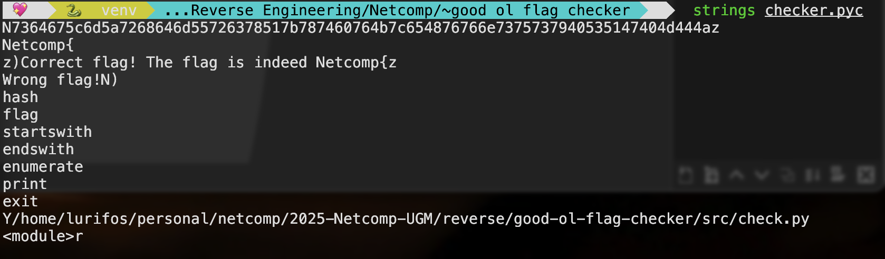
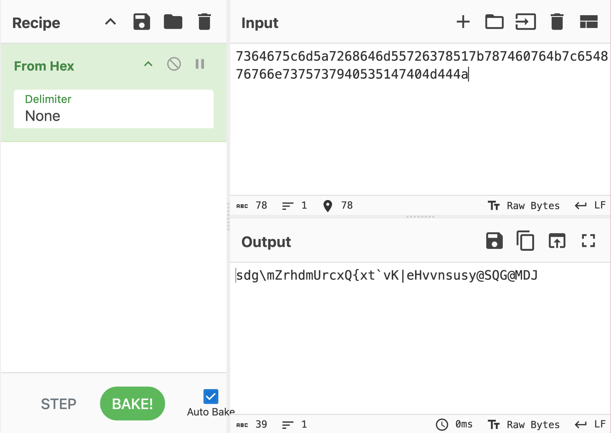
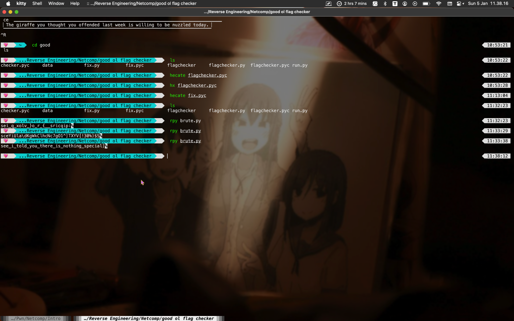

---
title: Netcomp 3.0 Quals
slug: netcomp-3.0
date: 2025-02-03
description: My SHS Team's First CTF
categories:
  - Write-up
tags:
  - Institute
  - National
---

## Netcomp 3.0 Qualification Write-up

Netcomp is a local networking and cyber security competition held by University of Gadjah Mada in Yogyakarta–my home town! :D  
It was open for high school and college student division,
with jeopardy format for the quals and boot2root for the finals.
Honestly, I'm nothing in boot2root, so this write-up is just a few of the challenges we solved :>  
This is the first CTF that my SHS school team,

**⋆𐙚₊˚⊹♡ `sixnthesis` ⋆౨ৎ˚⟡˖ ࣪ **

ever played! Even so,
we got to finals by going in the top 8 of the high school division B)

Online gdocs version [here](https://docs.google.com/document/d/14n2jHKG0hW4DBrXCIdVZEo4F83wPAUEjIP0y7rARCLg/edit?usp=sharing)!! GIFs can move :O!  
Anyway, happy reading!! :DD

## REVERSE ENGINEERING

### [100] good ol flag checker [25 Solves]

Easy-going, relaxed, friendly, nothin special.

###### author: Lurifos

#### Summary

We’re given flagchecker, a python compiled bytecode containing xor-index encrypted marshal code object of the flag checker. Just decompile, decrypt, and then decompile (if you can) to get the flag! 

#### Solution \<3

I don’t have pycdc installed! D: I ~~wasted~~ spent minutes trying to install it. Silly me, I still can’t differentiate cmake and make. When I got it compiled, pycdc can’t fully decompile it, DUH. And oh well you know what, an online decompiler does it better, so maybe you can watch out for that possibility too next time :\>  

  
So, this script takes the flag input to be checked, then decrypts and runs the marshal code inside it that is responsible for the flag checking logic. See there! The bytes are XOR’ed with its index, and this is easily reversible. ;) We can just decrypt it by doing the exact same operation, and that’s XOR cipher for you.  

You can see on line 10, the current `__file__` is read, skipping 676 bytes belonging to this small script, essentially reading the marshal object code. Now that we know where they part, use the code to output the marshal code into a file, checker.pyc:


import marshal
flag = input('please input the flag:')
i = 0
s = open('flagchecker.pyc', 'rb')
# marshal_code = marshal.loads(bytes([c ^ i % 256 for i, c in enumerate(s.read()[676:])]))
open('checker.pyc', "wb").write(bytes([c ^ i % 256 for i, c in enumerate(s.read()[676:])]))
# exec(marshal_code)


  
See these strings? That means the decryption is correct! ^\_^  
However, when I try to decompile it with both PyLingual and pycdc, they complain!! It isn’t a .pyc file?! BAD [magic number](https://gist.github.com/leommoore/f9e57ba2aa4bf197ebc5)?! Ohh, maybe add the magic number myself?? NOPE– This kind of situation gives me flashbacks…  

  
Woaahh, would that work here?? I opened checker.pyc in hecate and Helix💜  

  

  
Yeah, the start of the file doesn’t seem like any magic number. You might have noticed a weird first string on checker.pyc (see above!) and I did realize that too here. Is that… [ASCII Hex](https://www.ascii-code.com/)?!    
BAM, MY HEART. BEATING. HARD. I opened cyberchef to check, and dang right! Now, with these visible function name strings, I guess what could the check be? I noticed the similarity to encryption with enumerate, i and c, in addition to ord and int.  

Obviously, that ASCIIs is encrypted, and I’m missing the operator for `c ? i % 256`, and had to guess it. I tried from addition, then reduction, before finally getting the right one, XOR!! ^w^

#### Solver 🔥🔥


s = b"\x73\x64\x67\x5c\x6d\x5a\x72\x68\x64\x6d\x55\x72\x63\x78\x51\x7b\x78\x74\x60\x76\x4b\x7c\x65\x48\x76\x76\x6e\x73\x75\x73\x79\x40\x53\x51\x47\x40\x4d\x44\x4az" # should've removed this z
for i, c in enumerate(s):
    print(chr(c ^ i % 256), end='')


**Flag: `Netcomp{see_i_told_you_there_is_nothing_special}`**  
**Rating [6/10]**  

I’m ✋🏻so 😢dumbb 😭– For HOURS I thought that marshal object code is .pyc (they’re not, well almost the same but no). I kept asking “Wheree’ss the magic numberr??”- adding them myself still doesn’t work :\<. Uh, I mean like, I’m not that good with .pyc anyway so don’t blame mee :p

## WEB EXPLOITATION

### [100] Karbitan [39 Solves]

Ada cewek anime cantik klaim, ada lagi cewek anime cantik klaim, ada lagi klaim. Itu namanya penyakit karbitan

URL: [http://103.127.138.252:23130/](http://103.127.138.252:23130/)

###### author: cacadosman

#### Summary

We’re asked to get 5000 actions in 60 seconds, that’s 5000 APM!!? How?? EZ, just spaamm websocket updates till you win!! 

#### Trying-Trying Out

Ahh yes… another waifu web chall, my favorite gender. Web exp is my worst category, and I’m pleasantly surprised that I pulled this off :D If you’re anti-social, then you might not know what “Karbitan”, but it’s important for this challenge (enjoyment)!!! 

Basically that, but here, instead of football teams, it’s anime waifus!

When we open the link, we get this page!  

Aflo: Basically, all we had to claim the flag was to submit our waifu/husbu’s name and click on Alya (from Alya Sometimes Hides Her Feelings in Russian, or Roshidere) repeatedly until we got a score of 1000\. Simple right? NAUR T-T

Effie: Well, kinda, (I don’t even know who Alya is). Everytime you click, press your keyboard, or what else, you get a point! The premise seems simple, spam fast enough and get the flag, 1000 is totally reachable manually (albeit tiring). But when you do, you fail?  
Late to mention, but this challenge gives us the server code:


 const express = require('express');
 const app = express();
 const http = require('http').createServer(app)
 const sqlite3 = require('sqlite3').verbose();
 const db = new sqlite3.Database('scores.db');
 const io = require('socket.io')(http, {
     cors: {
         origin: '*',
         methods: ['GET', 'POST'],
        credentials: true,
        transports: ['websocket', 'polling'],
    },
    allowEIO3: true
})
const port = process.env.PORT || 3000

db.serialize(() => {
    db.run("CREATE TABLE IF NOT EXISTS scores (uuid TEXT PRIMARY KEY, name VARCHAR(255), score INTEGER)");
});

let clients = []

const NETCOMP_FLAG = 'Netcomp{coba_submit_flagnya_dulu}'
const MINIMUM_SCORE_FOR_FLAG = 5000
const MAX_ALLOWED_SCORE_PER_TICK = 50

io.on('connection', async (socket) => {
    let clientIndex = clients.indexOf(socket)
    if (clientIndex != -1) {
        clients[clientIndex] = socket
    } else {
        let currentTimestamp = Date.now()
        socket.score = 0
        socket.createdAt = currentTimestamp
        socket.lastUpdate = currentTimestamp
        clients.push(socket)
    }

    if (socket.score != null)
        socket.emit('score', socket.score)

    socket.on('flag', async () => {
        db.get("SELECT score FROM scores WHERE uuid = ?", [socket.uuid], function(err, row) {
            if (row.score >= MINIMUM_SCORE_FOR_FLAG) {
                socket.emit('flag', NETCOMP_FLAG)
            } else {
                socket.emit('flag', 'LARI ADA KARBIT!')
            }
        });
    })

    socket.on('init', async (data) => {
        socket.uuid = data.uuid
        socket.name = data.name
        socket.score = 0
    })

    socket.on('update', async (data) => {
        if (data.score > 0) {
            if (data.score > MAX_ALLOWED_SCORE_PER_TICK) {
                // do nothing
            } else {
                socket.score += data.score
            }
        }
        let currentTimestamp = Date.now()
        if (currentTimestamp - socket.createdAt > 60000) {
            socket.disconnect()
        }
    })
})

function emitScore() {
    clients.forEach(client => {
        if (client.score != null)
            client.emit('score', client.score)
    })
}

function loadScores() {
    setInterval(saveScores, 1000)
}

function saveScores() {
    clients.forEach(client => {
        if (client.score != null) {
            db.run("INSERT OR REPLACE INTO scores (uuid, name, score) VALUES (?, ?, ?)", [client.uuid, client.name, client.score], function(err) {
                if (err) {
                    console.log(err)
                }
            });

        }

    })
}

function purgeClients() {
    let currentTimestamp = Date.now()
    clients.forEach(client => {
        if (currentTimestamp - client.createdAt > 60000) {
            client.disconnect()
        }
    })
    clients = clients.filter(client => currentTimestamp - client.createdAt <= 60000)   
}

loadScores()
setInterval(emitScore, 1000)
setInterval(purgeClients, 1000)

http.listen(port, () => console.log(`App listening at port ${port}`))


I won’t go into great details about the code. Line 46 is where the flag would print, but to reach there, **our score must be 5000 when we “Claim Flag”, not 1000**. Based on purgeClients (line 99), we only have 60 seconds to reach 5000 points. The vulnerability here is that there's a maximum allowed score addition of 50 (line 25\) per tick, supposedly…  
It’s intended that there’s only one call of emitScore (update) per second. **However, that tick is based on the server, and not on the client**! Get it? What comes next? Attackers could spam emitScore and the server doesn’t anticipate this! It would treat that as if it’s intended, but no!! That’s the vulnerability! 🐞💰 (idk what it’s called though) How did I exploit it? Well, I got backseated by Arcanum Cyber Security Bot (ChatGPT). :p  
Ehem, I have one hour left before this CTF ends 🤔 (ohNoo)  
I haven’t downloaded BurpSuite?? 🤨 (just do it then)  
Never used other features than intruder?! 😰 (uh buttons?? where?)  
In all seriousness, I first captured a few [websocket](https://en.wikipedia.org/wiki/WebSocket) messages with the Burp Browser, on the `Proxy tab > WebSockets History`, and looked at those marked to be sent to the servers.  

  
It first sends an init message, then sends a continuous update of score, like these below. For every second, the server sends a response about your score.


["init",{"uuid":"29b87cc0-4e23-4dca-9a01-e019a541c41e","name":"","score":0}] ["update",{"name":"","score":9}]


“This suggests the server uses Socket.IO communication with JSON-formatted payloads.” To do the exploit, we just need to spam this message with a score of 50, the maximum accepted.  
From WebSockets History, select one of the update messages and `Send to Repeater`. Repeater will automatically repeat that, but won’t have the 50 score we want. **Switch tab to `Repeater`, change the score to 50, and repeatedly `Send` it!! NO, SPAM IT!** (every 60 seconds, a minute passes!! D:) You can kinda see the server’s response about your score to track your progress on the History panel! Once you hit 5000, “Claim Flag”, and that’s it! :D  

**Flag: `Netcomp{webs0cket_k4rbitan_so_e4sy}`**  
**Rating [7/10]**  

MENTAL. Look at that clock! Kinda close hehe, we hope we’ll get to top 8 for SMA/SMK sederajat :)

## CRYPTO

### [100] I swear this is not a web or reverse [77]

It's been a few months since I only reported HTTP Headers findings 😭

Today, I am pentesting a company's internal web app and wonder if you could help me get a critical finding here...

###### BerlianGabriel

> This write-up is written by **Shawnxe**

#### Main

I used `wget` in the shell to download the website's source code from the copied link, then displayed the source code using `cat`. After that, I imported the HTML code into Visual Studio Code for further analysis.  


<!DOCTYPE html>
<html>  
<head>  
   <title>Employee Internal Portal</title>  
     
</head>  
<body>  
   <h1>Employee Internal Portal</h1>  
   
There is no internet connection within our super secure internal network. That way, hackers can't get in.
  
   
Because there is no internet, this website has been designed to securely verify your login password offline!
  
   <input type="password" id="passwordInput">  
   <button onclick="secureHash()">Login</button>

     
</body>  
</html>


I realize that the script hashes the entered password using a series of mathematical operations and compares it with the expected hash string. To address this problem, I reverse the hashing mechanism by examining the Python code generated from the JavaScript script.

#### Solver


magic = [  
   0x1fa9787f52d6819dac3e51c96c9850ac9a68a000,  
   0x551e7b2ade66a9cd21538d24f8232eb9e3c6a00,  
   0x685130edf575c5fd89b4ea52d8ce440fb75d40,  
   0x4d2b06845e7f210fd15f3697fe234c69919a0,  
   0x267227d769f1422427c2f550f7852c59bfec,  
   0xd9fd323c23dd5a26579cb53a8a42996b38,  
   0x388a9fbf545b3b1a5e4b80376e94de767,  
   0xadef7b085371d7244d43d0011e7c6d5,  
   0x18cbc26aefc3b3b1ef4588ce4acc6b,  
   0x296e5ed6f99d55e5efb08eb856e9,  
   0x314ef6584d10a8c5226f105685,  
   0x2798a7a450463592994fc72f,  
   0x133caaa3da819c1ca0087d,  
   0x445974d799d8bcf9c3b  
]

magic2 = 0x2971713e56d0006e6a0b48126ca34000  
expected_string = "7X!7|!@V|7eV77_!|@8S"

def reverse_hash(expected_string):  
   result_password = ""

   for char in expected_string:  
       found = False  
       for guess in range(33, 127):  # Printable ASCII range  
           calculated_char = ''  
           oneChar = -guess  
           result = 0  
           for j in range(len(magic)):  
               result *= oneChar  
               result += magic[len(magic) - 1 - j]

           nresult = result % magic2  
           result = -result // magic2

           result += (888 - result) * (result > 127)  
           result += (888 - result) * (nresult != 0)  
           result += (888 - result) * (result < 33)

           calculated_char = chr(result)  
            
           if calculated_char == char:  
               result_password += chr(guess)  
               found = True  
               break

       if not found:  
           raise ValueError(f"Could not reverse-engineer character {char}")

   return result_password

password = reverse_hash(expected_string)  
print(f"Recovered password: {password}")


The Python code simulates the hashing process by matching each character in the `expected_string` through brute-forcing the ASCII values (33–126). The code replicates the hashing function from JavaScript using a `magic` array and `magic2` values, applying mathematical operations and adjusting the results to fall within the range of printable ASCII characters. If the result matches a character in the `expected_string`, the corresponding password character is added to the final result. This process continues until the entire password is discovered or an error occurs if no match is found. Using this method, I successfully identified the original password that produces the `expected_string`.

**Flag: `Netcomp{1t_1S_b4S1C411y_Sb0x}`**  
**Rating [7/10]**  

## BONUS

### [1] Bonus [82]

#### Summary

Diberikan sebuah “challenge” bonus yang ketika dibuka, menampilkan flag.  

**Flag: Netcomp{semangat_dek_heker}**  
**Rating [1/10]**  

## DOCUMENTATION

^ when yh decompile & compile at the same time

## THANK YOU 💜

Thanks for reading, stay safe!!

Remarks\~

**Effie:**   
I spent way too much time on this one write-up,  
tomorrow is monday T-T  
IF WE GET TO FINALS I GONNA GO BACK HOME (AGAIN– jogja moment :v)   
Much thanks to my teammates! They do the school administration stuffs, hehe ^u^

**Aflo:**  
 
– a million thanks to my incredibly brilliant teammates, without whom I couldn’t enjoy the pleasure of skipping a school event \<3  
(I’m a total newbie im sorry T-T)

**Shawnxe:**  
Oh my gossshhh, welp kinda surprised I can do it wkwkwkwk  
Thankyou for my reallyyy smart teammates that support me on solving the problem and also mentally healthy wkwkwkwk (Tantrum dikit ga ngaruh:v)

(Shawnxe smashed dis all while doin physics ✍🏻homework 🔥)

**`;`**
