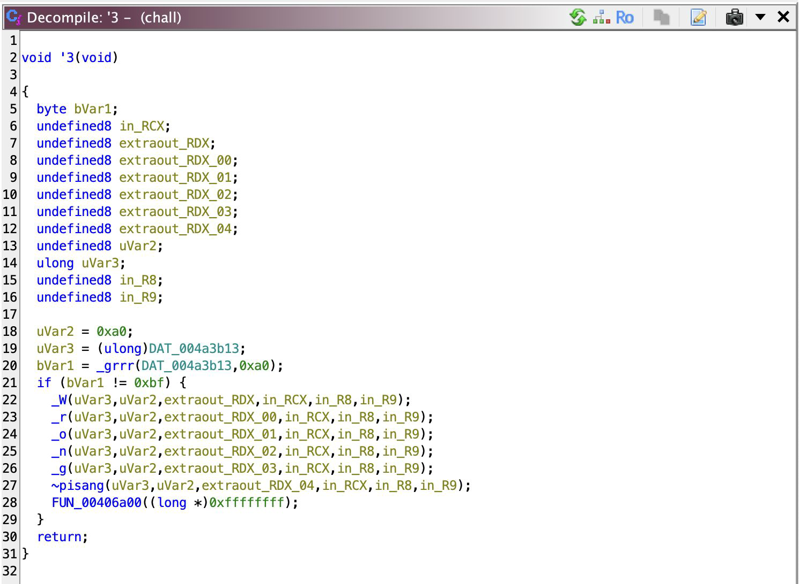
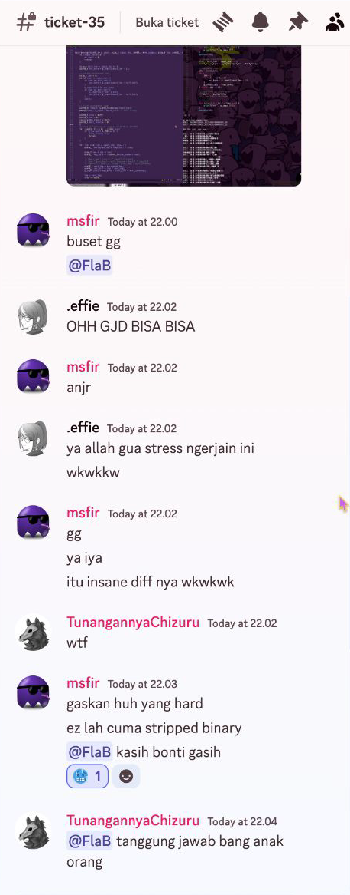

---
title: SNICTF 2024
slug: snictf-2024
date: 2024-11-25
description: My best time soloing any CTF
categories:
  - Write-up
tags:
  - SNICTF 2024
---

## Serikat Newbie Indonesia's Capture the Flag 2024

SNICTF 2024 is such a memorable one for me personally >v<  
It's held by the almighty [SNICTF](https://www.linkedin.com/company/serikatnewbie-id) team, who's known for being on the best in the country!  

In short, I got 4th place and also nominated as for the **best write-up**!
You can see its gdocs version [here](https://docs.google.com/document/d/1rOHj1BjaLcPQfOTUGRcqjM7UX1d8ZWya8h9zZmG6ZuA/edit?usp=sharing).  
Anyway, I'll put the write-up I made here, cuz why not :p

## FORENSIC

### [100] quotes of the day [31 Solves]

Kata-katanya dong buat hari ini.

[https://drive.google.com/file/d/1Y-nRtuoGJORsQbN9YscZhmirZN7hDhnv/view?usp=drive\_link](https://drive.google.com/file/d/1Y-nRtuoGJORsQbN9YscZhmirZN7hDhnv/view?usp=drive_link)

Jangan lupa flagnya nanti diwrapped dengan `SNI{}`

###### Author: fr3nnn

#### Solving it

Got `quotes_of_the_day.png: PNG image data, 808530225 x 808529968, 32-bit`, then I tried strings on it:  

  
That strings looks reverse, so I tried ran `cat 'quotes_of_the_day.png' | rev >quotes_of_the_day_reversed.png` but it failed. So I just `strings quotes_of_the_day.png | rev >strings-rev` it and `cat strings-rev`:

  
Damn, that’s big but it’s just binary of ASCII, and using [gchq.github.io/cyberchef](http://gchq.github.io/cyberchef), I’m able to get this part of the flag:  

  
Okay, so I open up `strings-rev` in Helix and found this:  

  
That’s three parts of the flag found!

**Flag: SNI{jika_seseorang_bercerita_tentang_buruknya_diriku_kabari_aku_siapa_tau_ceritanya_kurang_lengkap_e35983a5738e}**  
**Rating [4/10]**  

## REVERSE ENGINEERING

### [162] BabyRev [24 Solves]

Cuma chall baby

###### Author: Msfir 

#### Main

Open up your Ghidra, new project, import, auto-analyze, and bam, you’ll get this `main` function:


undefined8 main(void) {
  char *__s;
  byte xorry;
  ulong magik;
  size_t input_len;
  undefined8 uStack_60;
  char tmp [4];
  int key_idx;
  int _0x16;
  int n;
  char *input;
  long local_40;
  size_t p_iterator;
  FILE *flag;
  int idx;
  int n_;
  int i;
  FILE *p_flag;

  uStack_60 = 0x1011d1;
  flag = fopen("flag.txt","r");
  uStack_60 = 0x1011eb;
  fseek(flag,0,2);
  uStack_60 = 0x1011f7;
  p_iterator = ftell(flag);
  uStack_60 = 0x101211;
  fseek(flag,0,0);
  p_flag = flag;
  input_len = p_iterator;
  local_40 = p_iterator - 1;
  magik = (p_iterator + 0xf) / 0x10;
  input = tmp + magik * -0x10;
  (&uStack_60)[magik * -2] = 0x101264;
  fread(tmp + magik * -0x10,1,input_len,p_flag);
  __s = input;
  input[p_iterator - 1] = '\0';
  (&uStack_60)[magik * -2] = 0x101280;
  input_len = strlen(__s);
  n = (int)input_len;
  i = 1;
  if ((input_len & 1) == 0) {
    n_ = n + -1;
  } else {
    n_ = n + -2;
  }
  for (; i < n_; i = i + 2) {
    tmp[1] = input[i];
    input[i] = input[n_];
    input[n_] = tmp[1];
    n_ = n_ + -2;
  }
  _0x16 = 0x16;
  for (idx = 0; idx < n; idx = idx + 1) {
    if (0 < idx) {
      (&uStack_60)[magik * -2] = 0x101310;
      putchar(0x20);
    }
    key_idx = idx % _0x16;
    tmp[3] = input[idx];
    tmp[2] = "SerikatNewbieIndonesia"[key_idx];
    xorry = tmp[3] ^ tmp[2];
    (&uStack_60)[magik * -2] = 0x10135d;
    printf("%hhd",(ulong)(uint)(int)(char)xorry);
  }
  (&uStack_60)[magik * -2] = 0x101373;
  putchar(10);
  p_flag = flag;
  (&uStack_60)[magik * -2] = 0x10137f;
  fclose(p_flag);
  return 0;
}


Here’s a refactor of main (Thanks LLM). I hope that even if you’re a beginner, you can infer the meaning from the function name, just practice research and searching teehee:


#include <stdio.h>
#include <string.h>

int main(void) {
   FILE* flag_file;
   char* flag_content;
   size_t file_size;
   const char* key = "SerikatNewbieIndonesia";
   const int key_length = 22;
  
   flag_file = fopen("flag.txt", "r");
  
   // Get file size
   fseek(flag_file, 0, SEEK_END);
   file_size = ftell(flag_file);
   fseek(flag_file, 0, SEEK_SET);
  
   flag_content = (char*)malloc(file_size + 1);
  
   fread(flag_content, 1, file_size, flag_file); // store to memory
   flag_content[file_size - 1] = '\0'; // null terminator
  
   int content_length = strlen(flag_content);
   
   // reversing section
  
   int left = 1;
   int right;
   if (content_length % 2 == 0) {
       right = content_length - 1;
   } else {
       right = content_length - 2;
   }
  
   while (left < right) {
       char temp = flag_content[left];
       flag_content[left] = flag_content[right];
       flag_content[right] = temp;
      
       left += 2;
       right -= 2;
   }
  
   for (int i = 0; i < content_length; i++) {
       if (i > 0) {
           putchar(' ');
      
       // XOR operation with key
       int key_index = i % key_length;
       char encoded = flag_content[i] ^ key[key_index];
      
       // Print encoded value
       printf("%d", encoded);
   }
  
   // Print newline and cleanup
   putchar('\n');
   fclose(flag_file);
   free(flag_content);
  
   return 0;
}


So, I’ve renamed the variable for easier reading. Thank me, okay. You can see that this program just opens up `flag.txt`, and uses an iterator to work with it. Up until line 565, it’s just a setup not worth going into details. Line 565 - 569 make sure `n_` is even, as we swap odd indexed ([1], [3], etc.) characters with its symmetrical counterpart, leaving the first character (and the last if length is odd) untouched. Here’s a visualization:  

  
A quite interesting byte swap method, I guess. Then, it just XOR the bytes with a key that we know, so it’s pretty much useless. We can even just use the encryption method to decrypt it, duh. We reverse the output from `output.txt` that was given to us on the XOR first, then the swap- like that, and we’ll have the flag!

#### Solver


 enc = [0, 24, 59, 86, 2, 14, 43, 17, 17, 24, 0, 54, 7, 46, 49, 11, 1, 11, 16, 10, 1, 0, 53, 58, 0, 0, 18, 18, 1, 53, 90, 57]
 key = "SerikatNewbieIndonesia"
 shu = []
 
 for idx, e in enumerate(enc):
     shu.append(enc[idx] ^ ord(key[idx % len(key)]))
 
 left = 1
 right = len(enc) - (1 if len(enc) & 1 == 0 else 2)

while left < right:
    tmp = shu[left]
    shu[left] = shu[right]
    shu[right] = tmp

    left += 2
    right -= 2

for w in shu:
    print(chr(w), end='')


**FLAG: SNI{is_it_baby_enough_for_you??}**  
**Rating [5/10]**  

Just a baby chall, nothing to say. Maybe,

### [484] wleee [6 Solves]

demn, look the size of this executable  
###### Author: FlaBBB

#### Decompiling

I used DotPeekTM in my Windows 11 VM to decompile it… Here’s the full result:


 // Decompiled with JetBrains decompiler
 // Type: Program
 // Assembly: wleee, Version=1.0.0.0, Culture=neutral, PublicKeyToken=null
 // MVID: 40CDD1A5-1010-491C-B590-E97E98350824
 // Assembly location: wleee.dll inside \\Mac\CTF\Reverse Engineering\SNICTF\wleee\wleee.exe)
 
 using System;
 
 #nullable enable
internal class Program {
  private static Program.Checker checker1(string flag) {
    int correct_number = 0;
    int[][] numArray = new int[8][] {
      Array.Empty<int>(),
      Array.Empty<int>(),
      new int[2]{ 5, 37 },
      new int[7]{ 15, 19, 22, 24, 26, 30, 34 },
      new int[5]{ 1, 2, 4, 18, 40 },
      new int[8]{ 0, 6, 13, 20, 25, 28, 29, 35 },
      new int[14]{ 7, 8, 10, 11, 16, 17, 21, 23, 31, 32, 33, 36, 38, 39 },
      new int[6]{ 3, 9, 12, 14, 27, 41 }
    };
    for (int index1 = 0; index1 < numArray.Length; ++index1) {
      for (int index2 = 0; index2 < numArray[index1].Length; ++index2) {
        if (flag.Length <= numArray[index1][index2])
          return (Program.Checker) (() => false);
        correct_number += (int) flag[numArray[index1][index2]] >> 4 == index1 ? 1 : 0;
      }
    }
    return (Program.Checker) (() => correct_number == flag.Length);
  }

  private static Program.Checker checker2(string flag) {
    int correct_number = 0;
    int[][] numArray = new int[8][] {
      new int[6]{ 15, 22, 26, 30, 34, 37 },
      new int[9]{ 0, 4, 5, 14, 19, 24, 27, 29, 36 },
      new int[4]{ 7, 9, 11, 12 },
      new int[5]{ 17, 21, 38, 39, 40 },
      new int[1]{ 2 },
      new int[1]{ 3 },
      new int[3]{ 18, 23, 41 },
      new int[13]{ 1, 6, 8, 10, 13, 16, 20, 25, 28, 31, 32, 33, 35 }
    };
    for (int index1 = 0; index1 < numArray.Length; ++index1) {
      for (int index2 = 0; index2 < numArray[index1].Length; ++index2) {
        if (flag.Length <= numArray[index1][index2])
          return (Program.Checker) (() => false);
        correct_number += ((int) flag[numArray[index1][index2]] >> 1 & 7) == index1 ? 1 : 0;
      }
    }
    return (Program.Checker) (() => correct_number == flag.Length);
  }

  private static Program.Checker checker3(string flag) {
    int correct_number = 0;
    int[][] numArray = new int[2][] {
      new int[12]{ 1, 7, 9, 10, 12, 16, 18, 21, 23, 30, 34, 36 },
      new int[30] { 0, 2, 3, 4, 5, 6, 8, 11, 13, 14, 15, 17, 19, 20, 22, 24, 25, 26, 27, 28, 29, 31, 32, 33, 35, 37, 38, 39, 40, 41 }
    };
    for (int index1 = 0; index1 < numArray.Length; ++index1) {
      for (int index2 = 0; index2 < numArray[index1].Length; ++index2) {
        if (flag.Length <= numArray[index1][index2])
          return (Program.Checker) (() => false);
        correct_number += ((int) flag[numArray[index1][index2]] & 1) == index1 ? 1 : 0;
      }
    }
    return (Program.Checker) (() => correct_number == flag.Length);
  }

  private static void Main() {
    Program.CheckerCallback[] checkerCallbackArray = new Program.CheckerCallback[3] {
      (Program.CheckerCallback) (flag => Program.checker1(flag)),
      (Program.CheckerCallback) (flag => Program.checker2(flag)),
      (Program.CheckerCallback) (flag => Program.checker3(flag))
    };
    Console.Write("Enter the flag: ");
    string _ = Console.ReadLine();
    foreach (Program.CheckerCallback checkerCallback in checkerCallbackArray) {
      if (!checkerCallback(_)()) {
        Console.WriteLine("Incorrect!!");
        Environment.Exit(1);
      }
    }
    Console.WriteLine("Correct!!");
  }

  public delegate bool Checker();

  public delegate Program.Checker CheckerCallback(string _);
}


#### Reversing

So, it uses 3 different checkers functions for the input. The only difference is the operation done on the byte, and they return true if the index of the byte is in the array row accessed with the result of the operation. Rows of the ‘mapping’ or ‘table’ is accessed through a byte’s:

- Checker1: higher 4 bits (OOOO.XXXX)  
- Checker2: second until fourth least significant bit. (XXXX.OOOX)  
- Checker3: least significant bit (XXXX.XXXO)

So, I just brute forced it. There’s only 100 printable characters, and if you see, the highest index value is 41, so the input length should be 42\. That’s computable!

#### Solver


import string

c1 = [
    [],
    [],
    [5, 37],
    [15, 19, 22, 24, 26, 30, 34],
    [1, 2, 4, 18, 40],
    [0, 6, 13, 20, 25, 28, 29, 35],
    [7, 8, 10, 11, 16, 17, 21, 23, 31, 32, 33, 36, 38, 39],
    [3, 9, 12, 14, 27, 41]
]

c2 = [
    [15, 22, 26, 30, 34, 37],
    [0, 4, 5, 14, 19, 24, 27, 29, 36],
    [7, 9, 11, 12],
    [17, 21, 38, 39, 40],
    [2],
    [3],
    [18, 23, 41],
    [1, 6, 8, 10, 13, 16, 20, 25, 28, 31, 32, 33, 35]
]

c3 = [
    [1, 7, 9, 10, 12, 16, 18, 21, 23, 30, 34, 36],
    [0, 2, 3, 4, 5, 6, 8, 11, 13, 14, 15, 17, 19, 20, 22, 24, 25, 26, 27, 28, 29, 31, 32, 33, 35, 37, 38, 39, 40, 41]
]

for idx in range(42):
    for c in string.printable:
        c = ord(c)
        if idx in c1[c >> 4] and idx in c2[c >> 1 & 7] and idx in c3[c & 1]:
            print(chr(c), end='')


**Flag: SNI{C\#_dotnet_s1ngL3_f1l3_1s_S0ooo0_b\!ggG}**  
**Rating [6/10]**  

T-T T-T T-T my window VM literally broke one day before the CTF started. I tried 3 different hypervisors like UTM & VMWare & then Parallels Desktop, installed Windows 1-by-1 and dotpeek took a katabasis to hell before I- **continue ranting-*  
This is WAY easier than BabyRev, I don’t know why people solve it less…

### [500] Huh [1 Solve]

  
###### Author: msfir

#### tl;dr

“Single-responsibility principle”. That’s what the author said to me before I even started working on it. This chall just annoys reversers with multiple functions that do the same thing. It uses a substitution table and, honestly-I-don’t-know-cipher cuz I just brute it. That’s it!

#### Entry

As always, roll out the reversing carpet. Ghidra then detects an `entry` function, and we’ll jump there!  

  
So, it calls a function that detects and gathers information about the CPU, nothing interesting there, except the function pointer that I’ve given the name `~main_yuk`. `_just_cpu_detecting` then call a function that passes `~main_yuk` to call it.

#### Main

  
Figure A: Renamed; There’s more and more below :p

You peek at it and… a scroll of function calls. Like, just a mile row of them lining up. Such a sight to see. You see more or less it’s divided into 3 by the parameter similarities. Let’s call these `clusters`. Why? Do they have similar functionality? (yes they are). 

#### Print Functions

So, I look at one of them,   

  
And all it does is just call `~bawang` (I renamed it), except with a constant as its first argument. I step out, then check all of the functions within the first cluster and all they do is call `~bawang`, but with a different `param_1`. So then I follow along where this `param_1` is passed along numerous calls and end up with  

  
It calls a function by a pointer, and yeah I don’t know what it does. But what I do know is that when the program first runs it’ll output “Give me flag:”. And well you know, that `param_1` really looks like an ASCII character and correct, and sure they are. So as you can see I’ve already renamed these functions based on what ASCII character they’re passing to `~bawang`, and you can kinda make sense of the output (a prompt) in Figure A. In conclusion, `~bawang` just prints a character LOL.

#### Input Length

What follows is these 32 functions with prefix ‘/’ that shares the same functionality,  

  
Yeah, let me tell you that `read_stream_byte` (renamed) just basically reads ONE byte from a stream, presumably stdin, so we don’t need to go into details about it. It prints “Wrong” if the character read was a newline character, which means that for all 32 bytes read from the stream, it should not be a newline character. In other words, our input length should be **32**!

#### Writing Input to Memory

For this particular `/0`, it writes that byte to `DAT_004a3b2c`. I jump into that memory address referenced and identified what is probably an array of bytes,  

  
And ends at `DAT_004a3b2f`. See, 0x2f - 0x10 is equal to 31, so this REAALLY seems like where these `/` prefix functions. Except that `/0` write to NOT the first index in this array. If I order from `/0` to `/31` where it write their address, it’ll be


DAT_004a3b2c
DAT_004a3b19
DAT_004a3b29
DAT_004a3b14
DAT_004a3b28
DAT_004a3b24
DAT_004a3b21
DAT_004a3b2d
DAT_004a3b2f
DAT_004a3b1c
DAT_004a3b1e
DAT_004a3b1b
DAT_004a3b15
DAT_004a3b27
DAT_004a3b26
DAT_004a3b1d
DAT_004a3b11
DAT_004a3b23
DAT_004a3b12
DAT_004a3b13
DAT_004a3b10
DAT_004a3b22
DAT_004a3b16
DAT_004a3b2e
DAT_004a3b17
DAT_004a3b1a
DAT_004a3b2a
DAT_004a3b1f
DAT_004a3b2b
DAT_004a3b25
DAT_004a3b18
DAT_004a3b20


What do we get from this? So, in short, the program writes input bytes in a ‘random’ order. Basically, like a substitution table, or a map, uh honestly I don’t know what to call it. We can `reverse` this with a `reverse` map, that we can generate with


 with open('orderofwrite', 'r') as f:
     idx = 0
     for line in f:
         wto = int(line[10:-1], 16)-0x10
         print(f'map[{wto:#02d}] = {idx}')
         idx += 1


Which will output


map[28] = 0
map[09] = 1
map[25] = 2
map[04] = 3
map[24] = 4
map[20] = 5
map[17] = 6
map[29] = 7
map[31] = 8
map[12] = 9
map[14] = 10
map[11] = 11
map[05] = 12
map[23] = 13
map[22] = 14
map[13] = 15
map[01] = 16
map[19] = 17
map[02] = 18
map[03] = 19
map[00] = 20
map[18] = 21
map[06] = 22
map[30] = 23
map[07] = 24
map[10] = 25
map[26] = 26
map[15] = 27
map[27] = 28
map[21] = 29
map[08] = 30
map[16] = 31


That we can use as an assignment for the reverse map!

#### THE Checker

  
I denote functions with a prefix `‘` as a byte checker that checks whether the character at that index matches a target byte. If not, it prints “Wrong” and quits the program. This means ALL 32 checks must pass until we get to where it prints “Correct”.  

  
The other checker functions look pretty much the same except that they have different constants for the ‘key’ (`uVar2)` and target value (operand in `if`). It calls `_pusing` (I should’ve picked a better name) with these two values which itself looks like  

  
It xor the input byte with the key multiple times and multiplying key by 2, until key becomes 0, then return the resulting input byte. That’s possible because the key is a byte, and I don’t need to explain to you about overflow. What’s important is: how to reverse this? Duh, since there’s only 100 (printable) possible input values, we can just brute force this method until we get the target value. EZ! 

#### Multiple Checkers??

When I made the solver, I noticed that it failed, even if it should be successful. What’s wrong? Turns out, there are THREE different types of checkers, and function `‘0` uses what’s codenamed `_pusing`. The other, I codenamed `_grrr` and `_charcoal` (I just rename them with what’s there on my immediate thought okay).  

  

  
Lemme tell you this: the same solution for `_pusing` (i.e. bruteforce) also applies to these two, AND they have similar parameter definition, so you only really need to change what you call. The checker function called for character N are


_pusing
_pusing
_charcoal
_grrr
_charcoal
_charcoal
_charcoal
_charcoal
_grrr
_grrr
_pusing
_grrr
_grrr
_grrr
_grrr
_pusing
_pusing
_pusing
_grrr
_charcoal
_charcoal
_pusing
_charcoal
_grrr
_grrr
_pusing
_pusing
_charcoal
_pusing
_pusing
_pusing
_pusing


I referenced how function pointers are implemented and used in another pwn challenge (Coloring). And well, even after characters are checked with the correct function, I still can’t get the flag. Why? dummy, it’s just a mistype for one of the variables in `_charcoal`, changed it from char to unsigned int (or the other way around, I don’t remember), and now the solver is working!!

#### Solver


 #include <stdio.h>
 
 typedef char (*func_ptr)(char, char);
 
 char _pusing(char param_1,char param_2) {
   char bVar1;
   char local_20;
   char local_1c;
   
  local_20 = param_2;
  local_1c = param_1;
  while (local_20 != 0) {
    bVar1 = local_1c & local_20;
    local_1c = local_1c ^ local_20;
    local_20 = bVar1 * 2;
  }
  return local_1c;
}

char _geram_sekali_aduhai(char param_1) {
  unsigned int local_10;
  unsigned int local_9;
  
  local_9 = 0;
  for (local_10 = 0; local_10 < 8; local_10 = local_10 + 1) {
    local_9 = local_9 | (((int)(unsigned int)param_1 >> ((char)local_10 & 0x1f) & 1U) == 0) <<
                        ((char)local_10 & 0x1f);
  }
  return local_9;
}

char _grrr(char param_1,char param_2) {
  char bVar1;
  char local_20;
  char local_1c;
  
  local_1c = param_1;
  for (local_20 = param_2; local_20 != 0; local_20 = (bVar1 & local_20) * '\x02') {
    bVar1 = _geram_sekali_aduhai(local_1c);
    local_1c = local_1c ^ local_20;
  }
  return local_1c;
}

char _charcoal(char param_1,char param_2) {
  char bVar1;
  unsigned int local_20;
  unsigned int local_1c;
  char local_9;
  
  local_9 = 0;
  local_1c = param_1;
  for (local_20 = param_2; local_20 != 0; local_20 = local_20 >> 1) {
    bVar1 = local_1c;
    if ((local_20 & 1) == 0) {
      bVar1 = 0;
    }
    local_9 = _pusing(local_9,bVar1);
    local_1c = local_1c << 1;
  }
  // printf("charcoal");
  return local_9;
}

char target[] = {0x47, 0x7f, 0xe9, 0xbf, 0x87, 0xfb, 0x53, 0xc3, 0x83, 0xe6, 0xf7, 0xde, 0xc6, 0x4c, 0xa8, 0x3f, 0x2b, 0x6e, 0xb0, 0xcc, 0x1a, 0xbb, 0xc3, 0xef, 0x9a, 0x3e, 0x77, 0xaa, 0x05, 0xc1, 0x5c, 0xef};
char key[] = {0xe0, 0x10, 0x35, 0xa0, 0x65, 0xdf, 0x57, 0x1d, 0xef, 0x68, 0x95, 0x96, 0x9d, 0x17, 0xb9, 0xcd, 0xae, 0x08, 0xbf, 0x2b, 0x9d, 0x49, 0x1d, 0x75, 0xd5, 0xf5, 0x05, 0x7d, 0xb2, 0x4c, 0xe9, 0x7c};
func_ptr func_array[] = {_pusing, _pusing, _charcoal, _grrr, _charcoal, _charcoal, _charcoal, _charcoal, _grrr, _grrr, _pusing, _grrr, _grrr, _grrr, _grrr, _pusing, _pusing, _pusing, _grrr, _charcoal, _charcoal, _pusing, _charcoal, _grrr, _grrr, _pusing, _pusing, _charcoal, _pusing, _pusing, _pusing, _pusing};

func_ptr func(size_t idx) {
  return func_array[idx];
}

int main() {
  int map[32];
  char flag[33];

  map[28] = 0;
  map[9] = 1;
  map[25] = 2;
  map[4] = 3;
  map[24] = 4;
  map[20] = 5;
  map[17] = 6;
  map[29] = 7;
  map[31] = 8;
  map[12] = 9;
  map[14] = 10;
  map[11] = 11;
  map[5] = 12;
  map[23] = 13;
  map[22] = 14;
  map[13] = 15;
  map[1] = 16;
  map[19] = 17;
  map[2] = 18;
  map[3] = 19;
  map[0] = 20;
  map[18] = 21;
  map[6] = 22;
  map[30] = 23;
  map[7] = 24;
  map[10] = 25;
  map[26] = 26;
  map[15] = 27;
  map[27] = 28;
  map[21] = 29;
  map[8] = 30;
  map[16] = 31;
  
  for (int i = 0; i < 32; ++i) {
    func_ptr function = func(i);
    // printf("%x of ", function);
    for (char g = 0; g < 127; ++g) {
      if (function(g, key[i]) == target[i]) {
        flag[map[i]] = g;
      }
    }
    // putchar(10);
  }

  for (int i = 0; i < 32; ++i) {
    printf("%c", flag[i]);
  }
}


**Flag: SNI{obfuscated_code_goes_brrrrr}**  
**Rating [8/10]**  

This chall is so tedious omg i have to rename A TON of things and the key/mouse press needed per rename is 💀 (ghidra bilek). Yeah, it’s kinda clever I guess, anti-reversing through redundancies (idk what to call it), wkwkwkw. Funny chall. I first-blooded it btw (sole solver wkwkwk).

### [500] OhNoo [2 Solve]

oh noo, i cant see it even using disassambler  
###### Author: FlaBBB

#### tl;dr

Can’t disassemble, `mprotect` with rwx for runtime-code-injection (crazy ikr), byte xor + multiplication encryption, and then byte xor with byte before it except that it changes midhalf. Very stressful, very fun, very brutal, very cute. Can’t recommend. The other solver isn’t valid if you know, cuz I’M THE ONLY TRUE-

#### Can’t disassemble?

So, cool, okay, you can’t disassemble it. What then?  

  
Weird label, isn’t it? As if that part of the operand should be an instruction…, cuz well it actually is supposed to be an instruction. Just tell our lovely Ghidra to treat that instruction with a shorter length, right click \>\> Modify Instruction Length…  

  

  
Now it can be disassembled!! Yayy :DD- but wait there’s more! There’s another one of this trick at 0x0010110f, just do the same thing and voila! Press D to disassemble these newly accessible bytes!! 0x0010110f should looks like   

   
Wowww, a lot of jumps, but now that everything's disassemble-able, let’s focus on the `~main` function!  

  
Eeh, just your standard input procedure, then- writing bytes to instructions region in memory? Woah. Ghidra is scared omg calm down, I know it’s read only but I’ll explain it when you’re properly fed with the right food (i.e. binary, like literally the illustration shows him eating 0 and 1 😭 that’s rad).

#### Patch Ghidra’s Food (I was hungry when I wrote this ok)

Okay, cool, runtime-instruction-injection, or whatever you call it, but what if I tell you, we don’t even need to run this program? Lemme explain: WE HAVE THE INSTRUCTION RIGHT THERE. JUST, JUST HEX EDIT IT TO THE BINARY AS IF WE’RE ON RUNTIME AND PATCH IT! \-and then we feed Ghidra the new binary\~ :3  

  
That’s how it looks before you patch it! I use Helix (best editor ever; it was a breeze) to format the instruction from these rows of assignments into hexes. After that just open up HexEd.it and paste that to the correct address at 0x00101d20. Patched! Now `~encrypt` looks like   

#### mprotect RWX

Still have those ugly looking runtime instruction assignments, but now we’re on to the real deal. `~encrypt` is the pointer to the runtime injected instructions. It calls `~rwx` (renamed) which basically just sets read + write + execute permission for the memory page pointed by `~encrypt`. Here, look:  

  
It use `sysconf(0x1e)` to get the page size (iirc), then calls `mprotect` with flags as 7 (READ | WRITE | EXECUTE; you should already know this amirite).

#### Encryption

Yeah, see there, it calls `~encrypt` and passes `~key` to it, 0x341240e33a1242230a1002d3, exactly 12 bytes (0xc). If you’re smart, you’ll immediately see the fourth argument is the key len! The same for input too! How the ‘result’ is output there with these `if` is redundant, so let’s just focus on `~encrypt`.

##### First Phase

  
Shorter than I expected… there’s two `do` loops there, so 2 phases of encryption. The first phase does xor input bytes with key bytes on corresponding index, combined with a multiplication with 0x79. Okay, okay, how to reverse this? Because we’re working in bytes, we can find the multiplicative inverse of 0x79 with


    for (uint16_t i = 0*; i < 256; i++) {*
        if ((i * mult) % 256 == 1) {
            mult_inverse = i*;*
            break;
        }
    }


If we multiply a byte multiplied by 0x79 with the multiplicative inverse of 0x79, we’ll get the byte back! XOR is XOR, and you can just XOR XOR-ed byte with the same XOR key to get back the un-XOR-ed byte XD.

##### Second Phase

Aight, for the second phase, it XOR the second-half of input with input byte at index `length/2` (middle but choose right if even length), and the the first half with the last already-XOR-ed byte. However, look at the code and tell me what’s off here.

C'mon look at it pls, find it, wait not find it, like, `edge case`, wait not edge case, uh just give great notice to index and how `tmp` change before XOR-ing the byte. (not the syntax error, something to do with index)  
Found it? Aww, you know what, I’ll tell you: the middlemost byte XOR itself. Sad, I know, I’m sorry to hear it. AND WHAT HAPPENS WHEN YOU XOR YOURSELF? \-you become nothing, you die- I- I- I mean zero. Oh, any byte could XOR itself and become zero. So, how do we know what a byte is before it XOR itself??  
Yeah- it’s brute force (again)

Okay so sorry for the long pages, I’m really an unprofessional WU writer but I hope you get the `intended reading experience` XD.  
Anyway, how to reverse the second phase? Dunno, I just do it like


    size_t half_len = input_len >> 1;
    uint8_t xor_byte = p_input[input_len - 1];
    
    // second encryption loop
    size_t idx = 0;
    while (idx != input_len) {
        if (idx == half_len) {
            xor_byte = p_input[input_len - half_len];
        }
        p_input[idx] ^= xor_byte;
        if (idx == half_len) {
            p_input[half_len] = mid; // Guess
            xor_byte = p_input[input_len - half_len]; // Don't ask 
        }
        idx++;
    }


*mid* is the guessed byte before the middlemost byte XOR itself. Yeah, brute force :3.

#### Output

We get `out.txt` and it contains


result: 8f6c54103d16682e98ca66d8b1bb67a0007d57e166d719f12fcd2ca1884454aa


Yeah that’s it.

#### Solver


#include <stdio.h>
#include <string.h>
#include <stdint.h>
#include <stdlib.h>

void encrypt(uint8_t* p_input, size_t input_len, int64_t *the_number, size_t len) {
    if (input_len == 0) {
        *p_input = 0;
        return;
    }

    // Print
    printf("ENC: ");
    for (size_t i = 0; i < input_len; ++i) {
        printf("%c", p_input[i]);
    }
    putchar(10);

    // Push RBX to preserve it
    uint8_t step = 0x35;   // R8D = 0x35
    size_t idx = 0;        // RCX (len) = 0
    uint8_t tmp = 0;       // RSI = 0
    const uint8_t mult = 0x79;  // EBX = 0x79

    // First encryption loop
    do {
        // DIV R9 operation with idx
        size_t rem = idx % len;
        
        // MOVZX from byte ptr [R11 + rdx]
        uint8_t key_byte = ((uint8_t*)the_number)[rem];
        
        // XOR with input and multiply
        tmp = tmp ^ (key_byte ^ p_input[idx]) * mult;
        
        // Store result
        p_input[idx] = tmp + step;
        step += 0x35;
        
        idx++;
    } while (idx != input_len);

    // Print
    // for (size_t i = 0; i < len; ++i) {
        // printf("%d ", p_input[i]);
    // }
    // putchar(10);

    // Second transformation phase
    size_t half_len = input_len >> 1;
    uint8_t xor_byte = p_input[input_len - half_len];
    // printf("%d ", xor_byte);

    // Backward loop
    idx = input_len;
    do {
        idx--;
        if (idx < half_len) {
            xor_byte = p_input[input_len - 1];
        }
        p_input[idx] ^= xor_byte;
    } while (idx != 0);

    // Final XOR of first byte
    xor_byte ^= p_input[0];
    // p_input[0] = xor_byte;
}

void decrypt(uint8_t* p_input, size_t input_len, int64_t *the_number, size_t len, uint8_t mid) {
    if (input_len == 0) {
        *p_input = 0;
        return;
    }

    size_t half_len = input_len >> 1;
    uint8_t xor_byte = p_input[input_len - 1];
    
    // second encryption loop
    size_t idx = 0;
    while (idx != input_len) {
        if (idx == half_len) {
            xor_byte = p_input[input_len - half_len];
        }
        p_input[idx] ^= xor_byte;
        if (idx == half_len) {
            p_input[half_len] = mid;
            xor_byte = p_input[input_len - half_len];
        }
        idx++;
    }

    // first encryption loop
    uint8_t* temp = (uint8_t*)malloc(input_len);
    memcpy(temp, p_input, input_len); // make a copy
    
    uint8_t step = 0x35;
    uint8_t tmp = 0;
    const uint8_t mult = 0x79;
    uint8_t mult_inverse = 0;
    
    // find multiplicative inverse of 0x79 in GF(256)
    for (uint16_t i = 0; i < 256; i++) {
        if ((i * mult) % 256 == 1) {
            mult_inverse = i;
            break;
        }
    }

    for (idx = 0; idx < input_len; idx++) {
        uint8_t encrypted_tmp = temp[idx] - step;
        
        size_t rem = idx % len;
        uint8_t key_byte = ((uint8_t*)the_number)[rem];
        
        // tmp = tmp ^ (key[i] ^ input[i]) \ mult*
        // (tmp ^ prev_tmp) \ mult_inverse = key[i] ^ input[i]*
        // input[i] = key[i] ^ ((tmp ^ prev_tmp) \ mult_inverse)*
        uint8_t next_tmp = encrypted_tmp;
        uint8_t xor_diff = tmp ^ next_tmp;
        p_input[idx] = key_byte ^ (xor_diff * mult_inverse);
        
        tmp = next_tmp;
        step += 0x35;
    }

    free(temp);

    printf("DEC: ");
    for (size_t i = 0; i < input_len; ++i) {
        printf("%c", p_input[i]);
    }
    putchar(10);
}

void main(void) {
    const char* test_data = "SNIOMG123456_0123456789ABCDEF_SE";
    size_t len = strlen(test_data);
    
    // allocate and initialize test buffers
    uint8_t* original = (uint8_t*)malloc(len + 1);
    uint8_t* encrypted = (uint8_t*)malloc(len + 1);
    uint8_t* decrypted = (uint8_t*)malloc(len + 1);
    
    // keyyy
    uint8_t key[16] = {0};
    uint64_t rax_value = 0x341240e33a124223;
    memcpy(key, &rax_value, sizeof(rax_value));
    uint32_t dword_value = 0x0A1002D3;
    memcpy(key + 8, &dword_value, sizeof(dword_value));
    size_t key_len = 0xc;
    
    // testing     memcpy(original, test_data, len + 1);
    encrypt(encrypted, len, &key, key_len);
    memcpy(decrypted, encrypted, len);
    decrypt(decrypted, len, &key, key_len, 153);

    printf("\nOn the real one now...\n\n");

    unsigned char out[] = {0x8f, 0x6c, 0x54, 0x10, 0x3d, 0x16, 0x68, 0x2e, 0x98, 0xca, 0x66, 0xd8, 0xb1, 0xbb, 0x67, 0xa0, 0x00, 0x7d, 0x57, 0xe1, 0x66, 0xd7, 0x19, 0xf1, 0x2f, 0xcd, 0x2c, 0xa1, 0x88, 0x44, 0x54, 0xaa};
    len = 32;
    unsigned char out2[33]; // use a copy
    
    for (uint8_t mid = 0; mid < 255; ++mid) {
        memcpy(out2, out, len);
        decrypt(out2, len, &key, key_len, mid);
    }
    
    free(original);
    free(encrypted);
    free(decrypted);
    
    return 0;
}


  
(yeah whatever, I use macOS 💅)

**Flag: SNI{K0k_B1sA_K3ren_G1Tu_bAnh???}**  
**Rating [10/10]**  

HARD AF, as expected from this nice FlaBBB man. Took me HOURS T-T to solve. First blood though, cool. Feedback: flag should be SNI{K0k\_B1sA\_K3ren\_G1Tu\_mb4k???}.  

## OSINT

### [269] Haunted-repository [20 Solves]

Under the light of the full moon, a forgotten file has resurfaced. Those who dare to open it speak of whispers in the code and shadows that stretch across professional realms. From places where people connect and share their creations, a trail begins.

But beware—this journey is not for the faint-hearted. The path winds through repositories once alive with activity, now cold and eerie. Somewhere, hidden in the depths of this digital graveyard, the treasure rests... waiting.

###### Author: dapa

#### Soceng

So, I just got a hint from a guy I soc-eng’ed and he send me this: [https://gitlab.com/wanngh0st](https://gitlab.com/wanngh0st). Won’t spill the chat though, I’ll be embarrassed.  

  

  
Wow, that’s the flag… This is not even OSINT T-T

**Flag: SNI{Trick0rTreat_TheFlagIsInTheLab👻}**  
**Rating [Soceng/10]**  

## PROGRAMMING

### [293] Hadiah Bengsky [19 Solves]

Buat program sesuai dengan deskripsi soal dan masukkan testcase input ke program kalian.

Flag: SNI{hex(sha256(output))}

###### Author: agoyy

#### Why I Quit CP 💔

  
I can’t imagine how my CP’er friends keep going with it. They- don’t they know- How AI just beats them here? Like, let me tell you: I sent this to one of my friend as a ‘challenge from me’, and HE- I MEAN `THEY` CAN’T SOLVE IT EVEN AFTER DISCUSSING- DISCUSSING IT WITH TWO OTHER BETTER CP’ER, LIKE WTF-  
You know what?! They’ve been 80%-hardcore doing CP, FROM THEIR FIRST YEAR. ONE IS EVEN 12th GRADER NOW. I’m REALLY glad I quit CP, heck, I can’t even know how CP could help me in my future. AI kills it. They’re done for.

#### Solver


 def solve_bengsky(N, M, prices):
     # Convert prices to tuples with original indices to maintain order
     prices_with_index = [(p, i) for i, p in enumerate(prices)]
     
     # Dictionary to store all possible sums for first half
     first_half_sums = {}
     
     # Generate all possible combinations for first half
     mid = N // 2
    for mask in range(1 << mid):
        curr_sum = 0
        combination = []
        for i in range(mid):
            if mask & (1 << i):
                curr_sum += prices_with_index[i][0]
                combination.append(prices_with_index[i])
        first_half_sums[curr_sum] = combination
    
    # Check all combinations of second half
    result = None
    for mask in range(1 << (N - mid)):
        curr_sum = 0
        combination = []
        for i in range(N - mid):
            if mask & (1 << i):
                curr_sum += prices_with_index[i + mid][0]
                combination.append(prices_with_index[i + mid])
        
        # Look for complementary sum in first half
        target = M - curr_sum
        if target in first_half_sums:
            complete_combination = first_half_sums[target] + combination
            # Sort by price
            complete_combination.sort(key=lambda x: x[0])
            result = [price for price, _ in complete_combination]
            break
    
    return result

# Read input
N, M = map(int, input().split())
prices = list(map(int, input().split()))

# Get and print result
result = solve_bengsky(N, M, prices)
print(" ".join(map(str, result)))


**Flag: SNI{55e7e87ba720040b6ac8264ad340b61cf936b5e2f91f4651acd7cef752a3f3a6}**  
**Rating [AI/10]**  

### [408] Lomba Rusa [13 Solves]

Buat program sesuai dengan deskripsi soal dan masukkan testcase input ke program kalian.

Flag: SNI{hex(output)}

Contoh: SNI{deadbeef}, SNI{7}

###### Author: agoyy

#### Shame, Shame, Shame

Maaf kak agoyy T-T, tapi inilah kenyataannya (saya jujur juga kecewa)  


 def minimal_deduction(f1, f2):
     """Calculate minimal point deduction for formation transition."""
     INSERT, DELETE, SUBSTITUTE = 11, 7, 15
     prev = [j * INSERT for j in range(len(f2) + 1)]
     
     for i in range(1, len(f1) + 1):
         curr = [prev[0] + DELETE]
         for j in range(1, len(f2) + 1):
             if f1[i-1] == f2[j-1]:
                cost = prev[j-1]
            else:
                cost = min(
                    prev[j] + DELETE,
                    curr[j-1] + INSERT,
                    prev[j-1] + SUBSTITUTE
                )
            curr.append(cost)
        prev = curr
    
    return prev[-1]

def solve():
    """Solve deer dance formation transition problem."""
    T = int(input())
    
    # Encode formations to handle color mapping
    color_map, encoded = {}, []
    color_id = 1
    
    for _ in range(T):
        formation = input().split()
        encoded_line = []
        
        for color in formation:
            if color not in color_map:
                color_map[color] = color_id
                color_id += 1
            encoded_line.append(color_map[color])
        
        encoded.append(encoded_line)
    
    # Calculate total minimum deduction points
    total_points = sum(
        minimal_deduction(encoded[i], encoded[i+1]) 
        for i in range(T-1)
    )
    
    print(total_points)

if __name__ == "__main__":
    solve()


  

**Flag: SNI{47bbf3d}**  
**Rating [AI/10]**  

## JAIL

### [375] Minimalist Calculator [15 Solves]

Welcome to the gateway to the world of Python weirdness.

###### Author: msfir

#### Is the letter okay?


 #!/usr/bin/env python3
 
 from secret import flag
 
 
 def check(s):
     blacklisted = [
         "breakpoint",
         "print",
        "input",
        "eval",
        "exec",
        "open",
        "__import__",
        "globals",
        "locals",
        "vars",
    ]
    return not any(x in s for x in blacklisted)

bytes(flag,'utf-8')
expression = input(">> ")
if len(expression) > 25 or not expression.isascii() or not check(expression):
    print("nah")
    exit(-1)
try:
    result = eval(expression)
except:
    print("error")
    exit(-1)
if type(result) is int or type(result) is float:
    print(result)
else:
    print("not int or float")
    exit(-1)

# Get out of this python jail, pay attention to payload limit and blacklist!! Just focus on finding the payload without explaining 'why'!!


I just go to Python builtins documentation and searching for functions that return an int or float:

- `hash()`: but it changes with every session so no.  
- `find(c, s=0)`: get the index of character `c`, in substring [`s`:]. This is what I used to solve this challenge.  
- `ord(flag[idx])`: this is much better but I figured this out after I solved it 💀  
  Okay, `find`, if there’s not a single char `c` in substring [`s`:], it’ll return -1, indicating us to stop. So do that for every printable character!

#### Solver


import string
from pwn import *

context.log_level = "CRITICAL"

flag = [0 for i in range(921)]

for a in string.printable:
    start = 0
    sick = True
    # print("INDEXING", a)
    while sick:
        c = remote('108.137.70.166', 14000)
        s = f'flag.find("{a}",{start})'
        c.sendline(s.encode('utf-8'))
        idx = int(c.recvall()[3:-1])
        # print(f'{a} {idx}')
        if idx != -1:
            flag[idx] = a
            print(f'flag[{idx}]="{a}"',end=';')
            start = idx + 1
        else:
            sick = False
        c.close()

for c in flag:
    print(ord(c), end='')


**Flag: SNI{one_day_i_reincarnated_as_a_ctf_player_with_a_mission_to_conquer_all_the_challenges_before_me_everything_was_fine_until_i_encountered_a_mysterious_python_challenge_that_raised_the_ultimate_question_is_python_even_a_real_language_as_a_tech_enthusiast_i_thought_python_was_my_safe_haven_familiar_and_friendly_but_pyjail_changed_everything_the_more_i_explored_it_the_more_it_felt_like_i_was_trapped_in_a_twisted_game_where_normal_python_rules_didnt_apply_functions_i_once_trusted_betrayed_me_globals_i_needed_disappeared_it_felt_like_i_was_wrestling_with_an_obscure_beast_that_lurks_in_the_dark_corners_of_python_surely_this_cant_be_happening_i_questioned_was_this_even_programming_anymore_or_a_mind_bending_puzzle_beyond_my_comprehension_it_was_as_if_logic_bent_to_the_whims_of_some_cruel_pyjail_overlord_restricting_my_every_move_and_taunting_me_with_imports_i_couldnt_use_yet_i_persisted_because_in_ctf_we_never_quit}**  
**Rating [7/10]**  

## CRYPTO

### [477] Weird RSA [5 Solves]

Something weird in my RSA!

###### Author: Agoyy

#### Encryption


from Crypto.Util.number import *
import os

flag = open("flag.txt", "rb").read() 
flag += os.urandom(130-len(flag))

m = bytes_to_long(flag)
p,q = getPrime(512), getPrime(512)
n = p*q
e = 65537
d = inverse(e,(p-1)*(q-1))
c = pow(m,d,n)

print("n = ", n)
print("e = ", e)
print("c = ", c)


This is just an intro/warmup chall, I felt like. I can just brute force the multiplication of `n` as `m`, and see if that `m` is comprehensible or not.

#### Decryption


from Crypto.Util.number import long_to_bytes
import string

n = 110223867746640965637669407552200539300404951940768922626582126620277066812791667641777082687154314924063023851590405173123594044684465359525968546353220060077378235806055903644738787114955134145583027933486021793899403480011282191691500982373555555656504653560686754735448569923801597654019701001782484065071
e = 65537
c = 101650847822923866634342729608400565998505884084276942969417606985521641681029353145045350584846972739992534688286585744643195719775872682045707770452738645334803464930727255506592812075527569723183312927425192465942290775111371647005607833363470384342180049453831084341449156409625358355424770931826856361541

m1 = pow(c, e, n)
k = 1

while True:
    guess = long_to_bytes(m1 + k * n)
    k += 1
    prefix = b'SNI{'
    suffix = b'}'
    idx = guess.find(prefix)
    end_index = guess.find(suffix, idx)
    if idx != -1 and end_index != -1:
        flag = guess[idx:end_index + len(suffix)]
        print( f'{flag.decode('utf-8')}' )
        break


**Flag: SNI{very_weird_huhh???}**  
**Rating [5/10]**  

## BLOCKCHAIN

### [484] MizuharaSecret [3 Solves]

This is the entry chall

My fiancé keeps her secret archive on a blockhain contract, but she forgot the key. Of course I as his future husband will help him.

###### Author: TunangannyaChizuru

#### tl;dr

Our goal is to submitSecret() with the correct secret value, as there, it’s redacted. As we get the needed functions, like getSecret and submitSecret, we only need to use them!

#### Searching


// SPDX-License-Identifier: MIT
pragma solidity ^0.8.0;

contract MizuharaSecret {
    bool public solved;

    mapping(uint256 => uint256[]) private secret;
 
    constructor() {
        secret[1337] = [
            0x5245444143544544 // REDACTED
        ];
    }

    function getSecret(
        uint256 key,
        uint256 index
    ) public view returns (uint256) {
        require(msg.sender == address(0), "Youre not mizuhara chizuru");
        return secret[key][index];
    }

    function submitSecret(uint256 _secret) public {
        require(_secret == secret[1337][0], "Wrong secret");
        solved = true;
    }
}



#!/bin/bash
set -x

_x(){ local a="$1";shift;eval "$a=\"$*\""; }
_y(){ eval "local $1"; }

eval RPC_SRC="http://108.137.70.166:46716/747b1414-a3d6-4915-8006-7427dce3bc90"
eval PRIV_K="Oxe9af35f7dc3e098295311cdac0462ec56bfa1a5986d51fac47167a5b1f6de9d9"
eval CNTR="0x5BAdbfC9016fD335BcFe27f14fF5F0BCF587f2E9"

local sec_addr=$(cast call "$CNTR" "mizuharaSecret() view returns(address)" --rpc-url "$RPC_SRC" --private-key "$PRIV_K")
local sec_val=$(cast call "$sec_addr" "getSecret(uint256,uint256)" 1337 0 --rpc-url "$RPC_SRC")
cast send "$sec_addr" --rpc-url "$RPC_SRC" --private-key "$PRIV_K" "submitSecret(uint256)" "$sec_val"

local ye_solved=$(cast call "$CNTR" "isSolved()" --rpc-url "$RPC_SRC" --private-key "$PRIV_K")
[[ "$ye_solved" != "0x0000000000000000000000000000000000000000000000000000000000000000" ]] && {
 echo "Yayy >_<"; 
 exit 0;
}


**Flag: SNI{Introduction_To_Blockchain_Environment_a71fa51ca6}**  
**Rating [6/10]**  

## DOCUMENTATION

  

  

  

  

  

  

  

  

## I’LL MISS YOU, GRANDMA 💜

  
Friday, 09.17, I got a message from my dad.  
I never expected that day, I’ll lose someone I’ve known since I was little.  
I usually repress the bad things I felt, but I can’t this time.  
I just want to let you know, it’s been a hard time that weekends,  
but SNI CTF helped distract me when I’m drowning.  
This write-up is one medium for which I express my immediate feelings.

May all the virtues in the world and everafter overflow you, grandma.  
Please remember, that I always cherish you, with all my heart, & I always will.  
I’ll miss you forever, grandma…

Thanks for reading, stay safe. Never die.

**`;`**

